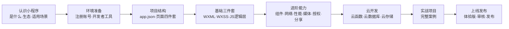
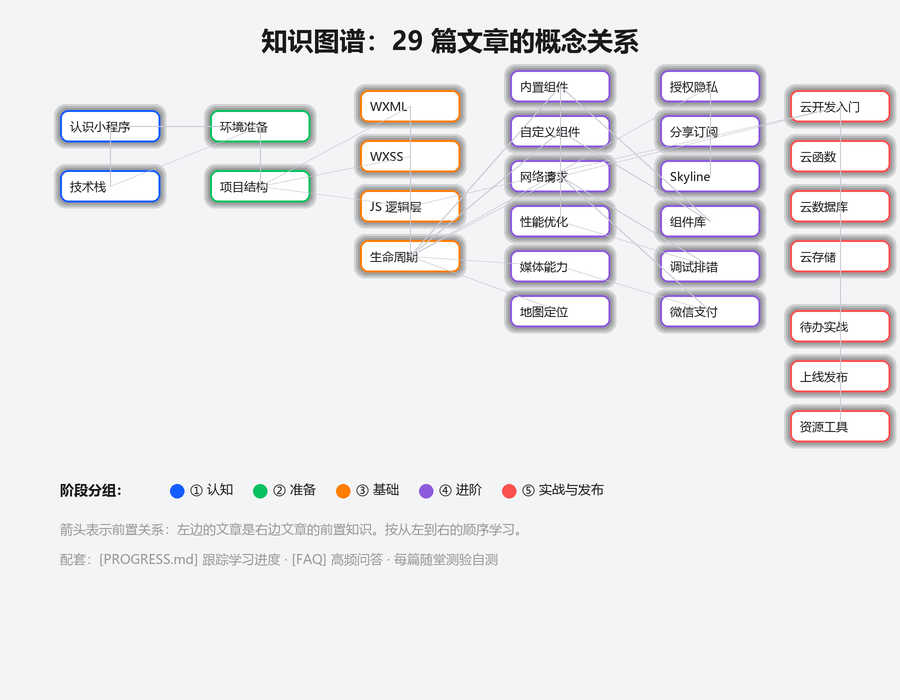

# 小程序开发之路


> 仿照「[通往 AGI 之路（WayToAGI）](https://www.waytoagi.com/)」知识库模式，把分散的微信小程序知识组织成一条人人都能走、也能一起修的路。
> 让更多人少走弯路，因小程序而强大。


本知识库是**开源共建**的微信小程序原生开发教程：从认识小程序、搭建开发环境，到 WXML/WXSS/JS 三件套、组件化、云开发，最后上线发布。每篇文章独立可读，代码可直接复现，事实链接官方文档。

## 学习路径

按「认知 → 理解 → 应用 → 实战 → 发布」五个阶段组织，与 [docs/00-学习路线/01-学习路径总览.md](docs/00-学习路线/01-学习路径总览.md) 对应：



**概念关系全景图**（29 篇文章的前置关系与知识依赖）：



| 阶段 | 文章 | 说明 |
|---|---|---|
| 认知 | [认识小程序](docs/01-入门/01-认识小程序.md) | 小程序是什么，与 H5/原生 App 的差别 |
| 认知 | [编程语言与技术栈](docs/01-入门/04-编程语言与技术栈.md) | 四种语言（JS/WXML/WXSS/JSON）如何分工协作 |
| 准备 | [环境准备](docs/01-入门/02-环境准备.md) | 注册账号、安装开发者工具、跑通 Hello World |
| 结构 | [项目结构](docs/01-入门/03-项目结构.md) | 全局配置与页面四件套 |
| 基础 | [WXML 数据绑定与渲染](docs/02-基础/01-WXML数据绑定与渲染.md) | 视图层语法：绑定、条件、列表 |
| 基础 | [WXSS 样式与 rpx](docs/02-基础/02-WXSS样式与rpx.md) | 响应式样式单位与布局 |
| 基础 | [JS 逻辑层与数据驱动](docs/02-基础/03-JS逻辑层与数据驱动.md) | setData 数据流、模块化 |
| 基础 | [页面生命周期与事件](docs/02-基础/04-页面生命周期与事件.md) | 页面/应用生命周期、事件系统 |
| 进阶 | [内置组件](docs/03-进阶/01-内置组件.md) | 高频组件速查 |
| 进阶 | [自定义组件](docs/03-进阶/02-自定义组件.md) | Component 构造器、组件通信 |
| 进阶 | [网络请求与数据](docs/03-进阶/03-网络请求与数据.md) | wx.request、本地存储、登录态 |
| 进阶 | [性能优化](docs/03-进阶/04-性能优化.md) | 数据更新算法、setData 军规、分包、长列表 |
| 进阶 | [媒体能力](docs/03-进阶/05-媒体能力.md) | 选图/拍照/录音、临时文件机制、上传持久化 |
| 进阶 | [地图与定位](docs/03-进阶/06-地图与定位.md) | getLocation、map 组件、坐标系机制 |
| 进阶 | [授权与隐私](docs/03-进阶/07-授权与隐私.md) | scope 模型、隐私指引、头像昵称填写 |
| 进阶 | [分享与订阅消息](docs/03-进阶/08-分享与订阅消息.md) | 转发/朋友圈、订阅授权模型 |
| 进阶 | [Skyline 与适配](docs/03-进阶/09-Skyline与适配.md) | 渲染引擎机制、safe-area 与刘海屏 |
| 进阶 | [第三方组件库](docs/03-进阶/10-第三方组件库.md) | vant/TDesign、npm 构建机制、按需引入 |
| 进阶 | [调试与排错](docs/03-进阶/11-调试与排错.md) | 面板地图、真机调试与 vConsole、线上错误监控 |
| 进阶 | [微信支付](docs/03-进阶/12-微信支付.md) | 云调用接入、requestPayment、回调幂等与退款 |
| 云开发 | [云开发入门](docs/04-云开发/01-云开发入门.md) | Serverless 后端能力全景 |
| 云开发 | [云函数](docs/04-云开发/02-云函数.md) | 后端逻辑、身份获取、定时触发 |
| 云开发 | [云数据库](docs/04-云开发/03-云数据库.md) | 集合文档、权限、增删改查 |
| 云开发 | [云存储](docs/04-云开发/04-云存储.md) | 上传下载、临时链接、配额与安全 |
| 发布 | [上线发布](docs/05-发布/01-上线发布.md) | 体验版、审核、发布与回退 |
| 实战 | [实战项目：待办清单](docs/06-实战/01-待办清单实战.md) | 完整端到端案例 |
| 实战 | [实战项目：多页面导航](docs/06-实战/02-多页面导航实战.md) | tabBar、页面跳转、数据传递 |
| 实战 | [实战项目：商品列表](docs/06-实战/03-商品列表实战.md) | 搜索、列表渲染、scroll-view |
| 资源 | [资源与工具](docs/07-资源/01-资源与工具.md) | 官方文档、社区、常用工具 |

## 如何阅读

- **零基础起步**：按上表从上往下读，每篇末尾的「随堂测验」和「验证」小节做完再进入下一篇。用 [PROGRESS.md](PROGRESS.md) 跟踪你的学习进度。
- **查速查**：直接看对应分类文章；`内置组件`、`WXSS` 等篇章按速查风格组织；找 API 先看 [API 速查索引](docs/00-学习路线/02-API速查索引.md)。
- **常见问题**：学习过程中遇到问题先看 [FAQ](docs/00-学习路线/03-FAQ.md)，覆盖各阶段高频问题。
- **进阶目标**：读完「进阶」十一篇 + 「云开发」四篇后，跟随实战项目做一遍完整上线。

## 项目结构

```text
.
├── README.md               # 总览：学习路径 + 文章索引 + 仓库规模
├── PROGRESS.md             # 学习进度追踪（读者本地勾选）
├── CONTRIBUTORS.md         # 贡献者墙
├── CHANGELOG.md            # 版本历史（Keep a Changelog 风格）
├── CONTRIBUTING.md         # 贡献指南（写作规范 + 提 PR 自查清单）
├── LICENSE
├── .github/
│   ├── ISSUE_TEMPLATE/     # 纠错报告 / 新增文章 / 问题讨论模板
│   └── workflows/check.yml # CI：仓库一致性校验
├── docs/                   # 知识库正文
│   ├── 00-学习路线/         # 学习路径总览 + API 速查索引 + FAQ
│   ├── 01-入门/ … 07-资源/  # 教学链 29 篇（教学顺序见 README 表格）
│   ├── _契约.md            # 写作契约（元数据/结构/视觉资产/深度要求）
│   └── assets/             # 视觉资产 + videos/ 教学视频（脚本生成，勿手改）
├── examples/
│   ├── todo-miniprogram/        # 待办清单（云开发实战）
│   ├── navigation-miniprogram/  # 多页面导航（tabBar + 跳转）
│   └── product-list-miniprogram/ # 商品列表（搜索 + 列表渲染）
└── tools/                  # 资产生成（render/gen_animations/gen_statics/gen_diagrams/gen_videos）
                            # 校验：check_repo.py + check_assets_fresh.py + 三者各自的自测
                            # data/wx-api-names.txt、wx-api-promise.txt：官方 API 名单（校验真实性/Promise 断言用，脚本抓取）
```

## 参与共建

本知识库与 WayToAGI 一样，是开放共建项目。贡献方式：

1. **提纠错**：发现错误、过期信息，提 issue 说明文章与问题。
2. **写文章**：遵循 [docs/_契约.md](docs/_契约.md)（元数据 schema、结构、风格），`write` 后提 PR。
3. **补案例**：在「实战」分类下新增完整项目教程。
4. **改视觉资产**：所有动画/示意图由 `tools/` 下脚本程序化生成（2x 超采样渲染管线 + 补间动画），改脚本重跑即可，见 [docs/_契约.md](docs/_契约.md) 的「视觉资产的生成」一节。

写作规范、元数据格式与命名规则见 [docs/_契约.md](docs/_契约.md)；完整贡献流程与提 PR 自查清单见 [CONTRIBUTING.md](CONTRIBUTING.md)。

## 社区

- **问题与讨论**：在 [Issues](https://github.com/zhuguang-ZFG/xiaochengxu/issues) 提问或参与讨论（提问前先看 [FAQ](docs/00-学习路线/03-FAQ.md)）
- **贡献者墙**：[CONTRIBUTORS.md](CONTRIBUTORS.md)
- **学习进度**：用 [PROGRESS.md](PROGRESS.md) 跟踪你的学习进度（本地勾选，不上传）

## 内容范围

- ✅ 微信小程序**原生开发**（WXML/WXSS/JS + 微信开发者工具）
- ✅ 云开发（CloudBase：云函数/云数据库/云存储/云托管）
- ✅ **第三方组件库**（vant-weapp / TDesign，见[进阶篇](docs/03-进阶/10-第三方组件库.md)）
- ✅ 上线发布与运营基础
- ✅ **微信支付**（云开发云调用接入，见[进阶篇](docs/03-进阶/12-微信支付.md)）
- ❌ 跨端框架（Taro、uni-app 等）不在当前范围（可另行共建）
- ❌ 微信小游戏不在当前范围

## 仓库规模

| 指标 | 数值 |
|---|---|
| 教程文章 | 32 篇（学习路线 3 篇含 FAQ + 入门/基础/进阶/云开发/发布/实战/资源 29 篇教学链） |
| 随堂测验 | 121 题 / 29 组（每篇教学文章 3~6 道场景选择题，`<details>` 折叠答案） |
| 视觉资产 | 70 个（38 动画 GIF + 19 示意图 PNG + 13 教学视频 MP4），全部可脚本复现，CI 逐字节比对 |
| 教学视频 | 13 集（`docs/assets/videos/`，720×1280 竖屏 MP4，含字幕帧，由脚本生成） |
| 示例工程 | `examples/todo-miniprogram`、`examples/navigation-miniprogram`、`examples/product-list-miniprogram`（可运行，对应实战篇） |
| 学习体验 | [PROGRESS.md](PROGRESS.md) 进度追踪 + [FAQ](docs/00-学习路线/03-FAQ.md) 高频问答 + 知识图谱 |
| 自动校验 | 链接/元数据/序号/孤儿资产/GIF 与视频体积/MP4 完整性与时长/代码块语言/交叉引用顺序/示例工程结构/实战篇与示例工程逐行一致/**API 真实性 + Promise 断言**/**随堂测验格式 + checkbox 校验**/**进度同步**/**知识图谱引用**/**FAQ 格式**/**架构决策表列名**/**踩坑回顾表列名**/**延伸阅读官方链接**/**深度段落标题校验**/**README 指标表数字与仓库实际计数一致**，见 CI（外链 HTTP 校验为本地可选：`python tools/check_repo.py --external`） |
| 资产复现校验 | `tools/check_assets_fresh.py` 清空 `docs/assets/` 重跑四个生成脚本，要求与 HEAD 逐字节一致（CI 在 windows-latest 上跑，1m50s） |

## 示例工程

三个可运行的完整工程，导入微信开发者工具即可跑通，代码与教程逐行对应：

- [examples/todo-miniprogram](examples/todo-miniprogram/)：待办清单（对应[实战项目：待办清单](docs/06-实战/01-待办清单实战.md)），需开通云开发
- [examples/navigation-miniprogram](examples/navigation-miniprogram/)：多页面导航（对应[实战项目：多页面导航](docs/06-实战/02-多页面导航实战.md)），纯前端
- [examples/product-list-miniprogram](examples/product-list-miniprogram/)：商品列表（对应[实战项目：商品列表](docs/06-实战/03-商品列表实战.md)），纯前端

## 质量保障

- **CI 校验**：每次 push/PR 自动运行 [tools/check_repo.py](tools/check_repo.py)（链接断链、元数据、目录序号、孤儿资产、GIF/视频体积上限、代码块语言、交叉引用顺序、实战篇与示例工程逐行一致、API 真实性、Promise 断言）+ 示例工程 JS 语法检查与云函数单元测试，见 [.github/workflows/check.yml](.github/workflows/check.yml)
- **API 真实性 / Promise 断言**：正文与示例代码里出现的每个 `wx.<name>` 都要在 [tools/data/wx-api-names.txt](tools/data/wx-api-names.txt)（507 个，抓自官方 API 索引页 + 官方 typings）里，拼错或虚构的接口名直接红——本库曾把一个 npm 包的能力当成 `wx.` 接口收进速查索引；同时对照 [wx-api-promise.txt](tools/data/wx-api-promise.txt)（194 个不传回调即返回 Promise 的接口）检查两件事：不能把支持 Promise 风格的接口说成回调式，不能 `await` 不返回 Promise 的接口
- **资产复现校验**：另有一个 CI job 清空 `docs/assets/` 重跑全部生成脚本，要求与仓库内容逐字节一致——「改了脚本忘了重跑」或「手工改了 GIF」都会红。跑在 windows 上是因为字体解析（见 [docs/_契约.md](docs/_契约.md)）
- **校验器自测**：[tools/test_check_repo.py](tools/test_check_repo.py) 用迷你仓库夹具反证校验逻辑本身有效（40 用例）；[tools/test_assets_fresh.py](tools/test_assets_fresh.py) 守护资产比对「以 HEAD 为基准」这一属性（8 用例）；[tools/test_mutations.py](tools/test_mutations.py) 把已知缺陷还原成变异体验证自测确实会变红（20/20 捕获）——防止出现「校验静默失效、CI 依旧全绿」
- 本地可随时运行 `python tools/check_repo.py` 自查

## 教学视频

`docs/assets/videos/` 下有 13 集竖屏教学视频（720×1280、24fps、H.264，单集上限 3MB 由 `tools/check_repo.py` 强制），由 `python tools/gen_videos.py` 程序化生成——含字幕帧，不需要录音或录屏。下表的时长不是手打的：`check_repo.py` 会读每集成片 `mdhd` 里的真实时长逐行比对，改了一边就会被拦：

| 集 | 主题 | 时长 | 对应文章 |
|---|---|---|---|
| 第 1 集 | 学习路径导览 | 60 秒 | [学习路径总览](docs/00-学习路线/01-学习路径总览.md) |
| 第 2 集 | 认识小程序 | 75 秒 | [认识小程序](docs/01-入门/01-认识小程序.md) |
| 第 3 集 | 环境准备 | 75 秒 | [环境准备](docs/01-入门/02-环境准备.md) |
| 第 4 集 | WXML 数据绑定 | 75 秒 | [WXML 数据绑定与渲染](docs/02-基础/01-WXML数据绑定与渲染.md) |
| 第 5 集 | 自定义组件 | 90 秒 | [自定义组件](docs/03-进阶/02-自定义组件.md) |
| 第 6 集 | 云开发入门 | 75 秒 | [云开发入门](docs/04-云开发/01-云开发入门.md) |
| 第 7 集 | 性能优化 | 75 秒 | [性能优化](docs/03-进阶/04-性能优化.md) |
| 第 8 集 | 微信支付 | 75 秒 | [微信支付](docs/03-进阶/12-微信支付.md) |
| 第 9 集 | 上线发布 | 75 秒 | [上线发布](docs/05-发布/01-上线发布.md) |
| 第 10 集 | 实战项目导览 | 90 秒 | [待办清单实战](docs/06-实战/01-待办清单实战.md) |
| 第 11 集 | 云函数 | 75 秒 | [云函数](docs/04-云开发/02-云函数.md) |
| 第 12 集 | 授权与隐私 | 75 秒 | [授权与隐私](docs/03-进阶/07-授权与隐私.md) |
| 第 13 集 | 调试与排错 | 75 秒 | [调试与排错](docs/03-进阶/11-调试与排错.md) |

GitHub 渲染仓库 Markdown 时会过滤 `<video>` 标签，因此文章内以**引用块 + 链接**形式给出，点击后由 GitHub 内置播放器播放（见 [docs/_契约.md](docs/_契约.md) 的「视觉资产规范」）。

## 参考

- 官方文档：[微信开放文档 · 小程序](https://developers.weixin.qq.com/miniprogram/dev/framework/)（深度阅读清单见[资源篇](docs/07-资源/01-资源与工具.md)）
- 官方源码：[wechat-miniprogram](https://github.com/wechat-miniprogram)（组件扩展、API Promise 化等官方工程）
- 参考模式：[通往 AGI 之路](https://www.waytoagi.com/) · [WayToAGI_Documents](https://github.com/WayToAGI/WayToAGI_Documents)

## License

见 [LICENSE](LICENSE)。
