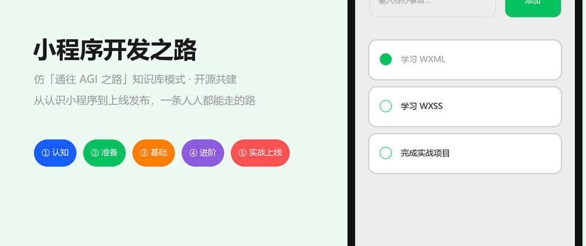
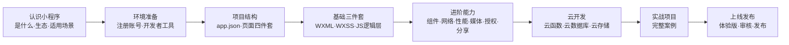

# 小程序开发之路

> 仿照「[通往 AGI 之路（WayToAGI）](https://www.waytoagi.com/)」知识库模式，把分散的微信小程序知识组织成一条人人都能走、也能一起修的路。
> 让更多人少走弯路，因小程序而强大。

本知识库是**开源共建**的微信小程序原生开发教程：从认识小程序、搭建开发环境，到 WXML/WXSS/JS 三件套、组件化、云开发，最后上线发布。每篇文章独立可读，代码可直接复现，事实链接官方文档。

## 学习路径

按「认知 → 理解 → 应用 → 实战 → 发布」五个阶段组织，与 [docs/00-学习路线/01-学习路径总览.md](docs/00-学习路线/01-学习路径总览.md) 对应：

| 阶段 | 文章 | 说明 |
|---|---|---|
| 认知 | [认识小程序](docs/01-入门/01-认识小程序.md) | 小程序是什么，与 H5/原生 App 的差别 |
| 认知 | [编程语言与技术栈](docs/01-入门/04-编程语言与技术栈.md) | 四种语言（JS/WXML/WXSS/JSON）如何分工协作 |
| 准备 | [环境准备](docs/01-入门/02-环境准备.md) | 注册账号、安装开发者工具、跑通 Hello World |
| 结构 | [项目结构](docs/01-入门/03-项目结构.md) | 全局配置与页面四件套 |
| 基础 | [WXML 数据绑定与渲染](docs/02-基础/01-WXML数据绑定与渲染.md) | 视图层语法：绑定、条件、列表 |
| 基础 | [WXSS 样式与 rpx](docs/02-基础/02-WXSS样式与rpx.md) | 响应式样式单位与布局 |
| 基础 | [JS 逻辑层与数据驱动](docs/02-基础/03-JS逻辑层与数据驱动.md) | setData 数据流、模块化 |
| 基础 | [页面生命周期与事件](docs/02-基础/04-页面生命周期与事件.md) | 页面/应用生命周期、事件系统 |
| 进阶 | [内置组件](docs/03-进阶/01-内置组件.md) | 高频组件速查 |
| 进阶 | [自定义组件](docs/03-进阶/02-自定义组件.md) | Component 构造器、组件通信 |
| 进阶 | [网络请求与数据](docs/03-进阶/03-网络请求与数据.md) | wx.request、本地存储、登录态 |
| 进阶 | [性能优化](docs/03-进阶/04-性能优化.md) | 数据更新算法、setData 军规、分包、长列表 |
| 进阶 | [媒体能力](docs/03-进阶/05-媒体能力.md) | 选图/拍照/录音、临时文件机制、上传持久化 |
| 进阶 | [地图与定位](docs/03-进阶/06-地图与定位.md) | getLocation、map 组件、坐标系机制 |
| 进阶 | [授权与隐私](docs/03-进阶/07-授权与隐私.md) | scope 模型、隐私指引、头像昵称填写 |
| 进阶 | [分享与订阅消息](docs/03-进阶/08-分享与订阅消息.md) | 转发/朋友圈、订阅授权模型 |
| 进阶 | [Skyline 与适配](docs/03-进阶/09-Skyline与适配.md) | 渲染引擎机制、safe-area 与刘海屏 |
| 进阶 | [第三方组件库](docs/03-进阶/10-第三方组件库.md) | vant/TDesign、npm 构建机制、按需引入 |
| 云开发 | [云开发入门](docs/04-云开发/01-云开发入门.md) | Serverless 后端能力全景 |
| 云开发 | [云函数](docs/04-云开发/02-云函数.md) | 后端逻辑、身份获取、定时触发 |
| 云开发 | [云数据库](docs/04-云开发/03-云数据库.md) | 集合文档、权限、增删改查 |
| 云开发 | [云存储](docs/04-云开发/04-云存储.md) | 上传下载、临时链接、配额与安全 |
| 发布 | [上线发布](docs/05-发布/01-上线发布.md) | 体验版、审核、发布与回退 |
| 实战 | [实战项目](docs/06-实战/01-待办清单实战.md) | 完整端到端案例 |
| 资源 | [资源与工具](docs/07-资源/01-资源与工具.md) | 官方文档、社区、常用工具 |

## 如何阅读

- **零基础起步**：按上表从上往下读，每篇末尾的「验证」小节做完再进入下一篇。
- **查速查**：直接看对应分类文章；`内置组件`、`WXSS` 等篇章按速查风格组织。
- **进阶目标**：读完「进阶」九篇 + 「云开发」四篇后，跟随实战项目做一遍完整上线。

## 参与共建

本知识库与 WayToAGI 一样，是开放共建项目。贡献方式：

1. **提纠错**：发现错误、过期信息，提 issue 说明文章与问题。
2. **写文章**：遵循 [docs/_契约.md](docs/_契约.md)（元数据 schema、结构、风格），`write` 后提 PR。
3. **补案例**：在「实战」分类下新增完整项目教程。
4. **改视觉资产**：所有动画/示意图由 `tools/` 下脚本程序化生成（2x 超采样渲染管线 + 补间动画），改脚本重跑即可，见 [docs/_契约.md](docs/_契约.md) 的「视觉资产的生成」一节。

写作规范、元数据格式与命名规则见 [docs/_契约.md](docs/_契约.md)。

## 内容范围

- ✅ 微信小程序**原生开发**（WXML/WXSS/JS + 微信开发者工具）
- ✅ 云开发（CloudBase：云函数/云数据库/云存储/云托管）
- ✅ **第三方组件库**（vant-weapp / TDesign，见[进阶篇](docs/03-进阶/10-第三方组件库.md)）
- ✅ 上线发布与运营基础
- ❌ 跨端框架（Taro、uni-app 等）不在当前范围（可另行共建）
- ❌ 微信小游戏不在当前范围

## 仓库规模

| 指标 | 数值 |
|---|---|
| 教程文章 | 26 篇（学习路线 + 入门/基础/进阶/云开发/发布/实战/资源） |
| 视觉资产 | 41 个（32 动画 GIF + 9 示意图 PNG），全部可脚本复现 |
| 示例工程 | `examples/todo-miniprogram`（可运行，对应实战篇） |
| 自动校验 | 链接/元数据/序号/孤儿资产/GIF 体积/示例工程结构，见 CI |

## 示例工程

[examples/todo-miniprogram](examples/todo-miniprogram/) 是可运行的完整工程（待办清单，对应[实战篇](docs/06-实战/01-待办清单实战.md)）：导入微信开发者工具 + 开通云开发即可跑通，代码与教程逐行对应。

## 质量保障

- **CI 校验**：每次 push/PR 自动运行 [tools/check_repo.py](tools/check_repo.py)（链接断链、元数据、目录序号、孤儿资产）+ 示例工程 JS 语法检查，见 [.github/workflows/check.yml](.github/workflows/check.yml)
- 本地可随时运行 `python tools/check_repo.py` 自查

## 参考

- 官方文档：[微信开放文档 · 小程序](https://developers.weixin.qq.com/miniprogram/dev/framework/)
- 参考模式：[通往 AGI 之路](https://www.waytoagi.com/) · [WayToAGI_Documents](https://github.com/WayToAGI/WayToAGI_Documents)

## License

见 [LICENSE](LICENSE)。
