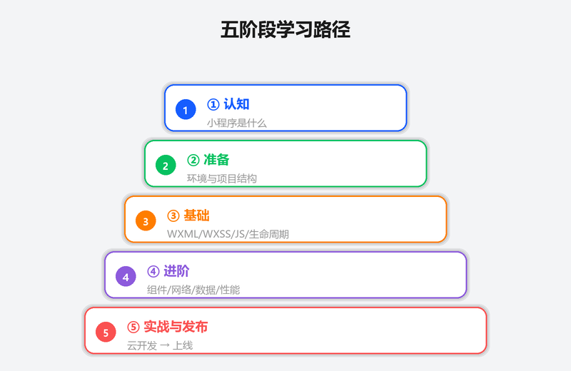
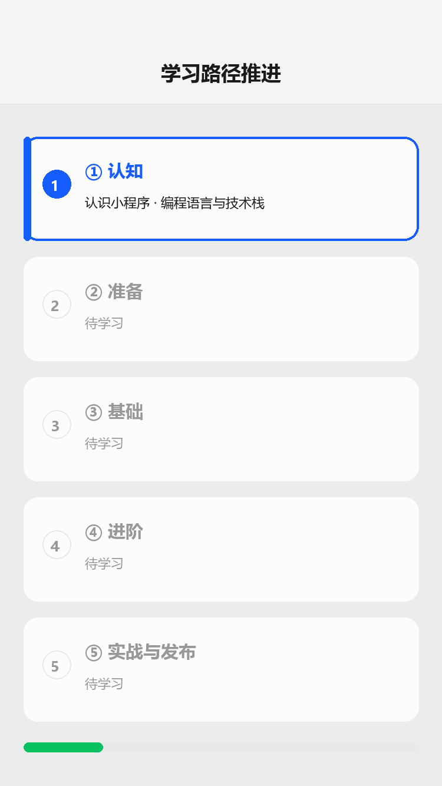

# 学习路径总览

## 为什么读这篇

面对零散的小程序教程，最常见的问题是：学完 WXML 语法不知道下一步该学什么，看完一堆 API 列表却做不出一个能上线的产品。「通往 AGI 之路」用**学习路径**把知识组织成可走的路线，本知识库沿用同样思路：五个阶段、二十七篇教学文章（另有学习路径总览与 API 速查索引），每阶段有明确的出口标准（做完什么、能验证什么），达标再进入下一阶段。

前置知识：会用电脑、会基本的 HTML/CSS/JavaScript 最好，但本路径从「什么是小程序」讲起，纯零基础也可以按顺序走。

## 五个阶段总览

学习路径阶梯（概念示意图：认知 → 准备 → 基础 → 进阶 → 实战与发布，五级阶梯逐级递进）：

路径推进演示（渲染示意图动画：五阶段依次点亮，每阶段标注学习内容，底部进度条）：

| 阶段 | 目标 | 覆盖文章 | 出口标准 |
|---|---|---|---|
| ① 认知 | 搞清楚小程序是什么、值不值得学 | 认识小程序 | 能向别人讲清楚小程序与 H5/App 的差异 |
| ② 准备 | 跑通开发环境，能预览自己写的页面 | 环境准备、项目结构 | 开发者工具里能新建项目并真机预览 |
| ③ 基础 | 掌握 WXML/WXSS/JS 三件套与生命周期 | WXML、WXSS、JS 逻辑层、生命周期与事件 | 能独立写一个多页面、带交互的小程序 |
| ④ 进阶 | 组件化、网络与数据能力 | 内置组件、自定义组件、网络请求与数据 | 能封装复用组件、联调后端接口 |
| ⑤ 实战与发布 | 完整项目 + 上线运营 | 云开发三篇、实战项目、上线发布 | 完成实战项目并走完一次真实发布流程 |

## 阶段① 认知：小程序是什么

- [认识小程序](../01-入门/01-认识小程序.md)
- 读完后自问：小程序和 H5 网页、原生 App 各有什么不可替代的场景？如果答案里能说出「入口在微信内、无需下载安装、用完即走」，进入下一阶段。

## 阶段② 准备：把环境跑起来

- [编程语言与技术栈](../01-入门/04-编程语言与技术栈.md) — 先建立技术栈全景，知道四种语言各自干什么
- [环境准备](../01-入门/02-环境准备.md)
- [项目结构](../01-入门/03-项目结构.md)
- 出口标准：微信开发者工具里新建项目，模拟器中看到 Hello World；知道 app.json 配了哪三个关键字段（pages、window、tabBar）。

## 阶段③ 基础：三件套 + 生命周期

这是小程序开发的核心，花的时间最多，四篇按顺序读：

1. [WXML 数据绑定与渲染](../02-基础/01-WXML数据绑定与渲染.md) — 视图层怎么写
2. [WXSS 样式与 rpx](../02-基础/02-WXSS样式与rpx.md) — 样式与响应式布局
3. [JS 逻辑层与数据驱动](../02-基础/03-JS逻辑层与数据驱动.md) — 逻辑层怎么写、setData 数据流
4. [页面生命周期与事件](../02-基础/04-页面生命周期与事件.md) — 页面什么时候加载/显示/卸载，事件怎么绑

出口标准：独立写出一个三页面小程序（列表页 + 详情页 + 我的页），列表数据来自 JS data，点击列表项跳详情页。不要追求样式好看，先跑通数据流。

## 阶段④ 进阶：组件化与数据

- [内置组件](../03-进阶/01-内置组件.md) — 高频组件速查
- [自定义组件](../03-进阶/02-自定义组件.md) — 封装自己的组件
- [网络请求与数据](../03-进阶/03-网络请求与数据.md) — 联调真实接口、本地存储、登录态
- [性能优化](../03-进阶/04-性能优化.md) — 数据更新算法、setData 军规、分包与长列表（**从「写得出」到「跑得动」**）
- [媒体能力](../03-进阶/05-媒体能力.md) — 选图/拍照/录音与临时文件机制（做真实项目必经）
- [地图与定位](../03-进阶/06-地图与定位.md) — 定位授权、map 组件、坐标系机制
- [授权与隐私](../03-进阶/07-授权与隐私.md) — scope 模型、隐私指引（新手最大卡点）
- [分享与订阅消息](../03-进阶/08-分享与订阅消息.md) — 转发与订阅消息的授权模型
- [Skyline 与适配](../03-进阶/09-Skyline与适配.md) — 新渲染引擎机制、safe-area 刘海屏适配
- [第三方组件库](../03-进阶/10-第三方组件库.md) — vant/TDesign、npm 构建、按需引入与包体积
- [调试与排错](../03-进阶/11-调试与排错.md) — 面板地图、真机调试与 vConsole、线上错误监控（排错是进阶必备技能）
- [微信支付](../03-进阶/12-微信支付.md) — 云调用接入、requestPayment、回调幂等与退款（商业小程序核心能力）

出口标准：把列表页拆成自定义组件（如 `todo-item`），通过 properties 传数据、triggerEvent 抛事件；能用 wx.request 请求一个真实接口并渲染；能实现一次完整的「选图 → 上传云存储 → 展示」链路，并在真机上走通定位授权流程。进阶篇完成后，能用真机调试解决一个线上问题，并对接一次微信支付下单闭环。

## 阶段⑤ 云开发、实战与发布

- [云开发入门](../04-云开发/01-云开发入门.md)
- [云函数](../04-云开发/02-云函数.md)
- [云数据库](../04-云开发/03-云数据库.md)
- [云存储](../04-云开发/04-云存储.md)
- [实战项目](../06-实战/01-待办清单实战.md) — 把前面所有知识串成一个完整项目
- [上线发布](../05-发布/01-上线发布.md)

出口标准：实战项目在真机上跑通（不依赖本地调试开关），提交审核并成功发布一次；知道如何做版本回退与强制更新。

## 常见错误 / 避坑

1. **跳过阶段③直接学云开发**：云开发假设你已经会 setData 数据流和组件通信，跳级会导致「接口会调、页面不会渲染」。
2. **把前端教程当小程序教程**：小程序是双线程架构（逻辑层/渲染层），DOM 操作思路在这里行不通；所有视图更新必须走 setData。
3. **不按出口标准自测就往下走**：知识是累积的，阶段③的列表页写不出来，实战项目会卡在第一步。
4. **只读不写**：小程序语法本身不难，难的是数据流和生命周期直觉；每篇的「验证」小节必须动手做。

## 验证

- [ ] 能说出五个阶段的名称与顺序
- [ ] 能说出阶段③四篇文章各自解决什么问题
- [ ] 对照 README 的路线图，标出自己当前所处阶段
- [ ] 给当前阶段挑一个出口标准，今天做完它

## 延伸阅读

- [README 路线图](../../README.md)
- 官方：[小程序开发指南](https://developers.weixin.qq.com/miniprogram/dev/framework/)
- 参考模式：[通往 AGI 之路 · WayToAGI_Documents](https://github.com/WayToAGI/WayToAGI_Documents)（开源文档仓库，本库的模式来源）
