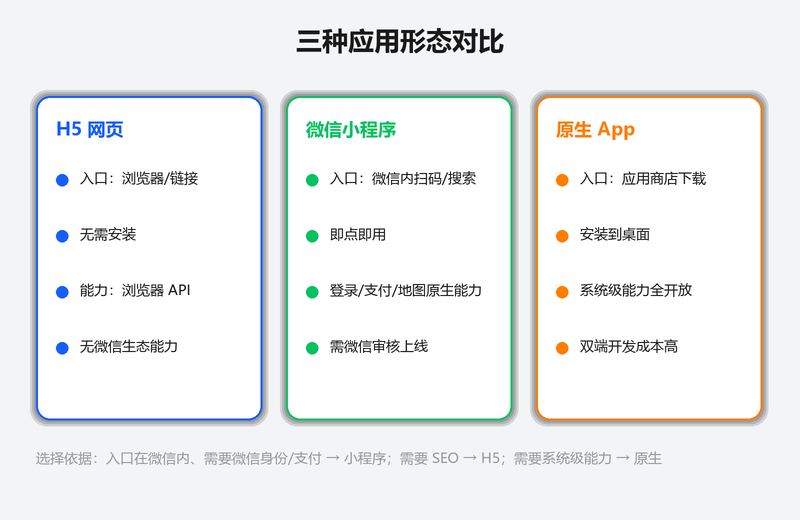
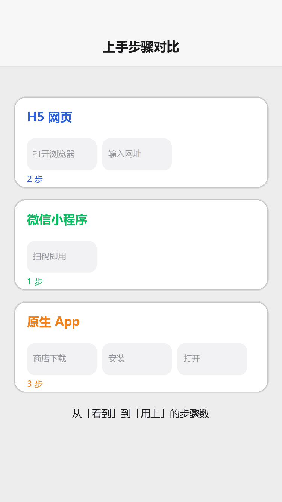

# 认识小程序

## 为什么读这篇

在动手写代码之前，先把「小程序到底是什么」搞清楚，避免学错方向。读完你会明白：小程序和 H5 网页、原生 App 的本质区别，什么样的产品适合做成小程序，以及这套知识库为什么只讲原生开发。

前置知识：无，纯概念。

## 小程序是什么

微信小程序（Mini Program）是腾讯微信推出的一种**无需下载安装、即点即用**的应用形态。用户通过微信内扫码、搜索、分享、下拉等入口直接打开，用完关掉即可，不占用手机桌面。

一句话定义：

> 小程序 = 运行在微信客户端内的轻量应用，前端用 WXML/WXSS/JS 编写，由微信提供运行环境和基础能力（登录、支付、地图、相机等）。

它不是一个网页，也不是一个 App，而是一套微信自有的技术栈：

- **视图层**：WXML（类似 HTML 的标记语言）+ WXSS（类似 CSS 的样式语言）
- **逻辑层**：JavaScript（运行在独立的 JS 引擎中，与视图层分离）
- **配置层**：JSON 文件描述页面、窗口、tabBar 等
- **运行环境**：微信客户端提供，分 WebView 渲染和 Skyline 渲染两种引擎（[渲染机制](../../docs/00-学习路线/01-学习路径总览.md)阶段③会讲）

## 与 H5 网页对比

三种形态对比（概念示意图：H5 网页 / 微信小程序 / 原生 App 的入口、安装、能力差异与选择依据）：

上手步骤对比（渲染示意图动画：H5 需打开浏览器输入网址、小程序扫码即用、App 需下载安装）：

> 📺 配套视频 · 第 2 集：[《认识小程序》](../assets/videos/video-02-intro.mp4)（75 秒 · 竖屏 720×1280）——三种形态逐维度对比，并给出「适不适合做小程序」的三个自检问题。点击在 GitHub 内置播放器打开（仓库 Markdown 不支持内嵌播放器）。

| 维度 | H5 网页 | 微信小程序 |
|---|---|---|
| 入口 | 浏览器地址、链接分享 | 微信内：扫码/搜索/下拉/分享卡片 |
| 安装 | 无需安装，打开即用 | 无需安装，但需先加载代码包（约几百 KB 上限） |
| 运行环境 | 任意浏览器 | 仅微信客户端 |
| 能力 | 浏览器 API，受限 | 微信原生能力：登录、支付、蓝牙、地图、摄像头等 |
| 体验 | 受浏览器性能限制 | 接近原生 App 的流畅度（尤其 Skyline 引擎） |
| 审核 | 无需审核 | 需提交微信审核后上线 |
| 代码包 | 无大小硬限制（但影响加载） | 主包 ≤ 2MB（可通过分包扩展） |

关键差异：**H5 是浏览器生态，小程序是微信生态**。小程序能拿到微信的用户身份（openid）、支付能力和流量入口，这是 H5 做不到的；代价是代码不能直接复用网页技术栈，且受平台审核约束。

## 与原生 App 对比

| 维度 | 原生 App | 微信小程序 |
|---|---|---|
| 安装 | 应用商店下载安装 | 微信内直接打开 |
| 开发成本 | 双端（iOS/Android）+ 上架审核 | 一套代码，微信统一运行环境 |
| 能力 | 系统级能力全开放 | 受微信 API 限制，部分能力需申请 |
| 获客 | 商店搜索、买量 | 微信社交裂变、扫码即用 |
| 留存 | 桌面图标，高留存 | 用完即走，留存依赖「最近使用」列表和复访习惯 |
| 适合 | 高频重度、需要系统级能力的产品 | 轻量工具、内容、电商、本地生活 |

## 小程序生态与入口

小程序的价值核心在**生态位**：

1. **流量入口**：微信 10 亿级月活，扫码、聊天分享、公众号关联、搜一搜、下拉「最近使用」都是入口。
2. **身份体系**：`wx.login` 一键拿到用户身份，免注册登录。
3. **支付闭环**：微信支付与小程序原生打通，交易转化链路短。
4. **服务场景**：点餐、排队、缴费、预约、政务、出行——「低频但刚需」的服务最适合作小程序。

## 小程序类型

按主体和发布方式分类：

| 类型 | 说明 |
|---|---|
| 企业小程序 | 需企业/个体工商户主体，功能全开，可接入支付等能力 |
| 个人小程序 | 个人主体，功能受限（不能开通支付等部分能力） |
| 小游戏 | 游戏类，独立技术栈（Canvas），本知识库不覆盖 |

注册账号时就要选定主体类型，个人主体后期**不能升级为企业主体**，只能重新注册，所以一开始要想清楚。

## 适用场景判断

**适合做小程序**：本地生活服务（餐饮排队、预约）、电商零售、工具（计算器、快递查询）、内容资讯、政务民生、企业内部工具、线下场景扫码进入。

**不适合做小程序**：重度游戏（去做小游戏）、需要系统级能力的专业工具（去做原生 App）、需要稳定 SEO 的公开内容（去做 H5/网站）。

## 小程序的技术边界与设计原理

小程序为什么不能用 `document.getElementById`？为什么视图更新必须走 `setData`？这源于**双线程架构**的设计选择：

- **渲染层与逻辑层分离**：渲染层（WebView）负责界面绘制，逻辑层（JsCore/V8）负责业务逻辑。两个线程通过微信客户端中转通信，不共享内存。这意味着逻辑层拿不到 DOM 节点，渲染层也拿不到 JS 变量——必须通过序列化的 `setData` 跨线程传递数据
- **为什么这样设计**：安全隔离（JS 代码无法直接操作 DOM 做恶意行为）+ 性能可控（框架可以 diff 后批量更新，避免频繁 DOM 操作导致的卡顿）。代价是数据驱动模型的学习成本
- **本质**：小程序不是「跑在微信里的网页」，而是「微信托管的轻量原生容器」——渲染用 WebView 只是实现细节，核心是框架对渲染和逻辑的解耦控制

理解这个边界，才能理解后续所有 API 设计（组件、事件、生命周期）的「为什么」。

## 常见错误 / 避坑

1. **把小程序当网页写**：直接套用 DOM 操作思路（`document.getElementById`）在小程序里不存在；视图更新必须走 `setData`，这是双线程架构决定的（详见 [JS 逻辑层与数据驱动](../02-基础/03-JS逻辑层与数据驱动.md)）。
2. **用错了技术栈**：小程序不能用 HTML/CSS/JS 直接跑，语法是 WXML/WXSS + 小程序 API；用第三方框架（Taro/uni-app）可以复用 React/Vue 经验，但本知识库只讲原生，因为原生是理解一切上层框架的基础。
3. **主体选错**：个人主体功能受限，后期不能升级；先想清楚业务是否需要支付、是否需要企业认证。
4. **忽视审核约束**：小程序上线要过微信审核，涉及类目资质（如医疗、金融）；不是写完就能发布，规划时要预留审核时间。

## 随堂测验

**Q1**: 小明想做一个「扫码点餐」系统，顾客扫桌角二维码就能下单，不需要下载 App。他应该选哪种技术形态？
- [ ] A. H5 网页，因为无需安装
- [ ] B. 微信小程序，因为扫码即用且能直接调用微信支付
- [ ] C. 原生 App，因为体验最好
- [ ] D. 三种都可以，没有区别

答案

**B**. 小程序扫码即用、免安装，且与微信支付原生打通，是「低频刚需」线下场景的最佳选择；H5 无法直接调用微信支付能力，原生 App 则需要下载安装，获客成本高。

**Q2**: 小红有前端基础，想在小程序里用 `document.getElementById` 修改页面文字，结果页面没有任何变化。最可能的原因是什么？
- [ ] A. 小程序的 DOM API 名字不一样，应该用 `wx.getElementById` <!-- api-ignore -->
- [ ] B. 小程序运行在微信客户端内，视图层没有浏览器 DOM 环境，必须通过 setData 更新视图
- [ ] C. 她忘记点「编译」按钮了
- [ ] D. 小程序只支持 jQuery 语法操作 DOM

答案

**B**. 小程序采用双线程架构，视图层由 WXML 渲染，逻辑层没有 `document` 对象，视图更新只能走 `setData`——这是小程序与浏览器 JS 最本质的区别。

**Q3**: 小李用个人主体注册了小程序，上线后发现无法接入支付功能。他想升级为企业主体，应该怎么做？
- [ ] A. 在小程序后台提交企业资质直接升级
- [ ] B. 重新注册一个企业主体的小程序账号
- [ ] C. 联系微信客服开通个人支付权限
- [ ] D. 在 app.json 里添加 `"enablePayment": true`

答案

**B**. 个人主体注册后不能升级为企业主体，只能重新注册；所以在注册时就要根据业务需求（是否需要支付、企业认证等）选好主体类型。

**Q4**: 以下关于小程序与 H5 网页的差异，哪项描述是正确的？
- [ ] A. 小程序代码运行在浏览器中，H5 运行在微信客户端中
- [ ] B. 小程序能通过 `wx.login` 获取用户身份（openid），H5 无法直接获取
- [ ] C. 小程序上线无需审核，H5 需要审核
- [ ] D. 小程序的主包大小没有上限

答案

**B**. 小程序运行在微信客户端内，能通过 `wx.login` 拿到微信用户身份；H5 运行在浏览器中，无法直接获取微信生态的用户身份和支付能力。小程序上线需要审核，主包限制 2MB。

## 验证

- [ ] 用一句话向别人解释清楚「小程序是什么」
- [ ] 说出小程序与 H5、原生 App 各一个不可替代的优势
- [ ] 判断一个你身边的产品（如「某奶茶店点单」）为什么适合做小程序
- [ ] 知道 `wx.login` 提供什么能力，想清楚它为什么是「免登录」的关键

## 延伸阅读

- 本库下一篇：[编程语言与技术栈](../01-入门/04-编程语言与技术栈.md) — 四种语言如何分工协作
- 官方：[小程序简介](https://developers.weixin.qq.com/miniprogram/dev/framework/)
- 官方：[小程序运营规范与审核](https://developers.weixin.qq.com/miniprogram/product/)
