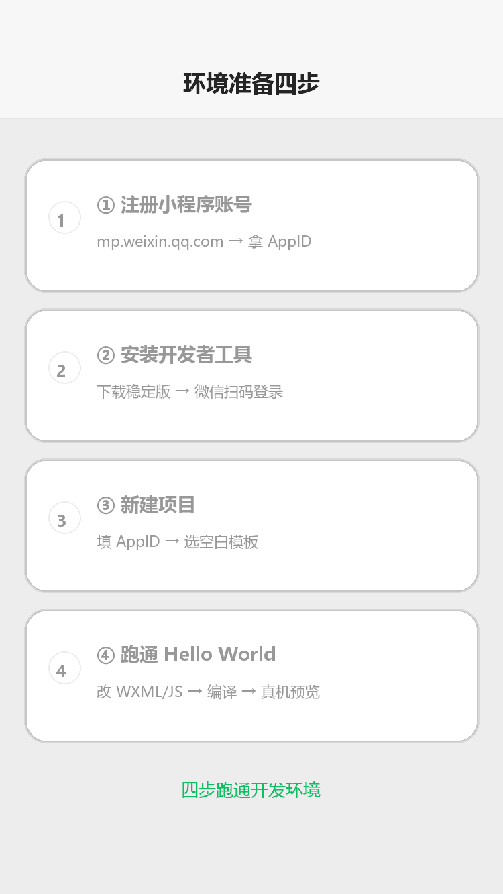
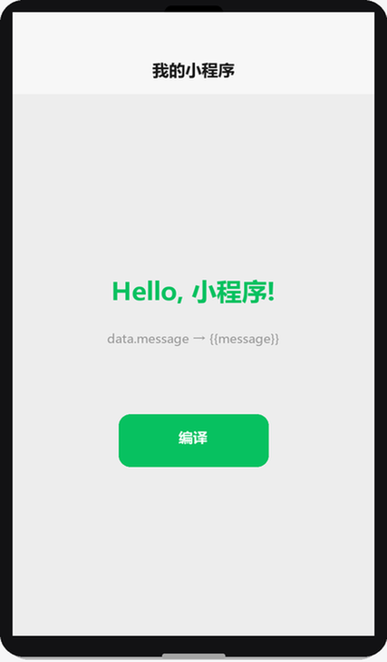

# 环境准备

## 为什么读这篇

学习小程序的第一步不是背语法，而是把「写代码 → 看效果」的回路跑通。这篇带你完成：注册小程序账号 → 安装微信开发者工具 → 新建第一个项目 → 在模拟器和真机上看到自己的页面。

前置知识：[认识小程序](../01-入门/01-认识小程序.md) 的基本概念；会基本电脑操作。

## 第一步：注册小程序账号

环境准备四步（渲染示意图动画：注册账号 → 安装工具 → 新建项目 → 跑通 Hello World）：



> 📺 配套视频 · 第 3 集：[《环境准备》](../assets/videos/video-03-env.mp4)（75 秒 · 竖屏 720×1280）——注册账号、装工具、新建项目到跑通 Hello World 的完整路径，并解释真机预览的本质。点击在 GitHub 内置播放器打开（仓库 Markdown 不支持内嵌播放器）。

打开微信公众平台 [mp.weixin.qq.com](https://mp.weixin.qq.com/)，右上角「立即注册」，选择「小程序」。

关键决策点：

| 选项 | 说明 | 建议 |
|---|---|---|
| 主体类型 | 个人 / 企业 / 个体工商户 / 其他组织 | 先想清楚业务：个人主体不能开支付，且后期不能升级 |
| 邮箱 | 每个邮箱只能注册一个账号 | 用不常用的邮箱，避免与公众号冲突 |
| 小程序名称 | 注册后可改，但每年有次数限制 | 先起临时名，想好再改 |

注册完成后进入小程序后台，在「设置 → 基本设置 → 账号信息」里能看到 **AppID**（形如 `wx1234567890abcdef`）。AppID 是项目的身份证，开发者工具里新建项目必须用它；没有 AppID 也可以先用「测试号」体验（见下）。

## 第二步：安装微信开发者工具

官方下载页：[developers.weixin.qq.com/miniprogram/dev/devtools/download.html](https://developers.weixin.qq.com/miniprogram/dev/devtools/download.html)

选择对应操作系统的**稳定版（Stable）**。截至 2026-10，支持 Skyline 渲染引擎要求开发者工具 ≥ 1.06.2307260（普通开发用最新稳定版即可，无需追 Nightly）。

安装注意：

- Windows 用户注意安装路径不要含中文或空格，避免后续工具链（如 npm 构建）报错
- 首次启动需要**微信扫码登录**，用注册小程序时绑定的微信号
- 工具会自动更新，保持最新稳定版

## 第三步：新建第一个项目

打开开发者工具，选择「小程序 → 新建项目」：

1. **目录**：选择或新建一个空文件夹，如 `D:\projects\my-first-miniprogram`
2. **AppID**：填刚才拿到的 AppID；没有就点「测试号」（测试号体验完整，但真机预览、云开发等功能受限）
3. **模板**：选「不使用模板 / 空白模板」（不同版本叫法略异，选最简的即可），之后自己写代码理解更深
4. 点击「新建」，工具会生成最小工程骨架并打开

生成的最小工程包含：

```text
my-first-miniprogram/
├── app.js          # 全局逻辑（小程序入口）
├── app.json        # 全局配置（页面注册、窗口样式）
├── app.wxss        # 全局样式
├── project.config.json  # 开发者工具项目配置
└── pages/
    └── index/      # 一个页面
        ├── index.wxml    # 页面结构
        ├── index.wxss    # 页面样式
        ├── index.js      # 页面逻辑
        └── index.json    # 页面配置
```

## 第四步：认识工具界面

工具界面由四块组成（新版工具还有 Skyline 调试面板）：

| 区域 | 作用 | 常用操作 |
|---|---|---|
| 工具栏（顶部） | 编译、预览、上传、模式切换 | 「编译」= 重新运行；「预览」= 生成真机二维码 |
| 模拟器（左侧） | 用内置浏览器渲染页面 | 可切换 iPhone/Android 机型、模拟屏幕尺寸 |
| 编辑器（中间） | 写代码 | 自带语法提示，WXML/WXSS/JS 都有补全 |
| 调试器（右侧） | Console、Network、AppData、Wxml 面板 | **AppData 面板看 setData 数据**；Wxml 面板看渲染结果 |

两个对你最实用的调试面板：

- **AppData**：查看和修改页面 `data`，改完点「编译」生效——理解数据驱动（[JS 逻辑层与数据驱动](../02-基础/03-JS逻辑层与数据驱动.md)）时的利器
- **Console**：看 `console.log` 输出和报错

## 第五步：真机预览

模拟器能看效果，但小程序最终跑在微信客户端里。真机预览：

1. 工具栏点「预览」
2. 工具生成二维码
3. 用**你的微信**扫码（需与开发者工具登录账号关联的小程序管理员/开发者权限）
4. 手机上打开即真实运行

注意：真机预览默认加载的是开发版，接口域名、权限等都按开发环境处理；走正式上线流程见 [上线发布](../05-发布/01-上线发布.md)。

## 第一个改动：Hello World

把 `pages/index/index.wxml` 改成：

```wxml
<view class="container">
  <text class="title">{{message}}</text>
</view>
```

`pages/index/index.js` 改成：

```js
Page({
  data: {
    message: 'Hello, 小程序!'
  }
})
```

预期效果（渲染示意图）：



点击「编译」，模拟器里就能看到 `Hello, 小程序!`。这就是小程序的「数据驱动」雏形：JS 里定义 `data`，WXML 用 `{{}}` 绑定，`setData` 修改后视图自动更新（下一篇 [项目结构](../01-入门/03-项目结构.md) 详解文件职责，[JS 逻辑层](../02-基础/03-JS逻辑层与数据驱动.md) 详解数据流）。

## 常见错误 / 避坑

1. **AppID 填错或没填**：新建项目时 AppID 格式不对会直接报错；没有 AppID 用「测试号」，但云开发、部分 API 需要真实 AppID。
2. **工具扫码登录后仍提示无权限**：开发者工具登录的微信号必须是该小程序项目的成员（在 mp 后台「成员管理」里添加），否则无法预览/上传。
3. **项目路径含中文**：Windows 上路径含中文偶尔触发工具链报错（npm、云函数相关），路径用英文最稳。
4. **预览二维码过期**：预览二维码有时效（约 20 分钟），过期重新点「预览」生成新的即可。
5. **模拟器正常但真机空白**：多半是权限/版本问题——检查基础库版本设置（详情 → 本地设置 → 调试基础库），或按第五步重新预览。

## 机制理解：AppID / 测试号 / 预览 到底是什么

环境里三个名词背后是同一套身份与权限模型，理解它比背步骤有用：

- **AppID = 小程序在微信侧的身份证**。它关联：代码归属（谁能预览/上传）、云端资源（云开发环境挂在 AppID 下）、接口权限（哪些 wx.* API 对这个 AppID 开放）。工具新建项目时用它绑定工程与身份。
- **测试号 = 无身份的临时通道**。没有 AppID 也能体验开发，但拿不到真实用户态：不能真机预览、不能开通云开发、部分 API 不可用——因为微信侧没有你的账号记录。
- **预览 ≠ 发布**。预览生成的二维码加载的是**开发版代码包**，走微信客户端的开发通道；它与「审核通过的线上版」完全隔离，其他人看不到，也不需要过审核。只有走 [上线发布](../05-发布/01-上线发布.md) 的「上传 → 审核 → 发布」才进入公网。
- **为什么开发者工具叫「工具」不叫「IDE」**：它同时是编译器（把 WXML/WXSS/JS 编译成小程序可执行的代码包）、调试器（模拟器/AppData/Console）、发布器（上传）。一个工具承担三层职责，这也是为什么界面有那么多面板。

## 验证

- [ ] 完成注册，拿到自己的 AppID
- [ ] 开发者工具里新建项目，跑通 Hello World
- [ ] 说出工具界面四个区域的名字和各自用途
- [ ] 用真机扫码预览，在手机上看到 Hello World
- [ ] 打开 AppData 面板，把 `message` 改成你自己的名字再编译，观察视图变化

## 延伸阅读

- 本库上一篇：[编程语言与技术栈](../01-入门/04-编程语言与技术栈.md)
- 本库下一篇：[项目结构](../01-入门/03-项目结构.md)
- 官方：[开发者工具下载](https://developers.weixin.qq.com/miniprogram/dev/devtools/download.html)
- 官方：[开发者工具介绍](https://developers.weixin.qq.com/miniprogram/dev/devtools/devtools.html)