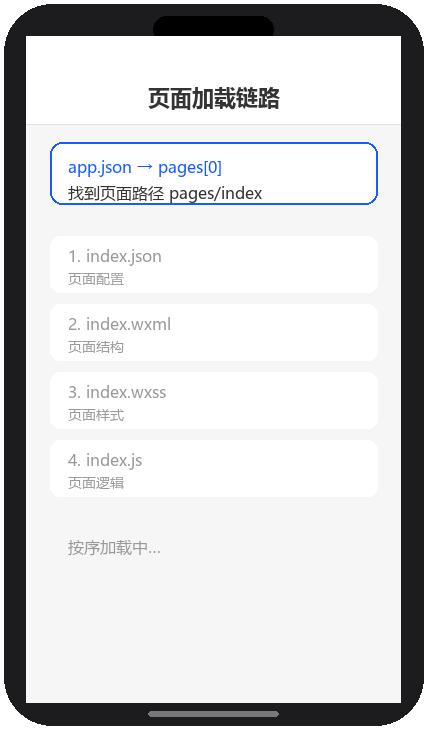

# 项目结构

## 为什么读这篇

打开一个新建的小程序工程，你会看到一堆文件。这篇讲清楚每个文件的职责、它们如何协作，以及页面是怎么被注册和加载的。理解结构是理解小程序「配置驱动」思维的第一步。

前置知识：[环境准备](../01-入门/02-环境准备.md) 里新建过项目。

## 全局三件套

每个小程序工程根目录有且仅有三个全局文件（名字固定，不能改）：

### app.json — 全局配置

声明页面、窗口、tabBar、分包等。**新建页面必须在 pages 里注册**，否则无法访问。

```json
{
  "pages": [
    "pages/index/index",
    "pages/detail/detail"
  ],
  "window": {
    "navigationBarBackgroundColor": "#ffffff",
    "navigationBarTitleText": "我的小程序",
    "navigationBarTextStyle": "black"
  },
  "tabBar": {
    "color": "#999999",
    "selectedColor": "#1296db",
    "list": [
      { "pagePath": "pages/index/index", "text": "首页" },
      { "pagePath": "pages/detail/detail", "text": "详情" }
    ]
  },
  "sitemapLocation": "sitemap.json"
}
```

要点：

- `pages` 数组第一项是**首页**（启动时加载的页面）
- `window` 控制顶部导航栏样式，作用于所有页面（页面自己的 json 可覆盖）
- `tabBar` 定义底部标签栏，`pagePath` 必须是已注册页面，2~5 个 tab
- 修改 app.json 后必须重新编译生效

### app.js — 全局逻辑

小程序入口，可调用 `App()` 注册小程序实例：

```js
App({
  onLaunch() {
    // 小程序初始化时执行一次（冷启动）
    console.log('小程序启动');
    // 典型用途：wx.login 拿登录态、读取全局配置
  },
  globalData: {
    userInfo: null
  }
})
```

页面里通过 `getApp()` 拿到实例：

```js
const app = getApp();
console.log(app.globalData.userInfo);
```

### app.wxss — 全局样式

作用于所有页面，适合放公共样式（reset、通用类名）：

```css
/* app.wxss */
page {
  background-color: #f7f7f7;
  font-size: 28rpx;
}
.container {
  padding: 20rpx;
}
```

页面自己的 wxss 会与全局样式叠加，同名规则按**页面样式优先**（样式隔离细节见 [WXSS 样式与 rpx](../02-基础/02-WXSS样式与rpx.md)）。

## 页面四件套

每个页面由**同名同目录**的四个文件组成，如 `pages/index/` 下：

| 文件 | 作用 | 类比 |
|---|---|---|
| `index.wxml` | 页面结构（视图） | HTML |
| `index.wxss` | 页面样式 | CSS |
| `index.js` | 页面逻辑与数据 | JS |
| `index.json` | 页面级配置（窗口、组件声明） | 局部配置 |

一个最小页面示例：

**index.wxml**

```wxml
<view class="card">
  <text>{{title}}</text>
  <button bindtap="onTap">点我</button>
</view>
```

**index.js**

```js
Page({
  data: {
    title: '第一页'
  },
  onTap() {
    this.setData({ title: '被点了' });
  }
})
```

**index.json**

```json
{
  "navigationBarTitleText": "首页",
  "usingComponents": {}
}
```

页面 json 里常用：`navigationBarTitleText`（标题）、`usingComponents`（声明用到的自定义组件，见 [自定义组件](../03-进阶/02-自定义组件.md)）、`enablePullDownRefresh`（下拉刷新）。

## 页面如何被加载

页面加载链路演示（渲染示意图动画：app.json 定位页面 → 四件套按序加载 → Page() 注册 → 渲染完成）：



完整链路：

1. 冷启动读 `app.json` 的 `pages`，找到首页路径
2. 加载对应目录的四个文件：先 json（配置）→ wxml（结构）→ wxss（样式）→ js（逻辑）
3. 执行 `Page({...})` 注册页面，触发生命周期（[页面生命周期与事件](../02-基础/04-页面生命周期与事件.md)）
4. 页面 `data` 与 wxml 的 `{{}}` 绑定，渲染出界面

## 页面加载的内部机制

页面加载不是简单的「读文件→显示」，背后有一条编译管线：

1. **编译期**：开发者工具把 WXML 编译为 JS 模板函数（不是直接传 HTML），WXSS 编译为样式规则。这意味着运行时渲染的是 JS 函数执行结果，不是静态 HTML——所以 `document.getElementById` 不存在
2. **启动期**：`app.json` 的 `pages` 数组决定首页，框架按 json→wxml→wxss→js 顺序加载。json 先加载是因为它决定页面用哪些组件（`usingComponents`），框架需要预先注册
3. **渲染期**：逻辑层执行 `Page({data})` 后，data 序列化发送到渲染层，渲染层用模板函数 + data 生成虚拟 DOM，再 diff 到真实 DOM。首次渲染的耗时 = 代码包下载 + 编译 + 首次 setData + 渲染
4. **分包优化**：主包 > 2MB 时考虑分包——主包只放首页和 tabBar 页，其他页面按模块拆到子包，按需下载（[性能优化](../03-进阶/04-性能优化.md)）

理解这条链路，就能理解为什么首屏优化要关注代码包大小、setData 数据量、组件预注册。

## 目录组织建议

小项目（单包 < 2MB）：

```text
miniprogram/
├── app.js / app.json / app.wxss
├── sitemap.json
├── pages/          # 页面，按功能分子目录
│   ├── index/
│   ├── detail/
│   └── mine/
├── components/     # 自定义组件
│   └── todo-item/
├── utils/          # 工具函数、请求封装
│   └── request.js
└── assets/         # 静态资源（图片等）
```

代码包超过 2MB 时用**分包**（`app.json` 的 `subpackages` 字段），主包保持 2MB 内；分包用于非首屏页面，显著降低启动加载量。

## 常见错误 / 避坑

1. **新建页面忘了注册**：在 `pages` 目录手建了文件但没加进 `app.json` 的 `pages`，编译报错 `page ... is not found`。开发者工具里右键目录「新建 Page」会自动注册。
2. **页面文件名与路径不一致**：小程序按「路径 + 同名」定位四件套，目录叫 `pages/index`，文件却叫 `home.wxml` 会导致无法解析。文件名必须与目录同名。
3. **改 app.json 不重新编译**：app.json 改动不触发自动热更，点「编译」才生效，容易误以为没生效。
4. **在页面 json 里写全局字段**：`tabBar`、`pages` 只能在 app.json；页面 json 只认窗口、组件等页面级字段，写错字段会被忽略且不易察觉。
5. **页面 js 忘记调用 Page()**：文件里只有裸对象 `{}` 没有包 `Page({})`，页面空白且 Console 报 `Component is not found`。

## 随堂测验

**Q1**: 小明在 `pages/` 目录下新建了 `pages/about/about.wxml` 等四个文件，编译后却报错 `page ... is not found`。他最可能遗漏了什么？
- [ ] A. 没有写 `about.js` 文件
- [ ] B. 没有在 `app.json` 的 `pages` 数组中注册该页面路径
- [ ] C. 没有在 `about.wxml` 里写 `<page>` 标签
- [ ] D. 没有安装最新版开发者工具

<details><summary>答案</summary>

**B**. 小程序通过 `app.json` 的 `pages` 数组定位所有页面，新建页面必须在其中注册路径，否则编译时找不到页面会报错。

</details>

**Q2**: 以下关于 `app.json` 和页面级 `index.json` 的职责划分，哪项描述是正确的？
- [ ] A. `tabBar` 可以写在任意页面的 json 里
- [ ] B. `app.json` 负责全局配置（pages、window、tabBar），页面 json 只负责本页的窗口标题、组件声明等页面级配置
- [ ] C. 页面 json 里可以声明 `pages` 数组来注册子页面
- [ ] D. `app.json` 和页面 json 的功能完全相同，只是作用范围不同

<details><summary>答案</summary>

**B**. `app.json` 是全局配置，管理页面注册、窗口样式和 tabBar；页面 json 只能配置本页的导航栏标题、自定义组件等页面级字段，写全局字段会被静默忽略。

</details>

**Q3**: 小红在 `app.wxss` 里定义了 `.card { padding: 10rpx; }`，又在 `pages/detail/detail.wxss` 里定义了 `.card { padding: 30rpx; }`。当 detail 页面里有一个 `class="card"` 的 view 时，它的 padding 最终是多少？
- [ ] A. 10rpx，因为全局样式优先级最高
- [ ] B. 30rpx，因为页面样式优先于全局样式
- [ ] C. 40rpx，两个样式叠加
- [ ] D. 0rpx，样式冲突导致都不生效

<details><summary>答案</summary>

**B**. 同名 CSS 规则下，页面 wxss 的优先级高于 app.wxss 全局样式（页面样式后加载，覆盖全局），所以最终 padding 为 30rpx。

</details>

**Q4**: 小程序冷启动时，页面加载的正确顺序是什么？
- [ ] A. wxml → js → wxss → json
- [ ] B. json（配置）→ wxml（结构）→ wxss（样式）→ js（逻辑）
- [ ] C. js → json → wxml → wxss
- [ ] D. 四个文件同时加载，没有固定顺序

<details><summary>答案</summary>

**B**. 小程序加载页面时按 json → wxml → wxss → js 的顺序依次读取四件套，先解析配置，再加载结构、样式，最后执行逻辑并触发 `Page()` 注册。

</details>

## 验证

- [ ] 说出全局三件套各自的职责
- [ ] 新建一个 `pages/detail` 页面（手写四个文件 + 注册 app.json），能从 index 跳转过去
- [ ] 说出页面四件套每个文件的最小职责
- [ ] 故意在 app.json 里加一个不存在的页面路径，观察编译报错并修复

## 延伸阅读

- 本库上一篇：[环境准备](../01-入门/02-环境准备.md)
- 本库下一篇：[WXML 数据绑定与渲染](../02-基础/01-WXML数据绑定与渲染.md)
- 官方：[小程序框架 · 全局配置 app.json](https://developers.weixin.qq.com/miniprogram/dev/reference/configuration/app.html)
- 官方：[小程序框架 · 页面配置](https://developers.weixin.qq.com/miniprogram/dev/reference/configuration/page.html)