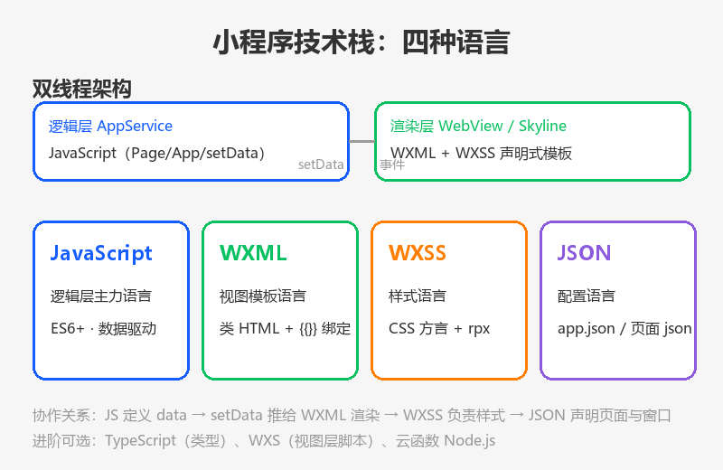
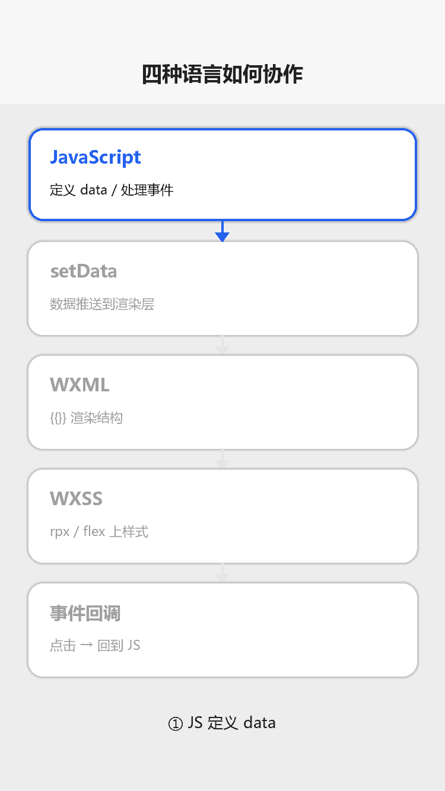

# 编程语言与技术栈

## 为什么读这篇

小程序不是「一种语言」写出来的，而是一套**四种语言分工协作**的技术栈。初学者最常见的困惑是：`{{}}` 是什么语法？为什么 JS 里改变量页面不动？为什么样式叫 WXSS 不叫 CSS？这篇一次性讲清楚：每种语言负责什么、四种语言如何协作、以及后续可以学的进阶语言。

前置知识：[认识小程序](../01-入门/01-认识小程序.md)；如果你会 HTML/CSS/JS 任何一项，这篇会很快。

## 技术栈全景

小程序技术栈（概念示意图：双线程架构 + 四种语言分工）：



四种语言各司其职：

| 语言 | 全称 | 类比 | 负责什么 | 文件后缀 |
|---|---|---|---|---|
| **JavaScript** | JavaScript | JS | 逻辑层：数据、事件、业务逻辑 | `.js` |
| **WXML** | WeiXin Markup Language | HTML | 视图层：页面结构、数据绑定 | `.wxml` |
| **WXSS** | WeiXin Style Sheets | CSS | 视图层：样式、响应式布局 | `.wxss` |
| **JSON** | JavaScript Object Notation | 配置 | 声明页面、窗口、组件 | `.json` |

## 核心：双线程架构

小程序运行时分两个独立线程，这是理解整个技术栈的钥匙：

```text
┌─────────────────────┐        ┌─────────────────────┐
│  逻辑层 AppService   │  setData│  渲染层（视图）      │
│                     │ ──────▶ │                     │
│  JavaScript         │  ◀───── │  WXML + WXSS        │
│  data / 业务逻辑     │   事件   │  页面结构与样式       │
└─────────────────────┘        └─────────────────────┘
```

- **逻辑层**：跑 JavaScript，负责数据与逻辑。**不能直接操作 DOM**（没有 `document`），这是与浏览器 JS 最大的区别
- **渲染层**：跑 WXML/WXSS，把数据渲染成界面
- **桥梁**：逻辑层 `setData()` 把数据推给渲染层；渲染层的用户事件（点击、输入）回调给逻辑层

推论（本库反复强调的规则）：**视图只认 data，改视图只能走 setData**——因为两线程之间没有别的通道。详见 [JS 逻辑层与数据驱动](../02-基础/03-JS逻辑层与数据驱动.md)。

## JavaScript：逻辑层主力语言

**你学的 JS 基本全能用**。小程序逻辑层基于现代 JS 引擎，支持：

- ES6+：`let`/`const`、箭头函数、模板字符串、解构赋值
- Promise 与 `async`/`await`（[网络请求与数据](../03-进阶/03-网络请求与数据.md) 的封装就用它）
- 可选链 `?.`、空值合并 `??`（较新基础库支持）

与浏览器 JS 的差异（**必须知道**）：

| 维度 | 浏览器 JS | 小程序 JS |
|---|---|---|
| DOM 操作 | `document.getElementById` 可用 | **不存在**，视图更新走 setData |
| 入口 | 全局作用域 | `App()` / `Page()` / `Component()` 构造器 |
| 网络 | `fetch` / `XMLHttpRequest` | `wx.request` 等 wx.* API |
| 本地存储 | `localStorage` | `wx.setStorageSync` 系列 |
| 模块 | ESM/CommonJS | 支持 `import` 与 `require` |

学完这篇后，你的 JS 技能**无缝迁移**，只需改掉「操作 DOM」的习惯。

## WXML：视图模板语言

WXML 是「类 HTML 的声明式模板」，与 HTML 的差别：

- **数据绑定**：用 `{{}}` 引用 JS data，如 `{{message}}`（HTML 没有这个概念）
- **指令**：`wx:if`、`wx:for`、`wx:key` 控制渲染逻辑（类似 Vue 的 `v-if`/`v-for`）
- **事件**：`bindtap` / `catchtap` 绑定事件（HTML 是 `onclick`）
- **没有 DOM 操作**：只有声明式渲染

```xml
<!-- WXML -->
<view wx:for="{{todos}}" wx:key="id">{{item.text}}</view>
```

详细语法见 [WXML 数据绑定与渲染](../02-基础/01-WXML数据绑定与渲染.md)。

如果你会 Vue，会非常亲切：`{{}}` 插值、指令、单向数据流几乎同构；但小程序没有 Vue 的响应式依赖追踪，一切更新显式走 setData。

## WXSS：样式语言

WXSS ≈ CSS + 两个小程序特性：

1. **rpx 响应式单位**：`750rpx = 屏幕宽度`，一套代码多机型自适应（[WXSS 样式与 rpx](../02-基础/02-WXSS样式与rpx.md)）
2. **样式隔离**：页面样式天然隔离，自定义组件默认完全隔离

```css
/* WXSS 与 CSS 语法一致 */
.card {
  width: 690rpx;
  display: flex;
  border-radius: 16rpx;
}
```

会 CSS 即可直接上手；注意选择器支持是 CSS 的子集（无属性选择器等）。

## JSON：配置语言

JSON 不写逻辑，只做**声明**，三种层级：

| 文件 | 声明内容 |
|---|---|
| `app.json` | 页面注册（pages）、窗口（window）、tabBar |
| 页面 `index.json` | 本页标题、自定义组件（usingComponents） |
| `project.config.json` | 开发者工具的项目配置（appid 等） |

JSON 语法严格要求：键值双引号、不能有注释、不能有尾逗号（[项目结构](../01-入门/03-项目结构.md) 有示例）。写错最常见表现：字段被静默忽略或编译报错。

## 四种语言如何协作：一次完整渲染

四种语言协作数据流（渲染示意图动画：JS 定义 data → setData 推送 → WXML 渲染 → WXSS 上样式 → 事件回调闭环）：



1. 冷启动读 `app.json` → 定位首页
2. 页面 `.js` 定义 `data`（JavaScript 的活）
3. WXML 用 `{{}}` 绑定 data → 渲染层出结构
4. WXSS 给结构上样式 → 用户看到界面
5. 用户点击 → 事件回调 JS → `setData()` → 回到第 3 步

## 进阶语言选择（学完基础后）

| 语言/技术 | 场景 | 本库覆盖 |
|---|---|---|
| **TypeScript** | 给 JS 加类型，工程化项目标配 | 未覆盖（资源篇进阶方向提及） |
| **WXS** | 视图层内的小脚本（`<wxs>` 标签），模板内做简单计算 | 未覆盖（[WXML 篇](../02-基础/01-WXML数据绑定与渲染.md) 提及） |
| **Node.js（云函数）** | 云开发后端逻辑，`exports.main` 入口 | 已覆盖：[云函数](../04-云开发/02-云函数.md) |
| **Taro / uni-app** | 用 React/Vue 语法写小程序（跨端） | 未覆盖（原生是基础） |

## 常见错误 / 避坑

1. **把 WXML 当 HTML 操作**：想用 `document` 或 jQuery 改页面——小程序里不存在 DOM API，视图只能靠 setData。
2. **把 WXSS 当完整 CSS**：属性选择器、通配符等不支持；样式不生效先查选择器是否超集。
3. **JSON 写注释/尾逗号**：`// 注释` 或 `{ "a": 1, }` 直接编译失败；JSON 只能纯数据。
4. **混淆 WXML 与 JS 的作用域**：WXML 只能访问页面 `data` 和方法，不能调用任意 JS 函数（除非 WXS 模块）；需要计算先算好放进 data。
5. **以为要学「小程序专属语言」**：没有这种东西——JS 是通用语言，WXML/WXSS 是类 HTML/CSS 的方言，JSON 是通用格式；你已有的 Web 技能大部分直接迁移。

## 验证

- [ ] 说出四种语言各自负责什么、后缀是什么
- [ ] 画出双线程架构图（逻辑层/渲染层/setData/事件），并解释为什么「直接改 data 视图不更新」
- [ ] 对照「浏览器 JS vs 小程序 JS」表，找出自己之前 Web 开发中会被小程序禁止的习惯（如 DOM 操作）
- [ ] 用一个你会的 Web 概念（Vue 指令 / CSS / fetch）类比小程序对应物，验证迁移路径
- [ ] 说出学完基础后三个进阶语言方向（TS / WXS / Node.js 云函数）各解决什么问题

## 延伸阅读

- 本库上一篇：[认识小程序](../01-入门/01-认识小程序.md)
- 本库下一篇：[环境准备](../01-入门/02-环境准备.md)
- 本库：[JS 逻辑层与数据驱动](../02-基础/03-JS逻辑层与数据驱动.md)（语言协作的核心）
- 官方：[小程序框架概述（双线程）](https://developers.weixin.qq.com/miniprogram/dev/framework/)
- 官方：[WXS（视图层脚本）](https://developers.weixin.qq.com/miniprogram/dev/framework/view/wxs/)