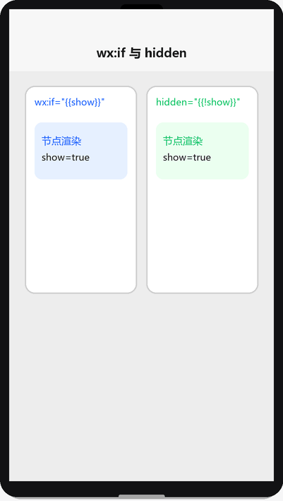
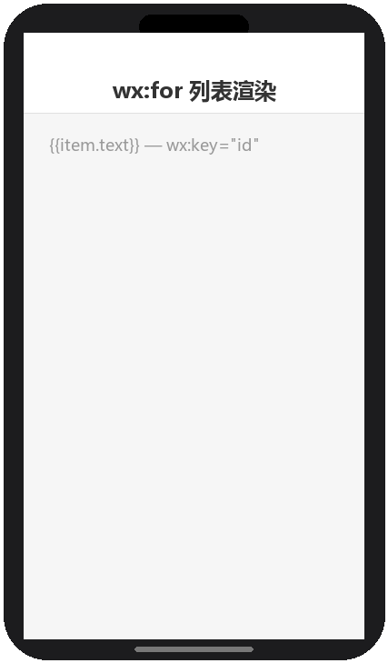

# WXML 数据绑定与渲染

## 为什么读这篇

WXML（WeiXin Markup Language）是小程序的视图层语言，负责「把 JS 数据渲染成界面」。它与 HTML 最大的区别：**不支持操作 DOM，只做声明式数据绑定**——你声明数据和结构的映射关系，数据变了视图自动更新。这篇覆盖 WXML 最核心的四块：数据绑定、条件渲染、列表渲染、模板复用。

前置知识：[项目结构](../01-入门/03-项目结构.md) 页面四件套；基础 JS 语法。

## 数据绑定：`{{}}`

WXML 用双花括号把 JS 的 `data` 绑定到视图。**任何想动态显示的内容都必须走 `{{}}`**，这是小程序数据驱动的根基（数据流详解见 [JS 逻辑层与数据驱动](../02-基础/03-JS逻辑层与数据驱动.md)）。

### 绑定文本

**index.js**

```js
Page({
  data: {
    name: '小明',
    score: 88,
    isVip: true
  }
})
```

**index.wxml**

```wxml
<view>{{name}}</view>
<view>我的分数：{{score}}</view>
<view>会员状态：{{isVip ? '是' : '否'}}</view>
```

### 绑定属性

```wxml
<image src="{{userAvatar}}" mode="aspectFill"></image>
<view class="{{isVip ? 'vip' : 'normal'}}">内容</view>
<button disabled="{{!isVip}}">按钮</button>
```

注意：**组件属性值里出现 `{{}}`，整个属性值会被当作绑定表达式解析**。所以布尔值、数字不能省略花括号，`disabled="{{true}}"` 是布尔 true，而 `disabled="true"` 是字符串 "true"。

### 绑定运算

`{{}}` 内支持有限表达式（不支持语句）：

```wxml
<view>{{score + 1}}</view>
<view>{{score > 90 ? '优秀' : '加油'}}</view>
<view>{{'前缀-' + name}}</view>
<view>{{[1, 2, 3].length}}</view>
```

不支持：变量赋值、函数调用（除非是 WXS 模块，见官方文档）。

## 条件渲染：`wx:if` 系列

### wx:if / wx:elif / wx:else

```wxml
<view wx:if="{{score >= 90}}">优秀</view>
<view wx:elif="{{score >= 60}}">及格</view>
<view wx:else>不及格</view>
```

`wx:if` 是**惰性渲染**：条件为假时节点不创建、不占位。适合切换不频繁、首屏不需要的场景。

### hidden 对比

`wx:if` vs `hidden` 演示（渲染示意图动画：show 切换时 wx:if 节点销毁重建，hidden 节点始终在 DOM 仅隐藏）：



```xml
<view hidden="{{!isVip}}">VIP 专属内容</view>
```

`hidden` 是**始终渲染、仅控制显示**（相当于 CSS `display:none`）。适合切换频繁的场景（性能更好），但节点一直在。

选择依据：

| 场景 | 用哪个 |
|---|---|
| 首次就不需要、条件很少变化 | `wx:if` |
| 频繁切换显示/隐藏 | `hidden` |
| 列表项内部的条件渲染 | `wx:if`（避免 hidden 造成布局抖动） |

## 列表渲染：`wx:for`

### 基本用法

列表渲染演示（渲染示意图动画：`wx:for` 逐条渲染数组项）：



**index.js**

```js
Page({
  data: {
    todos: [
      { id: 1, text: '学习 WXML' },
      { id: 2, text: '学习 WXSS' },
      { id: 3, text: '写个 demo' }
    ]
  }
})
```

**index.wxml**

```wxml
<view wx:for="{{todos}}" wx:key="id">
  {{index}} - {{item.text}}
</view>
```

- `item`：当前项（默认名，可用 `wx:for-item` 改名）
- `index`：当前下标（默认名，可用 `wx:for-index` 改名）

### 为什么必须写 wx:key

`wx:key` 给每个列表项一个稳定标识，让渲染层在数据变化时**复用已有节点**而不是全量重建：

```wxml
<view wx:for="{{todos}}" wx:key="id">{{item.text}}</view>
```

- 数组元素是对象：`wx:key="唯一字段名"`（如上 `id`）
- 数组元素是字符串/数字：`wx:key="*this"`

**不写 wx:key**：列表数据增删/重排时可能复用错误节点，出现渲染错乱，且在 Console 有警告。这是新手最常见的坑。

### 嵌套列表

```wxml
<view wx:for="{{groups}}" wx:for-item="group" wx:for-index="gIndex" wx:key="id">
  <text>{{gIndex}}.{{group.name}}</text>
  <view wx:for="{{group.items}}" wx:for-item="item" wx:key="id">
    - {{item.title}}
  </view>
</view>
```

内层必须改名（`wx:for-item`），否则与外层 `item` 冲突。

## block：无实体容器

`<block>` 不产生真实节点，只用来包裹条件/循环逻辑：

```wxml
<block wx:if="{{isLogin}}">
  <view>欢迎回来</view>
  <view>{{userName}}</view>
</block>

<block wx:for="{{todos}}" wx:key="id">
  <view>{{item.text}}</view>
</block>
```

渲染结果里没有 `<block>` 标签本身，只有内部节点——需要同时渲染多个节点又不能加包裹层时用。

## 模板复用：template

### 定义与引用

**定义模板（如 templates/item.wxml）**

```wxml
<template name="todoItem">
  <view class="todo-item">
    <text>{{text}}</text>
    <text class="status">{{done ? '已完成' : '未完成'}}</text>
  </view>
</template>
```

**使用模板**

```wxml
<import src="../../templates/item.wxml" />
<template is="todoItem" data="{{text: item.text, done: item.done}}" />
```

要点：

- `import` 引入模板文件；`template is` 指定名字；`data` 传参（**必须显式传**，模板不能访问页面 data）
- `import` 有作用域：不能递归引用，且 import 的模板里 import 的模板对当前文件不可见
- 另一种 `include`：把目标文件的**整个内容**原样展开到当前位置（适合公共头部/底部片段），无作用域概念

```wxml
<!-- header.wxml -->
<view class="header">公共头部</view>

<!-- 页面内 -->
<include src="../../templates/header.wxml" />
```

## 常见错误 / 避坑

1. **不写 wx:key**：列表重排/删除后渲染错乱（复用了错误的节点），且 Console 警告。数组对象给 `id`，基本类型给 `*this`。
2. **属性布尔值不带花括号**：`disabled="false"` 是字符串 `"false"`（恒真），必须 `disabled="{{false}}"` 才是布尔 false。这个坑会导致按钮永远不可点。
3. **`{{}}` 里写复杂逻辑**：只支持表达式不支持语句；需要计算就提前在 JS 里算好放进 data，或使用 WXS（详见官方文档）。
4. **template 忘记传 data**：模板里引用的变量不是页面 data 的全局可见，`<template is="xx" />` 不传 `data` 就是空数据，页面无内容且不报错。
5. **hidden 与 wx:if 混用直觉**：hidden 节点始终在 DOM 里，若其中包含高成本子组件，即使 hidden 也仍会初始化，此时应改用 wx:if。

## 验证

- [ ] 用 `{{}}` 完成：文本绑定、属性绑定（class 切换）、三元运算各一个
- [ ] 用 `wx:for` 渲染一个对象数组，正确设置 `wx:key`
- [ ] 实现「点击按钮切换某个区域显示/隐藏」，分别用 `wx:if` 和 `hidden` 各做一遍，并说明两者差异
- [ ] 用 template 抽出一个列表项模板，在页面中复用两次
- [ ] 故意不写 `wx:key`，在 Console 观察警告，再补上对比渲染行为

## 延伸阅读

- 本库上一篇：[项目结构](../01-入门/03-项目结构.md)
- 本库下一篇：[WXSS 样式与 rpx](../02-基础/02-WXSS样式与rpx.md)
- 官方：[WXML 语法参考](https://developers.weixin.qq.com/miniprogram/dev/reference/wxml/)
- 官方：[WXS 模块（视图层脚本）](https://developers.weixin.qq.com/miniprogram/dev/framework/view/wxs/)
