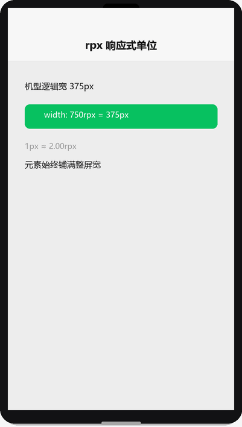

# WXSS 样式与 rpx

## 为什么读这篇

WXSS（WeiXin Style Sheets）是 CSS 的小程序方言：语法与 CSS 一致，但引入了 **rpx 响应式单位**，并规定了全局/页面样式的作用域规则。会写 CSS 的话这篇可作速查；不会的话这是你写页面样式的第一课。

前置知识：[WXML 数据绑定与渲染](../02-基础/01-WXML数据绑定与渲染.md)；基本 CSS 概念（选择器、盒模型）。

## rpx：响应式单位

rpx（responsive pixel）是小程序的核心长度单位。规则一句话：

> **任何屏幕宽度 = 750rpx**。

- iPhone 6（375px 逻辑宽）：`1px = 2rpx`
- 全面屏手机（如 390px 逻辑宽）：`1px ≈ 1.95rpx`

所以用 rpx 写尺寸，**同一套代码在不同宽度机型上自动等比缩放**，无需媒体查询。

```css
.container {
  width: 750rpx;        /* 撑满全屏 */
  padding: 32rpx;
}
.card {
  width: 690rpx;        /* 常见留白卡片：750 - 2*30 */
  height: 200rpx;
  font-size: 32rpx;
}
```

### 单位对比

rpx 响应式演示（渲染示意图动画：同一套 750rpx 代码在 375px 与 390px 逻辑宽机型上等比铺满，无需媒体查询）：



| 单位 | 含义 | 特点 | 建议场景 |
|---|---|---|---|
| rpx | 屏幕宽 1/750 | 自适应缩放 | **布局、字号、间距的主力单位** |
| px | 物理无关的 CSS 像素 | 固定不缩放 | 1px 边框、固定小元素 |
| vw/vh | 视口宽/高百分比 | 跟随视口 | 全屏容器、吸顶栏 |
| % | 父容器百分比 | 跟随父级 | 常规布局 |
| rem | 根字号倍数 | 小程序里不常用 | 一般不用 |

经验：**默认用 rpx，需要「固定不随机型缩放」的细节（如 1px 分隔线）用 px**。

## 选择器

WXSS 支持的选择器比 CSS 少，常用这些：

| 选择器 | 示例 | 说明 |
|---|---|---|
| 类 | `.card` | 最常用 |
| ID | `#title` | 尽量少用 |
| 标签 | `view` | 作用于所有同类组件 |
| 后代 | `.card .title` | 后代选择 |
| 伪类 | `::after`、`:active` | 支持一部分 |

**不支持**：属性选择器 `[data-x]`、`*` 通配符（部分版本）、兄弟选择器等高级选择器。样式中少依赖复杂选择器，多用 class。

```css
/* 合法示例 */
.card { border-radius: 16rpx; }
.card .title { font-weight: bold; }
.button:active { opacity: 0.7; }
```

## flex 布局：小程序布局主力

小程序页面基本用 flex 完成 90% 的布局。三个必会属性：

```css
.row {
  display: flex;              /* 横向排列 */
  align-items: center;        /* 垂直居中 */
  justify-content: space-between; /* 主轴分布 */
  gap: 20rpx;                 /* 间距（较新基础库支持，不确定时用 margin） */
}
.column {
  display: flex;
  flex-direction: column;     /* 纵向排列 */
}
.flex-1 {
  flex: 1;                    /* 占据剩余空间 */
}
```

典型布局：顶部导航 + 底部操作栏 + 中间滚动区。

```css
.page {
  display: flex;
  flex-direction: column;
  height: 100vh;
}
.content {
  flex: 1;                    /* 中间自适应 */
  overflow-y: auto;
}
.footer {
  height: 100rpx;
}
```

```wxml
<view class="page">
  <view class="content">滚动内容</view>
  <view class="footer">底部按钮</view>
</view>
```

## 样式导入：@import

公共样式抽成文件，用 `@import` 引入（注意结尾分号，路径相对当前文件）：

```css
/* app.wxss */
@import "styles/common.wxss";
```

```css
/* styles/common.wxss */
.btn-primary {
  background: #07c160;
  color: #fff;
  border-radius: 12rpx;
}
```

## 全局样式与页面样式隔离

三条规则：

1. **app.wxss 全局生效**：所有页面可用，适合 reset 与公共类
2. **页面 wxss 仅本页生效**：不影响其他页面（这点与普通 CSS 不同，天然隔离）
3. **同名规则优先级**：页面样式优先于全局样式（后加载者胜出，页面 wxss 后于 app.wxss 加载）

自定义组件内另有**样式隔离**规则（默认组件内样式不影响外部、外部也不影响组件内），见 [自定义组件](../03-进阶/02-自定义组件.md)。

## 常见错误 / 避坑

1. **rpx 与 px 混用想当然**：写了 `width: 375px` 的意图可能是「一半屏」，但不同机型结果完全不同；布局尺寸一律 rpx，px 只留给固定细节。
2. **flex 忘写 `flex-direction` 或容器没高度**：`justify-content` 是主轴（默认水平）对齐，想纵向分布要先 `flex-direction: column`；flex 布局中高度塌陷时检查父容器高度。
3. **`gap` 依赖基础库版本**：低版本基础库不认 `gap`，间距用 margin 更保险（margin 注意最后一个元素的边距问题）。
4. **选择器写复杂导致样式不生效**：属性选择器、`>` 子选择器在部分环境失效，换成 class 组合。
5. **页面样式「没生效」其实是全局覆盖**：如果 app.wxss 和页面 wxss 都有 `.card`，想覆盖必须保证选择器优先级相同或更高；用更具体的 class 命名（`.detail-card`）规避。
6. **rpx 在 Skyline 下的差异**：Skyline 渲染引擎（基础库 ≥ 3.0.2、客户端 ≥ 8.0.40）对部分 CSS 能力支持不同，迁移时用官方 [Skyline 迁移指南](https://developers.weixin.qq.com/miniprogram/dev/framework/runtime/skyline/migration/best-practice.html) 检查。

## 验证

- [ ] 用 rpx 写出一个「上中下」布局：顶栏 + 自适应中部 + 底栏
- [ ] 用 flex 实现横向导航（3 个按钮均匀分布）与纵向卡片列表
- [ ] 抽一个 `common.wxss` 放公共按钮样式，在页面 `@import` 使用
- [ ] 在 app.wxss 和页面 wxss 里同时定义同名 class，验证页面优先规则
- [ ] 换不同机型模拟器查看布局是否等比缩放

## 延伸阅读

- 本库上一篇：[WXML 数据绑定与渲染](../02-基础/01-WXML数据绑定与渲染.md)
- 本库下一篇：[JS 逻辑层与数据驱动](../02-基础/03-JS逻辑层与数据驱动.md)
- 官方：[WXSS 样式](https://developers.weixin.qq.com/miniprogram/dev/framework/view/wxss.html)
- 官方：[Skyline 渲染引擎迁移](https://developers.weixin.qq.com/miniprogram/dev/framework/runtime/skyline/migration/best-practice.html)
