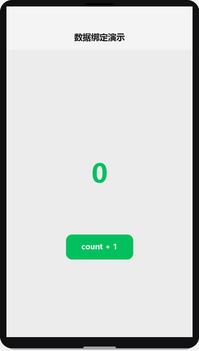
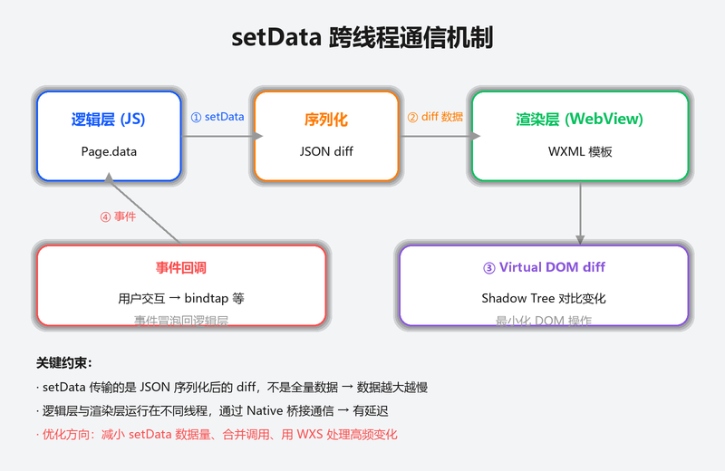

# JS 逻辑层与数据驱动

## 为什么读这篇

小程序把「逻辑」和「视图」分成两个独立线程：JS 跑在逻辑层，WXML 跑在渲染层。两者之间唯一的桥梁是 `data` + `setData`。**不理解这条数据流，就会出现「JS 里改了变量页面没反应」的困惑**。这篇讲透数据驱动模型、Page 构造器、模块化写法。

前置知识：[WXML 数据绑定与渲染](../02-基础/01-WXML数据绑定与渲染.md)、[WXSS 样式与 rpx](../02-基础/02-WXSS样式与rpx.md)、基本 JavaScript（对象、函数、ES6）。

## 双线程架构与数据流

```text
┌─────────────┐   setData()   ┌──────────────┐
│  逻辑层      │ ────────────▶ │  渲染层       │
│ (JS 引擎)    │  数据快照      │ (WXML 视图)   │
│ data: {...}  │ ◀──────────── │              │
└─────────────┘     事件/回调   └──────────────┘
```

规则只有一条，但最重要：

> **视图只认 `data`；修改视图的唯一方式是通过 `this.setData()` 更新 `data`。**

数据流演示（渲染示意图动画：点击按钮 → setData → 数字更新）：



- `this.data.xxx = 1` 直接改：数据变了，但**视图不更新**
- `this.setData({ xxx: 1 })`：数据变 + 视图同步更新

```js
Page({
  data: {
    count: 0
  },
  add() {
    // ❌ 错：视图不会更新
    this.data.count += 1;

    // ✅ 对：setData 后视图自动更新
    this.setData({ count: this.data.count + 1 });
  }
})
```

为什么这么设计？双线程之间传递整块数据成本高，`setData` 采用「**只传变更的部分 + 视图层 diff 更新**」的策略。所以：

- 每次 setData 只传**最小变更集**，不要整块 data 全传
- 高频调用（如滚动事件里 setData）会触发大量渲染层计算，注意节流

### setData 内部做了什么

理解这条链路，才能理解所有性能建议的由来。一次 `setData` 的完整路径：



```text
逻辑层 JS 线程                          视图层（渲染线程）
─────────────                          ─────────────────
setData({...})
  ├─ ① 数据深拷贝（把要更新的部分复制出来）
  ├─ ② 序列化 + 跨线程通信 ───────────▶ ③ 反序列化
  │                                       ├─ ④ 数据更新算法（diff：定位要更新的绑定）
  │                                       └─ ⑤ 更新渲染树
  └─ ⑥ 回调（setData 的第二个参数）
```

关键点：

- **① 深拷贝**：数据会被复制一次，所以 `setData` 后逻辑层继续改原对象**不影响**已提交的更新；也意味着大数据量有拷贝成本
- **② 跨线程通信**：这是双线程架构的固定代价，无法避免，只能减少次数与数据量
- **④ 数据更新算法**（官方机制）：框架在「**虚拟树更新**（遍历整棵 Shadow 树找绑定）」和「**绑定映射表更新**（用小更新直接定位绑定表达式，免遍历）」间自动选择——条件苛刻（单独更新一个字段 + 该字段未用于 `wx:if`/`wx:for`）。**算法的成本与 Shadow 树节点量正相关**，这是「拆组件优于减数据」的根因

```js
// ❌ 低效：整个列表重传
this.setData({ list: this.data.list.concat([newItem]) });

// ✅ 高效：只传变更路径（还可能命中免遍历的算法）
this.setData({ 'list[5]': newItem });
```

原理细节、量化手段与完整优化清单见 [性能优化](../03-进阶/04-性能优化.md)。

## Page 构造器

每个页面 js 文件调用 `Page(options)` 注册页面，常用字段：

```js
Page({
  data: { ... },        // 页面初始数据（WXML 绑定的数据源）
  onLoad(query) { ... }, // 生命周期：页面加载（query 为页面参数）
  onShow() { ... },      // 生命周期：页面显示
  onHide() { ... },      // 生命周期：页面隐藏
  onUnload() { ... },    // 生命周期：页面卸载
  // 自定义方法（WXML 里 bindtap 等事件绑定的就是这些方法）
  onTapButton() {
    this.setData({ ... });
  }
})
```

生命周期时机与顺序详见 [页面生命周期与事件](../02-基础/04-页面生命周期与事件.md)。

### 页面间跳转与参数

```js
// 跳转并传参（url 后跟 ?key=value）
wx.navigateTo({
  url: '/pages/detail/detail?id=42'
});
```

```js
// 详情页接收
Page({
  onLoad(query) {
    console.log(query.id); // "42"，注意是字符串
  }
})
```

## 模块化

小程序支持 CommonJS 与 ES6 Module 两种写法（开发者工具默认支持两者）。

### CommonJS（经典写法）

```js
// utils/format.js
function formatTime(ts) {
  return new Date(ts).toLocaleString();
}
module.exports = { formatTime };
```

```js
// pages/index/index.js
const { formatTime } = require('../../utils/format');

Page({
  data: { timeText: '' },
  onLoad() {
    this.setData({ timeText: formatTime(Date.now()) });
  }
})
```

### ES6 Module（推荐，现代写法）

```js
// utils/request.js
export function get(url) { ... }
export const BASE_URL = 'https://api.example.com';
```

```js
import { get, BASE_URL } from '../../utils/request';
```

注意：页面 js 里 `Page({})` 包裹的结构无法直接 `export`，**工具函数放独立文件再 import**。

## ES6+ 语法支持

小程序逻辑层基于较新的 JS 引擎，支持：

- `let` / `const`、箭头函数、模板字符串
- 解构赋值、展开运算符、`Object.assign`
- Promise、`async` / `await`
- 部分 ES2020+ 特性（`?.` 可选链、`??` 空值合并，需基础库较新）

```js
async function fetchList() {
  const res = await get('/list');       // 假设 get 返回 Promise
  console.log(res?.data ?? []);
}
```

**注意**：`async/await` 在低版本基础库/旧客户端可能不被支持（会报语法错误），生产环境建议通过「本地设置 → 增强编译」或构建插件转译（详见官方 [ES6 转 ES5](https://developers.weixin.qq.com/miniprogram/dev/devtools/codecompile.html)）。一般开发工具默认开了增强编译，模拟器正常、真机报错时优先检查此项。

## getApp 与 getCurrentPages

```js
// app.js
App({
  globalData: { userInfo: null },
  onLaunch() { /* 冷启动只执行一次 */ }
})
```

```js
// 任何页面
const app = getApp();
app.globalData.userInfo = { name: '小明' }; // 跨页面共享数据
```

- `getApp()`：获取全局 App 实例，`globalData` 是跨页面共享数据的惯用位置
- `getCurrentPages()`：返回当前页面栈数组，常用于拿上一页实例或做返回判断

```js
const pages = getCurrentPages();
const prev = pages[pages.length - 2]; // 上一页
if (prev) prev.setData({ ... });      // 直接改上一页数据（谨慎使用）
```

## 常见错误 / 避坑

1. **直接改 `this.data` 期待视图更新**：这是头号新手坑。记住视图只认 `setData`。排查思路：Console 打印 data 已变但界面没动 → 检查是否走了 setData。
2. **setData 传了整个大对象**：列表长、数据大时渲染层开销高，页面卡顿。改成路径式更新 `'list[3].title'`。
3. **在 data 里放函数**：data 只应放可序列化数据；函数放 Page 方法或独立模块，放 data 里既不能绑事件也不该存在。
4. **async/await 真机报错**：模拟器正常真机语法错误，多半是增强编译未开或基础库过旧，检查工具「本地设置」。
5. **onLoad 里拿不到页面参数**：参数在 `onLoad(query)` 的第一个参数里，不是 `this.data`；注意值全是字符串。
6. **require 路径写错**：`require('../../utils/format')` 的 `..` 层级数错会 `module not found`；路径相对当前文件。

## 随堂测验

**Q1**: 小红写了一个计数器，点击按钮后执行 `this.data.count += 1`。她发现 Console 打印 `this.data.count` 确实增加了，但页面上显示的数字始终没变。以下哪项解释最准确？
- [ ] A. `this.data` 是只读属性，不能直接修改
- [ ] B. 直接修改 `this.data` 只改变了逻辑层的变量值，没有通过 `setData` 通知渲染层，所以视图不会更新
- [ ] C. WXML 的 `{{count}}` 绑定只在页面首次加载时读取一次值
- [ ] D. 小程序的 JS 引擎不支持 `+=` 运算符

<details><summary>答案</summary>

**B**. 双线程架构下，逻辑层和渲染层之间唯一的通信通道是 `setData`；直接修改 `this.data` 只改变逻辑层内存中的值，渲染层收不到变更通知，视图自然不会刷新。

</details>

**Q2**: 小明有一个包含 100 条数据的列表，用户点击「完成」按钮后将第 5 条标记为已完成。以下哪种 `setData` 写法性能最优？
- [ ] A. `this.setData({ list: newList })`，把整个列表重新传一遍
- [ ] B. `this.setData({ 'list[4].done': true })`，只传变更路径上的最小数据
- [ ] C. `this.data.list[4].done = true`，直接修改 data 最高效
- [ ] D. 先 `JSON.stringify` 整个列表再 `setData`

<details><summary>答案</summary>

**B**. `setData` 会对传入的数据做深拷贝并跨线程传输，传整个列表的开销远大于路径式更新 `'list[4].done': true`；路径式写法只传最小变更集，还可能命中框架的「绑定映射表」免遍历算法，性能最优。

</details>

**Q3**: 小红在 `utils/format.js` 里导出了一个日期格式化函数，在页面 js 中想使用它。以下哪种导入方式是正确的？
- [ ] A. 直接在页面 js 里写 `formatDate()`，小程序会自动识别
- [ ] B. `import { formatDate } from '../../utils/format'` 或 `const { formatDate } = require('../../utils/format')`
- [ ] C. 在 app.json 里声明 `"utils": ["utils/format.js"]`
- [ ] D. 把函数放到 `data` 里，WXML 直接调用

<details><summary>答案</summary>

**B**. 小程序支持 CommonJS（`require`/`module.exports`）和 ES6 Module（`import`/`export`）两种模块化方式，工具函数放独立文件再通过相对路径 import 是标准做法；路径相对当前文件，`..` 层级要写对。

</details>

**Q4**: 小李在页面 A 通过 `wx.navigateTo` 跳转到页面 B，并在 URL 中传了 `?id=42`。页面 B 的 `onLoad` 中应该如何正确获取这个参数？
- [ ] A. 从 `this.data.id` 中读取
- [ ] B. 从 `onLoad(query)` 的第一个参数中读取 `query.id`，注意值是字符串类型
- [ ] C. 用 `wx.getStorageSync('id')` 读取
- [ ] D. 从 `app.json` 的 `globalData` 中读取

<details><summary>答案</summary>

**B**. 页面跳转传的参数通过 `onLoad(query)` 的 query 对象传入，`query.id` 即为 `"42"`（字符串类型）；它不在 `this.data` 里，也不走本地存储。

</details>

## 验证

- [ ] 写一个计数器：按钮点击 +1，视图实时更新；再故意用 `this.data.count += 1` 试一次，观察视图不动的现象并修复
- [ ] 把一段工具逻辑（如日期格式化）抽到 `utils/` 模块，用 import/require 在页面里调用
- [ ] 用 async/await 写一个模拟请求（setTimeout 包 Promise）并渲染结果
- [ ] 在 app.js 的 globalData 放一个值，两个页面里分别读取，验证跨页面共享
- [ ] 跳转页面传参（`?id=42`），在目标页 onLoad 打印 query

## 延伸阅读

- 本库上一篇：[WXSS 样式与 rpx](../02-基础/02-WXSS样式与rpx.md)
- 本库下一篇：[页面生命周期与事件](../02-基础/04-页面生命周期与事件.md)
- 官方：[逻辑层](https://developers.weixin.qq.com/miniprogram/dev/framework/app-service/)
- 官方：[setData 文档](https://developers.weixin.qq.com/miniprogram/dev/reference/api/Page.html)