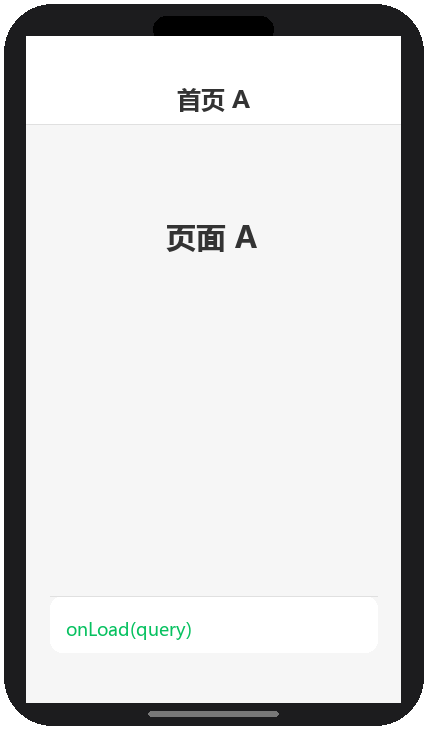
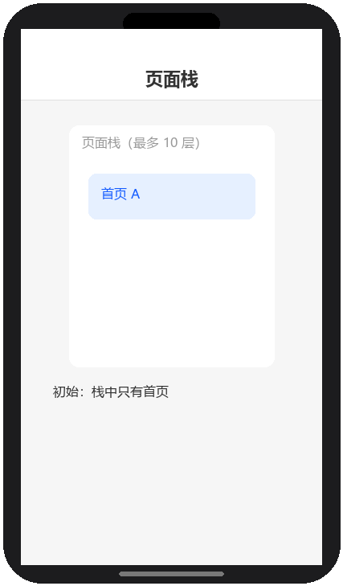
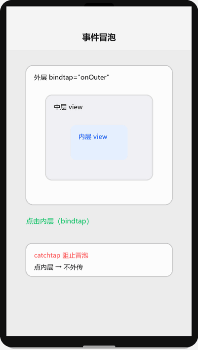

# 页面生命周期与事件

## 为什么读这篇

「什么时候该发请求、什么时候该存数据、点击后怎么把参数带进处理函数」——答案全在生命周期与事件系统里。写错时机最常见的症状：首屏数据没加载、返回上一页数据不同步、事件参数取错。这篇把两件事讲透：**生命周期触发时机表** 和 **事件对象怎么用**。

前置知识：[JS 逻辑层与数据驱动](../02-基础/03-JS逻辑层与数据驱动.md)。

## 应用生命周期：App()

`app.js` 里 `App(options)` 的生命周期，整个小程序只执行一套：

| 方法 | 触发时机 | 典型用途 |
|---|---|---|
| `onLaunch` | 小程序**冷启动**初始化完成时（首次打开） | 登录（wx.login）、读取全局配置 |
| `onShow` | 启动时、或从后台切回前台时 | 刷新全局数据 |
| `onHide` | 切到后台（如按 Home 键）时 | 保存草稿、停止计时器 |
| `onError` | 脚本报错时 | 错误上报 |

```js
App({
  onLaunch() {
    console.log('冷启动');
  },
  onShow() {
    console.log('回到前台');
  },
  globalData: {}
})
```

注意：**切后台再回来，App 不重建**（除非被系统回收），`onLaunch` 只在冷启动执行一次。

## 页面生命周期：Page()

页面的标准生命周期顺序（首次打开）：

```text
onLoad → onShow → onReady →（交互…）→ onHide → onUnload
```

生命周期切换演示（渲染示意图动画：首页 A 加载 → 跳详情页 B → 返回 A → 卸载，标注各阶段触发的事件）：



| 方法 | 触发时机 | 典型用途 |
|---|---|---|
| `onLoad(query)` | 页面加载（首次创建）一次 | 读页面参数、拉取首屏数据 |
| `onShow` | 页面每次显示（含从后台/下级页返回） | 刷新可见性相关数据 |
| `onReady` | 页面首次渲染完成 | 操作 canvas/组件实例 |
| `onHide` | 页面隐藏（跳走/切后台） | 暂停耗时任务 |
| `onUnload` | 页面销毁 | 清理监听、定时器 |
| `onPullDownRefresh` | 用户下拉刷新（需 json 开启） | 重新拉数据 |
| `onReachBottom` | 滚动触底 | 加载下一页（分页） |
| `onShareAppMessage` | 用户点右上角转发 | 配置分享卡片 |

```js
Page({
  data: { list: [], page: 1 },
  onLoad(query) {
    this.fetchList();        // 首屏数据
  },
  onShow() {
    // 每次回到本页都执行：如从详情页返回时刷新
  },
  onPullDownRefresh() {
    this.setData({ page: 1 }, () => this.fetchList());
    wx.stopPullDownRefresh();
  },
  onReachBottom() {
    this.setData({ page: this.data.page + 1 }, () => this.fetchList());
  }
})
```

要点：

- **onLoad 只一次，onShow 每次都执行**。首屏请求放 onLoad；「从下级页返回要刷新」的逻辑放 onShow
- `onPullDownRefresh` 需要在页面 json 里 `"enablePullDownRefresh": true` 才生效

## 页面栈与跳转方式

页面栈演示（渲染示意图动画：navigateTo 压栈 → navigateBack 弹栈 → switchTab 清栈 → reLaunch 重置）：



小程序用**页面栈**管理页面：

| API | 行为 | 栈变化 |
|---|---|---|
| `wx.navigateTo` | 打开新页面 | 压栈（可返回） |
| `wx.redirectTo` | 关闭当前页并打开新页 | 替换栈顶 |
| `wx.navigateBack` | 返回上一页 | 弹栈 |
| `wx.switchTab` | 切换 tabBar 页面 | 清栈并切换 |
| `wx.reLaunch` | 关闭所有页面打开新页 | 重置栈 |

```js
wx.navigateTo({ url: '/pages/detail/detail?id=1' });
wx.navigateBack({ delta: 1 });   // 返回一层
```

注意 `navigateTo` 栈深度上限 10 层，超过后 `navigateTo` 失败（用 redirectTo 或 reLaunch 规避）。

### 边界情况：新手最容易写错的时机

生命周期「什么时候**不**触发」比「什么时候触发」更容易踩坑：

| 场景 | 实际触发 | 常见误解 |
|---|---|---|
| `navigateBack` 返回上一页 | 只触发上一页 `onShow` | 以为会重新 `onLoad` → 把初始化放 onLoad 导致数据不刷新 |
| `switchTab` 切到 tab 页 | 目标页 `onShow`（首次进还触发 `onLoad`） | 以为每次切换都 `onLoad` |
| tab 页之间切换 | 旧 tab 页 `onHide`，**不触发 `onUnload`** | 以为 tab 页会被销毁；tab 页常驻，监听器不会自动清理 |
| `navigateTo` 超过 10 层 | 调用失败（fail 回调） | 以为会自动替换栈顶；深层导航改用 `redirectTo` |
| `redirectTo` 替换当前页 | 当前页 `onUnload`，新页 `onLoad` | 与 navigateTo 混淆（后者保留当前页） |
| 小程序切后台 | `App.onHide` + 当前页 `onHide` | 以为会 `onUnload`（进程仍在，回前台走 `onShow`） |
| 小程序被系统回收后重开 | `App.onLaunch` 重新执行 | 以为只是 `onShow`；被回收是**冷启动** |

由此得出两条实践规则：

1. **首屏一次性的初始化放 `onLoad`；「每次可见都要刷新」的逻辑放 `onShow`**。从详情页返回要刷新列表，就得放 `onShow`，放 `onLoad` 不会重跑。
2. **tab 页不会 `onUnload`**，注册的监听器/定时器要挂在 `onHide`/`onShow` 成对管理，否则一直驻留。

```js
Page({
  onLoad() { this.fetchInit(); },        // 只一次：拉取初始数据
  onShow() { this.refresh(); },          // 每次可见：从下级页返回也刷新
  onHide() { clearInterval(this._timer); },  // tab 页靠 onHide 停机
})
```

## 事件系统

### 绑定：bind 与 catch

WXML 里给组件绑事件：

```wxml
<view bindtap="onTap">点击</view>
<view catchtap="onTap">点击（阻止冒泡）</view>
```

- `bindtap`：绑定并**允许事件冒泡**到父节点
- `catchtap`：绑定并**阻止冒泡**

```wxml
<view bindtap="onOuter">
  外层
  <view catchtap="onInner">内层（点这里不会触发 onOuter）</view>
</view>
```

### 事件对象 event

事件冒泡演示（渲染示意图动画：点击内层 bindtap 逐级冒泡到外层，catchtap 则阻止冒泡）：



处理函数接收事件对象，三样最常用：

```js
Page({
  onTap(event) {
    console.log(event.type);        // "tap"
    console.log(event.currentTarget.dataset); // 当前绑定节点上的 data-*
    console.log(event.target);      // 实际点击的节点（可能是子元素）
  }
})
```

### dataset：往事件里带参数

```wxml
<view bindtap="onDelete" data-id="{{item.id}}" data-index="{{index}}">删除</view>
```

```js
onDelete(event) {
  const { id, index } = event.currentTarget.dataset;
  console.log(id, index);
}
```

注意：`data-xxx-yyy` 会转成 `dataset.xxxYyy`（连字符转驼峰）。

### target 与 currentTarget 的区别

- `currentTarget`：**绑定事件的那个节点**（事件绑定在谁身上）
- `target`：**实际触发事件的节点**（手指点到的，可能是绑定节点的子元素）

```wxml
<view bindtap="onTap" data-owner="外层">
  <view data-owner="内层">点我</view>
</view>
```

点内层时：`target.dataset.owner === '内层'`，`currentTarget.dataset.owner === '外层'`。
**带参数一律用 `currentTarget.dataset`**，用 `target` 会因点到子元素取错参数——这是高频 bug。

### 捕获阶段：capture-bind / capture-catch

事件默认从内向外（冒泡）；`capture-bindtap` 从外向内（捕获）先执行：

```wxml
<view capture-bindtap="onCapture">捕获阶段先触发</view>
```

日常开发冒泡就够，捕获用于特殊拦截场景。

## 常见错误 / 避坑

1. **首屏数据放 onShow 导致重复请求**：onShow 每次显示都执行，从下级页返回会再拉一次；首屏一次性的数据放 onLoad。
2. **用 `target.dataset` 取参数**：点击到子元素时参数取错（应为 `currentTarget.dataset`）。
3. **事件函数名与 Page 方法不匹配**：WXML 里 `bindtap="onTap"`，js 里没写 `onTap` 方法 → 点击无反应且 Console 报错 `not found`。
4. **忘记开下拉刷新**：写了 `onPullDownRefresh` 但页面 json 没配 `enablePullDownRefresh: true`，永远不触发。
5. **navigateTo 超过 10 层**：深层页面导航失败且难排查；长链路用 redirectTo/reLaunch。
6. **setData 回调当同步用**：`this.setData({...}, callback)` 的 callback 在渲染完成后执行，需要「改完数据立刻拿新值」时应读 `this.data` 而不是旧局部变量。

## 随堂测验

**Q1**: 小明在首页 `onLoad` 里拉取了商品列表数据。用户从首页跳转到商品详情页后，又点击返回按钮回到首页，但列表数据没有刷新（比如商品已售罄的状态没更新）。最可能的原因和解决方案是什么？
- [ ] A. `onLoad` 有 bug，应该换成 `onShow` 来拉取每次可见时都需要刷新的数据
- [ ] B. 返回上一页时不会重新触发 `onLoad`（只触发 `onShow`），所以刷新逻辑应该放在 `onShow` 中
- [ ] C. 需要在详情页手动调用首页的 `onLoad`
- [ ] D. 小程序不支持页面间数据同步

<details><summary>答案</summary>

**B**. `navigateBack` 返回上一页只触发 `onShow`，不会重新触发 `onLoad`；因此「每次回到页面都要刷新」的逻辑必须放在 `onShow` 中，而一次性初始化才放在 `onLoad` 中。

</details>

**Q2**: 以下 WXML 结构中，用户点击「内层」文字时，哪些事件处理函数会被触发？

```wxml
<view bindtap="onOuter">
  外层
  <view bindtap="onInner">内层</view>
</view>
```

- [ ] A. 只触发 `onInner`
- [ ] B. 先触发 `onInner`，然后冒泡触发 `onOuter`
- [ ] C. 只触发 `onOuter`
- [ ] D. 同时触发，没有先后顺序

<details><summary>答案</summary>

**B**. `bindtap` 允许事件冒泡：点击内层后先执行 `onInner`，事件沿节点树向上冒泡到外层 view，再触发 `onOuter`；如果想阻止冒泡，内层应改用 `catchtap`。

</details>

**Q3**: 小红在列表项的 view 上绑定了 `bindtap="onDelete" data-id="{{item.id}}"`，view 内部还有一个 `<text>` 子元素显示文字。用户点击文字后，`onDelete` 函数里用 `event.target.dataset.id` 取值，结果拿到 `undefined`。问题出在哪里？
- [ ] A. `data-id` 的写法有误，应该写成 `dataId`
- [ ] B. 用户点击的是 `<text>` 子元素，`event.target` 指向实际被点击的子元素（没有 `data-id`），应改用 `event.currentTarget.dataset.id` 获取绑定事件节点上的参数
- [ ] C. 小程序不支持 `data-*` 属性传参
- [ ] D. `item.id` 的值是 undefined

<details><summary>答案</summary>

**B**. `event.target` 是实际触发事件的节点（用户点到的 `<text>`），而 `data-id` 写在父 view 上；`event.currentTarget` 才是绑定了事件的那个节点（父 view），所以取参数应一律用 `currentTarget.dataset`。

</details>

**Q4**: 小李的 tabBar 页面里注册了一个定时器（`setInterval`），他发现切到其他 tab 再切回来后，定时器速度变快了（多个定时器同时在跑）。最可能的原因是什么？
- [ ] A. 小程序的定时器有 bug
- [ ] B. tab 页切换不会触发 `onUnload`（tab 页常驻不销毁），如果在 `onShow` 里创建定时器而没在 `onHide` 里清除，就会累积多个定时器
- [ ] C. 开发者工具的模拟器不支持定时器
- [ ] D. `setInterval` 的时间间隔设置得太短了

<details><summary>答案</summary>

**B**. tab 页之间切换只触发 `onHide`/`onShow`，不会触发 `onUnload`（tab 页常驻内存）；如果在 `onShow` 里新建定时器而不在 `onHide` 里清除旧定时器，每次切回来都会新建一个，导致多个定时器同时运行。

</details>

## 验证

- [ ] 页面加载 → 跳详情页 → 返回，打印每个生命周期方法，对照上文表格核对顺序
- [ ] 实现下拉刷新 + 触底分页，并正确开启 json 配置
- [ ] 写一个嵌套 view 绑定 bindtap 和 catchtap，点击内层观察冒泡差异
- [ ] 用 data-* 传参完成「列表项删除」，参数从 currentTarget.dataset 取
- [ ] 造一个 target/currentTarget 不一致的场景（点子元素），验证两者 dataset 不同

## 延伸阅读

- 本库上一篇：[JS 逻辑层与数据驱动](../02-基础/03-JS逻辑层与数据驱动.md)
- 本库下一篇：[内置组件](../03-进阶/01-内置组件.md)
- 官方：[页面生命周期](https://developers.weixin.qq.com/miniprogram/dev/framework/app-service/page-life-cycle.html)
- 官方：[事件系统](https://developers.weixin.qq.com/miniprogram/dev/framework/view/wxml/event.html)