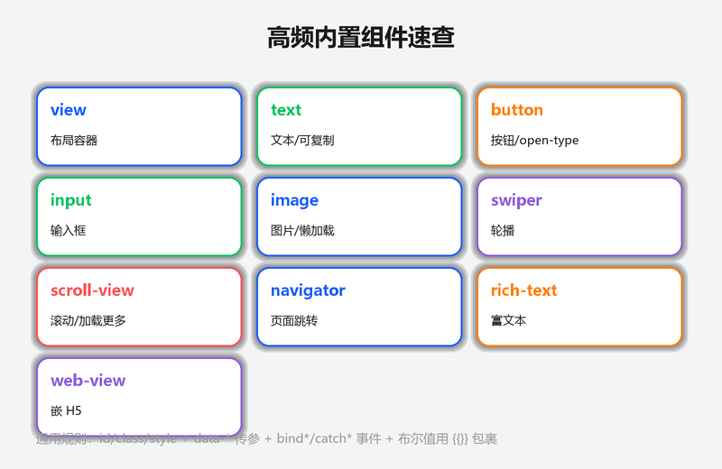
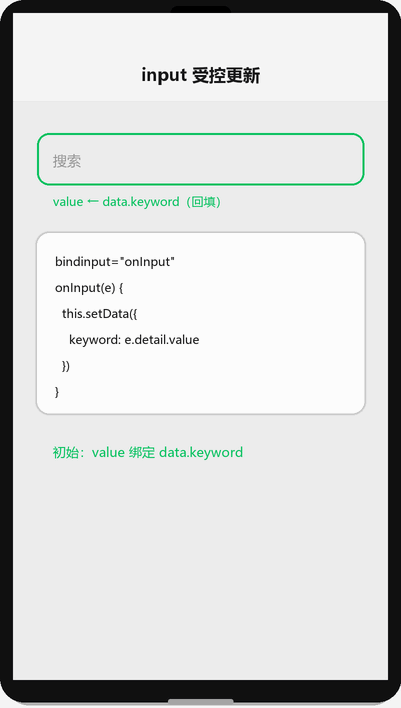
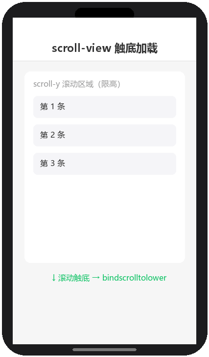

# 内置组件

## 为什么读这篇

小程序 UI 由「内置组件」拼装而成——没有 HTML 标签，一切皆是组件。这篇是高频组件的速查手册：每个组件的核心属性、一个可用示例、一个易错点。写页面时按需查阅即可。

前置知识：[WXML 数据绑定与渲染](../02-基础/01-WXML数据绑定与渲染.md)、[WXSS 样式与 rpx](../02-基础/02-WXSS样式与rpx.md)。

## 组件通用规则

高频组件速查（概念示意图：10 个高频内置组件及其用途，通用规则见下）：



所有组件都支持：

- `id` / `class` / `style`：样式定位
- `data-*`：自定义数据（事件里经 `event.currentTarget.dataset` 读取，见 [页面生命周期与事件](../02-基础/04-页面生命周期与事件.md)）
- `bind*` / `catch*`：事件绑定（`bindtap`、`catchlongpress` 等）
- `hidden`：显示/隐藏

命名规则：标签名一律小写（`view`、`text`、`button`），属性值中布尔值必须用 `{{true}}`/`{{false}}`（字符串 `"false"` 恒为真，详见 [WXML 数据绑定](../02-基础/01-WXML数据绑定与渲染.md)）。

## view：布局容器

万能容器，相当于 div。可滚动（`scroll-y` 属性）但不常用（有专用 scroll-view）。

```wxml
<view class="card" hover-class="card-hover">
  卡片内容
</view>
```

常用属性：`hover-class`（手指按下时的样式类）、`hover-stay-time`（松开后保持时间，默认 70ms）。

注意：`view` 默认 `display: block`；flex 布局记得在父容器设 `display: flex`。

## text：文本

```wxml
<text class="title">标题文本</text>
<text selectable>这段可以长按复制</text>
<text decode>&amp;nbsp;</text>
```

- `selectable`：允许长按选中复制
- `decode`：解码 `&nbsp;` 等实体
- `text` 内支持嵌套 `text`

注意：**只有 `text` 组件内的文本可以长按复制**，`view` 里的不行；「复制订单号」这类需求用 `text selectable`。

## button：按钮

```wxml
<button type="primary" size="mini">主要按钮</button>
<button type="default" loading="{{loading}}">加载中</button>
<button type="warn" disabled="{{!canSubmit}}">警告按钮</button>
<button open-type="share">转发给好友</button>
<button open-type="contact">打开客服</button>
```

- `type`：primary（绿）/ default / warn（红）
- `size`：default / mini
- `loading`：显示菊花
- `open-type`：开放能力——`share`（分享）、`contact`（客服）、`getUserInfo`（获取用户信息）、`getPhoneNumber`（获取手机号，需企业主体）等
- `hover-class`：按压态

注意：button 默认带微信样式（圆角、边框），想自定义要覆盖它的样式并留意 `::after` 边框：

```css
button::after { border: none; }
```

## input / textarea：输入

受控更新演示（渲染示意图动画：bindinput 不 setData 导致值丢失/光标乱跳，setData 回填 value 后正常）：



```xml
<input
  value="{{keyword}}"
  placeholder="搜索"
  bindinput="onInput"
  bindconfirm="onSearch"
  maxlength="20"
  confirm-type="search"
/>
```

```js
onInput(e) {
  this.setData({ keyword: e.detail.value });
}
```

- `bindinput`：输入时触发，`e.detail.value` 为当前值（**受控写法**：存进 data）
- `bindconfirm`：按确认键
- `confirm-type`：键盘右下角按钮（search/send/done…）
- `type`：text/number/idcard/digit 等

textarea 类似，多 `auto-height`（自动增高）。

注意：**input 的值必须通过 data 回填**，否则光标跳动/值丢失（受控组件模式）；不要直接在 wxml 里写死 value。

## image：图片

```wxml
<image src="{{item.cover}}" mode="aspectFill" lazy-load />
```

- `src`：网络地址、本地路径或 base64
- `mode`：裁剪/缩放模式，最常用 `aspectFill`（填满裁剪）与 `widthFix`（宽定高自动）
- `lazy-load`：懒加载（滚动到附近才加载）
- `bindload` / `binderror`：加载成功/失败回调

注意：image 默认有固定尺寸（320×240），**不设宽高会变形**；`mode="widthFix"` 配 `width: 100%` 是「宽度铺满、高度自适应」的经典组合。

## swiper：轮播

```wxml
<swiper indicator-dots autoplay interval="3000" circular>
  <swiper-item wx:for="{{banners}}" wx:key="id">
    <image src="{{item.url}}" mode="aspectFill" class="banner-img" />
  </swiper-item>
</swiper>
```

常用：`indicator-dots`（圆点）、`autoplay`、`interval`（间隔 ms）、`circular`（循环）、`bindchange`（切换事件，`e.detail.current` 为当前索引）。

注意：`swiper` 高度要显式设置，内容撑不开高度；item 用 `swiper-item` 包裹，不能直接用 view。

## scroll-view：滚动区域

触底加载演示（渲染示意图动画：滚动到容器底部触发 bindscrolltolower 加载下一页数据）：



```xml
<scroll-view scroll-y class="list" bindscrolltolower="loadMore">
  <view wx:for="{{list}}" wx:key="id">{{item.title}}</view>
</scroll-view>
```

- `scroll-y` / `scroll-x`：开启方向滚动（容器需限高）
- `bindscrolltolower`：滚动到底触发（做「加载更多」）
- `enable-flex`：允许内部 flex 布局

注意：页面级滚动不需要 scroll-view；scroll-view 用于**页面内固定高度区域的滚动**，配合 `bindscrolltolower` 做分页。普通长列表性能敏感时，`scroll-view` 配合虚拟列表（官方 [recycle-view](https://developers.weixin.qq.com/miniprogram/dev/extended/component-plus/recycle-view.html) 或 Skyline 的按需渲染）更好。

## navigator：页面跳转

```wxml
<navigator url="/pages/detail/detail?id={{item.id}}" open-type="navigate">
  查看详情
</navigator>
```

- `url`：目标路径（相对或绝对）
- `open-type`：navigate（默认压栈）/ redirect / switchTab / reLaunch / navigateBack
- 传参格式与 `wx.navigateTo` 一致：`?key=value`

注意：跳 tabBar 页面必须用 `open-type="switchTab"`；`navigate` 不能跳 tab 页，会失败无提示。

## rich-text：富文本

渲染 HTML 字符串（如后端返回的文章内容）：

```wxml
<rich-text nodes="{{htmlContent}}" />
```

- `nodes`：HTML 字符串或节点数组
- 只支持白名单内的标签（``、`<p>`、`<a>` 等），script/style 不解析

注意：`rich-text` 内图片尺寸由 `nodes` 里的样式决定，后端返回的 HTML 常需要清洗（去内联大图、加安全域名）。复杂交互场景（如点击图片预览）建议用 `web-view` 或自己解析节点。

## web-view：网页容器

在小程序里直接嵌 H5 页面：

```wxml
<web-view src="https://example.com/page" />
```

注意：**web-view 会铺满整个页面**（不能与其他组件混排），域名需在 mp 后台配置业务域名；业务含大量 H5 逻辑时用 web-view 快速迁移，但支付、登录等能力受限，交互体验不如原生。

## 常见错误 / 避坑

1. **image 不设宽高**：默认 320×240 导致图片变形；列表封面用 `width:100% + mode="widthFix"`，头像用固定宽高 + `aspectFill`。
2. **input 值不回填 data**：直接 `e.detail.value` 显示后输入框光标乱跳；必须 `this.setData({ keyword: e.detail.value })` 受控更新。
3. **swiper 高度塌陷**：不设高度时轮播区变一条线；给 swiper 显式高度（如 300rpx）。
4. **scroll-view 限高缺失**：scroll-y 不生效是因为容器没高度；给容器 `height` 或 flex:1。
5. **button 自定义样式被默认样式干扰**：微信 button 自带边框（::after）与圆角，重置需 `button::after{border:none}` + 覆盖 background。
6. **把富文本直接渲染成 view**：`view` 不解析 HTML 标签，`<p>` 会当作文本显示；必须用 `rich-text`。

## 验证

- [ ] 搭一个「列表页」：scroll-view 长列表 + 触底加载更多
- [ ] 实现「搜索框 + 按钮」：input 受控、confirm 触发搜索
- [ ] 实现「图片 + 文字」卡片：image 用 widthFix 自适应、text selectable 可复制
- [ ] 用 swiper 做一个 banner 轮播（带圆点、自动播放）
- [ ] 分别用 navigator 和 wx.navigateTo 跳详情页并传参，观察页面栈差异

## 延伸阅读

- 本库上一篇：[页面生命周期与事件](../02-基础/04-页面生命周期与事件.md)
- 本库下一篇：[自定义组件](../03-进阶/02-自定义组件.md)
- 官方：[组件总览](https://developers.weixin.qq.com/miniprogram/dev/component/)
- 官方：[open-type 开放能力](https://developers.weixin.qq.com/miniprogram/dev/framework/open-ability/login.html)
