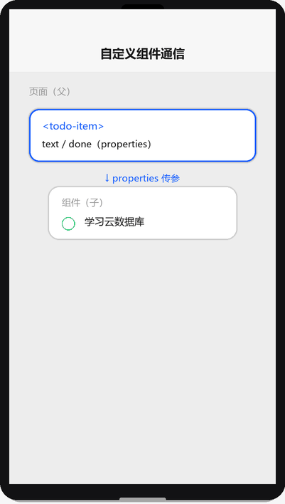
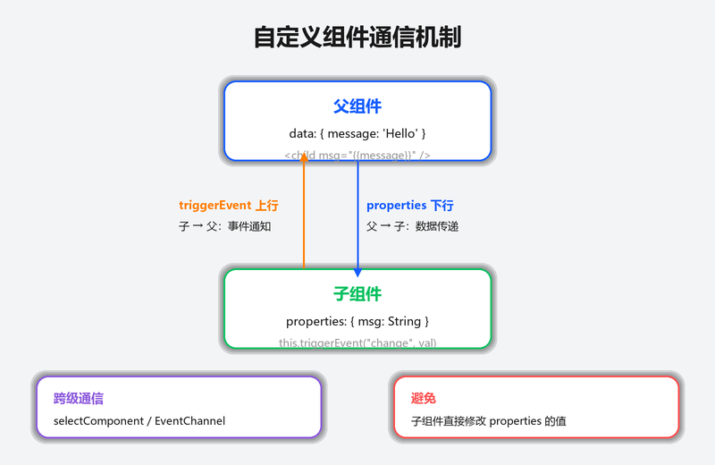

# 自定义组件

## 为什么读这篇

页面多了以后，重复的 UI 片段（卡片、弹窗、输入框组合）会让代码爆炸。小程序用 `Component()` 构造器做组件化：封装界面 + 逻辑 + 样式，通过 properties 收参数、triggerEvent 抛事件。这篇覆盖组件从创建到通信的完整链路，是「进阶」阶段的硬核内容。

前置知识：[内置组件](../03-进阶/01-内置组件.md)、[JS 逻辑层与数据驱动](../02-基础/03-JS逻辑层与数据驱动.md)、[页面生命周期与事件](../02-基础/04-页面生命周期与事件.md)。

> 📺 配套视频 · 第 5 集：[《自定义组件》](../assets/videos/video-05-component.mp4)（90 秒 · 竖屏 720×1280）——组件创建、通信机制、样式隔离的完整链路动画演示。点击在 GitHub 内置播放器打开（仓库 Markdown 不支持内嵌播放器）。

## 创建一个组件

组件目录（如 `components/todo-item/`）同样四件套：`todo-item.json`、`.wxml`、`.wxss`、`.js`。

**todo-item.json**（关键：`"component": true`）

```json
{
  "component": true,
  "usingComponents": {}
}
```

**todo-item.js**

```js
Component({
  properties: {
    text: { type: String, value: '' },       // 父组件传入的数据
    done: { type: Boolean, value: false }
  },
  data: {
    // 组件内部状态
  },
  methods: {
    onToggle() {
      // 组件内部方法：this 是组件实例
      this.triggerEvent('toggle', { done: !this.properties.done });
    }
  }
})
```

**todo-item.wxml**

```wxml
<view class="todo-item" bindtap="onToggle">
  <text class="{{done ? 'done' : ''}}">{{text}}</text>
</view>
```

### properties vs data

组件通信演示（渲染示意图动画：页面通过 properties 传参 → 组件渲染 → 点击触发 triggerEvent → 页面 onToggle 收到 event.detail 更新列表）：



| | properties | data |
|---|---|---|
| 来源 | 父组件传入（外部数据） | 组件自身状态（内部数据） |
| 访问 | `this.properties.xxx`（wxml 里直接 `{{xxx}}`） | `this.data.xxx`（wxml 里直接 `{{xxx}}`） |
| 更新 | 父组件传新值自动同步 | `this.setData()` |

在 wxml 里两者用法相同（`{{text}}`、`{{done}}`），js 里访问方式不同。

## 在页面中使用组件

**页面 json**（`usingComponents` 声明）：

```json
{
  "usingComponents": {
    "todo-item": "/components/todo-item/todo-item"
  }
}
```

**页面 wxml**：

```wxml
<todo-item
  wx:for="{{todos}}"
  wx:key="id"
  text="{{item.text}}"
  done="{{item.done}}"
  bindtoggle="onTodoToggle"
  data-id="{{item.id}}"
/>
```

**页面 js**：

```js
Page({
  data: { todos: [...] },
  onTodoToggle(event) {
    const { id } = event.currentTarget.dataset;   // data-* 传参
    const { done } = event.detail;                // triggerEvent 的 detail
    console.log('切换', id, done);
  }
})
```

使用注意：

- 组件标签名**必须小写或带横线**（`todo-item`），不能是单个单词与内置组件冲突
- `usingComponents` 路径建议写绝对路径（`/components/...`），避免层级混乱
- 事件名：组件里 `triggerEvent('toggle', detail)` ↔ 页面里 `bindtoggle`（bind + 事件名）

## 父子通信三条路

| 方式 | 方向 | 用法 |
|---|---|---|
| properties | 父 → 子 | 传数据（单向） |
| triggerEvent | 子 → 父 | 抛自定义事件 + detail 数据 |
| selectComponent | 父 → 子（拿实例） | 调用子组件方法/读子组件数据 |

```js
// 父组件里拿子组件实例
const item = this.selectComponent('#item-1');   // 子组件加 id
item.setData({ done: true });                    // 直接改子组件状态（谨慎，破坏封装）
item.someMethod();                               // 调子组件方法
```

**推荐**：数据向下（properties）、事件向上（triggerEvent），保持单向数据流；`selectComponent` 用于非交互的收尾操作（如表单校验），不要当成日常通信手段。



## 组件生命周期 lifetimes

组件也有生命周期，写在 `lifetimes` 里：

```js
Component({
  lifetimes: {
    attached() {   // 组件被插入页面时
      console.log('组件挂载');
    },
    detached() {   // 组件被移除时
      console.log('组件卸载');
    },
    ready() {      // 组件渲染完成
      console.log('组件就绪');
    }
  }
})
```

对照页面生命周期：[页面生命周期与事件](../02-基础/04-页面生命周期与事件.md)。`created`（组件实例创建，此时不能 setData）、`attached`（可 setData）、`ready`（可操作内部节点）。

## 样式隔离 options.styleIsolation

默认组件样式**完全隔离**：组件 wxss 不影响外部，外部样式（页面/app）也进不了组件内部。

| 取值 | 行为 |
|---|---|
| `isolated`（默认） | 完全隔离 |
| `apply-shared` | 外部样式可以影响组件（组件样式仍不影响外部） |
| `shared` | 双向共享 |

```js
Component({
  options: {
    styleIsolation: 'isolated'
  }
})
```

需要外部传色值进组件时，规范做法是**通过 properties 传 class 名**，而不是关掉隔离。

## 样式隔离的实现机制

样式隔离不是运行时动态计算，而是**编译期处理**：

- **原理**：开发者工具编译时，给组件 WXML 的每个标签加上私有属性（如 `data-wx-xxxx`），同时给组件 WXSS 的每条选择器加上属性选择器前缀（如 `.title` → `.title[data-wx-xxxx]`）。这样组件样式天然只匹配组件内部的节点
- **为什么不用 Shadow DOM**：Shadow DOM 是 Web 标准的样式隔离方案，但小程序渲染层不是标准浏览器（是 WebView 定制 + 框架桥接），且 Shadow DOM 的样式穿透（`:host`、`::slotted`）语义与小程序的组件模型不完全匹配。编译期方案更可控、跨端一致性更好
- **`externalClasses` 的本质**：当组件需要「让外部决定某个内部节点的样式」时，编译期给该节点额外加一个不带私有属性的类名——外部可以传这个类名的样式进来，但只能影响被标记的节点，不能任意穿透

理解编译期隔离，就能理解为什么 `styleIsolation: 'shared'` 是双向的（编译时不加私有属性），也能理解为什么运行时动态修改 `styleIsolation` 不生效——编译期已经决定了。

## behaviors：复用逻辑

多个组件有相同逻辑（如「埋点上报」）时抽成 behavior：

```js
// behaviors/track.js
module.exports = Behavior({
  data: { trackEnabled: true },
  methods: {
    report(action) {
      console.log('埋点:', action);
    }
  }
})
```

```js
const trackBehavior = require('../../behaviors/track');
Component({
  behaviors: [trackBehavior],
  methods: {
    onTap() {
      this.report('click');   // behavior 提供的方法
    }
  }
})
```

## 常见错误 / 避坑

1. **忘记 `"component": true`**：json 没声明，组件 js 用 Component() 会报错或行为异常。
2. **properties 类型不匹配**：`type: Number` 传了字符串，值会异常；传对象/数组必须用 `type: Object/Array` 且默认值用函数返回（`value: () => []`），不能直接 `value: []`（会共享引用）。
3. **在组件里访问页面数据**：组件无法直接读页面 data；需要数据就通过 properties 传下来。反过来，页面也读不到组件内部 data（除 selectComponent）。
4. **样式隔离误伤**：页面想给组件内部元素加样式没生效——这是隔离的正常行为；用 properties 传 class 或调 styleIsolation。
5. **triggerEvent 事件名大小写**：事件名全小写最稳（`toggle` 而非 `onToggle`），绑定时 `bindtoggle`。
6. **selectComponent 返回 null**：id 没写、或组件在 wx:if 里还没渲染；先确保组件已挂载再调用。

## 随堂测验

**Q1**: 一个自定义组件 `my-card` 在页面中使用，页面 wxss 里写了 `.my-card .title { color: red; }` 想改变组件内部标题颜色，但样式没有生效。最可能的原因是？
- [ ] A. 组件 json 里没有声明 `"component": true`
- [ ] B. 组件默认样式隔离（isolated），外部样式进不了组件内部
- [ ] C. 页面 wxss 文件没有被 app.wxss 引入
- [ ] D. 组件的 `.title` 类名必须改成 `#title` 才能被外部选中

<details><summary>答案</summary>

**B**. 组件默认 `styleIsolation: 'isolated'`，页面样式无法穿透到组件内部；需要通过 properties 传 class 名或调整隔离策略。

</details>

**Q2**: 组件里写了 `this.triggerEvent('toggle', { done: true })`，页面应该用什么方式监听这个事件？
- [ ] A. `bindToggle="onToggle"`
- [ ] B. `bindtoggle="onToggle"`
- [ ] C. `ontoggle="onToggle"`
- [ ] D. `catchToggle="onToggle"`

<details><summary>答案</summary>

**B**. 事件名全小写最稳，页面用 `bind` + 事件名（`bindtoggle`）绑定；`on` 前缀是页面生命周期写法，不用于组件事件监听。

</details>

**Q3**: 关于组件的 `properties` 和 `data`，以下说法正确的是？
- [ ] A. `properties` 用于组件内部状态，`data` 用于接收父组件传参
- [ ] B. 在 wxml 里访问 `properties` 和 `data` 的方式不同（一个要加 `properties.` 前缀，一个不用）
- [ ] C. `properties` 是父组件传入的外部数据，`data` 是组件自身内部状态；wxml 里两者都直接用 `{{xxx}}`
- [ ] D. `data` 的值可以通过 `this.properties.xxx` 来修改

<details><summary>答案</summary>

**C**. properties 收外部数据、data 管内部状态，但在 wxml 里都用 `{{xxx}}` 直接访问，不需要加前缀。

</details>

**Q4**: 组件的 `properties` 里定义了一个数组类型的属性 `list: { type: Array }`，以下哪种设置默认值的方式是正确的？
- [ ] A. `value: []`
- [ ] B. `value: [1, 2, 3]`
- [ ] C. `value: () => []`
- [ ] D. 数组类型不能设默认值

<details><summary>答案</summary>

**C**. 对象/数组类型的默认值必须用函数返回（`value: () => []`），直接 `value: []` 会导致多个组件实例共享同一个引用，修改一个会影响其他实例。

</details>

## 验证

- [ ] 把「待办项」封装成 todo-item 组件：properties 收 text/done，triggerEvent 抛 toggle
- [ ] 在页面里 wx:for 复用组件，点击项触发页面方法并正确取到 id
- [ ] 用 selectComponent 拿到某个组件实例并调用其方法
- [ ] 写一个 behavior 给两个组件共用，验证方法可用
- [ ] 实验 styleIsolation：默认隔离下页面样式进不了组件；改成 apply-shared 观察差异

## 延伸阅读

- 本库上一篇：[内置组件](../03-进阶/01-内置组件.md)
- 本库下一篇：[网络请求与数据](../03-进阶/03-网络请求与数据.md)
- 官方：[自定义组件](https://developers.weixin.qq.com/miniprogram/dev/framework/custom-component/)
- 官方：[组件间通信与事件](https://developers.weixin.qq.com/miniprogram/dev/framework/custom-component/events.html)
