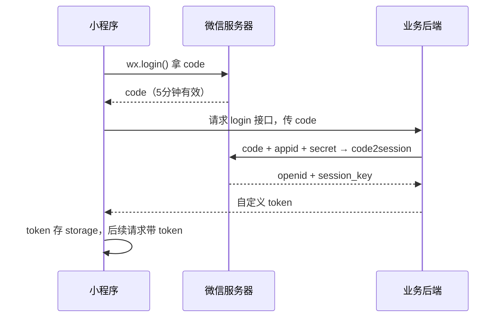

# 网络请求与数据

## 为什么读这篇

小程序不能没有后端。这篇解决三件事：**怎么发请求**（wx.request + 域名白名单）、**怎么本地存数据**（storage 系列）、**登录态怎么建立**（wx.login 流程）。这些是任何真实项目的地基，也是「联调后端」时错误最多的部分。

前置知识：[JS 逻辑层与数据驱动](../02-基础/03-JS逻辑层与数据驱动.md)、[页面生命周期与事件](../02-基础/04-页面生命周期与事件.md)。

## wx.request 基础

```js
wx.request({
  url: 'https://api.example.com/list',
  method: 'GET',
  data: { page: 1 },
  header: { 'content-type': 'application/json' },
  success(res) {
    console.log(res.statusCode, res.data);
  },
  fail(err) {
    console.error('请求失败', err);
  }
})
```

要点：

- `data`：GET 拼 query，POST 放 body
- `res.statusCode`：HTTP 状态码；`res.data`：响应体
- `header`：默认 `application/json`；传 FormData 需改 content-type

### 域名白名单（头号坑）

真机环境，**请求域名必须是 HTTPS 且在 mp 后台配置过**：

- 后台：「开发 → 开发设置 → 服务器域名」添加 request 合法域名
- 域名要求：HTTPS、已备案、不能带端口/路径、需下载校验文件验证归属
- 开发工具里可以勾选「详情 → 本地设置 → 不校验合法域名」绕过，但**真机仍会拦截**，上线前必须配好

配置域名后**发布生效有延迟**（约几分钟到十几分钟），联调要留时间。

## Promise 封装

原生回调写法难维护，统一封装成 Promise + async/await：

```js
// utils/request.js
const BASE_URL = 'https://api.example.com';

function request(path, method = 'GET', data = {}) {
  return new Promise((resolve, reject) => {
    wx.request({
      url: `${BASE_URL}${path}`,
      method,
      data,
      success(res) {
        if (res.statusCode >= 200 && res.statusCode < 300) {
          resolve(res.data);
        } else {
          reject(new Error(`HTTP ${res.statusCode}`));
        }
      },
      fail: reject
    });
  });
}

export const get = (path, data) => request(path, 'GET', data);
export const post = (path, data) => request(path, 'POST', data);
```

使用：

```js
import { get } from '../../utils/request';

Page({
  data: { list: [], loading: true },
  async onLoad() {
    try {
      const res = await get('/list', { page: 1 });
      this.setData({ list: res.list });
    } catch (err) {
      console.error(err);
    } finally {
      this.setData({ loading: false });
    }
  }
})
```

注意：`wx.request` 本身是回调式 API，**没有原生 Promise 版本**（部分新 API 有），所以封装层是必需品；微信还提供 `wx.promisify` 风格的工具（`util.promisify` 在部分基础库可用），但手写封装最可控。

## 本地存储

同步版（简单场景，数据量小）：

```js
wx.setStorageSync('user_info', { name: '小明' });
const info = wx.getStorageSync('user_info');
wx.removeStorageSync('user_info');
wx.clearStorageSync();
```

异步版（大数据量、避免阻塞）：

```js
wx.setStorage({
  key: 'user_info',
  data: { name: '小明' },
  success() { /* 写成功 */ }
});
```

注意：

- 同步版会阻塞逻辑层，大对象（> 几百 KB）用异步版
- 单 key 上限 1MB，总上限 10MB（超了报错）
- storage 是**本地**存储，跨设备不同步；需要云端数据用云开发或自建后端

典型用途：缓存 token、用户信息、列表快照（离线可看）。

## 登录态：wx.login 全流程

小程序免注册登录的标准链路：



```js
// 小程序端
wx.login({
  success: async (res) => {
    if (res.code) {
      const { token } = await post('/login', { code: res.code });
      wx.setStorageSync('token', token);
    }
  }
})
```

关键点：

- `code` 有效期 5 分钟，且**只能换一次** session，用完作废
- `code2session` 必须由**后端**调用（要用 appsecret，绝不能放小程序端）
- 后端据此拿 `openid`（用户在小程序内的唯一身份）建账号、发 token
- 业务接口校验 token；token 过期用 `wx.checkSession` 判断 session 是否还有效

## 请求的健壮性

### 防重复提交

```js
Page({
  data: { submitting: false },
  async onSubmit() {
    if (this.data.submitting) return;   // 防连点
    this.setData({ submitting: true });
    try {
      await post('/order', this.data.form);
    } finally {
      this.setData({ submitting: false });
    }
  }
})
```

### 超时与重试

```js
// 封装里加超时
function request(path, method = 'GET', data = {}) {
  return new Promise((resolve, reject) => {
    let done = false;
    const timer = setTimeout(() => {
      done = true;
      reject(new Error('timeout'));
    }, 10000);
    wx.request({
      url: `${BASE_URL}${path}`,
      method, data,
      success(res) {
        if (done) return;
        clearTimeout(timer);
        resolve(res.data);
      },
      fail(err) {
        if (done) return;
        clearTimeout(timer);
        reject(err);
      }
    });
  });
}
```

重试策略：GET 类幂等请求失败可重试 1~2 次（间隔递增），POST 提交类请求**不要盲目重试**（可能重复下单），提示用户手动处理。

## 常见错误 / 避坑

1. **真机请求失败、模拟器正常**：99% 是域名白名单问题——检查后台服务器域名配置、域名是否备案、是否 HTTPS。
2. **`fail` 回调里没有 res.statusCode**：网络错误（域名不通/超时）走 fail，HTTP 错误（404/500）走 success 但 statusCode 非 2xx——**两个分支都要处理**，不能只在 success 里判断。
3. **wx.login 的 code 多次使用**：code 一次性，误用两次会 40029 报错；重新 wx.login 拿新 code。
4. **把 appsecret 写进小程序代码**：任何人反编译都能看到，账号安全直接沦陷；secret 只在后端。
5. **同步存储大对象卡顿**：setStorageSync 阻塞逻辑层，大对象换异步版。
6. **POST 没设 content-type**：后端收不到 JSON body 或收到字符串；header 明确 `'content-type': 'application/json'`（默认已是，改 FormData 时注意）。

## 验证

- [ ] 封装 utils/request.js（Promise 版），页面里 async/await 拉列表并渲染
- [ ] 用本地存储实现「上次浏览位置」：进页面读、退出存
- [ ] 模拟登录链路：后端用 code 换 token（可用云函数做，见 [云函数](../04-云开发/02-云函数.md)），小程序存 token 并带上请求
- [ ] 做一个「提交按钮防连点」的提交表单
- [ ] 故意请求一个未配置域名的接口，真机观察失败，然后到后台配置域名验证通过

## 延伸阅读

- 本库上一篇：[自定义组件](../03-进阶/02-自定义组件.md)
- 本库下一篇：[云开发入门](../04-云开发/01-云开发入门.md)（不想自建后端就上云开发）
- 官方：[wx.request](https://developers.weixin.qq.com/miniprogram/dev/api/network/request/wx.request.html)
- 官方：[登录流程](https://developers.weixin.qq.com/miniprogram/dev/framework/open-ability/login.html)
