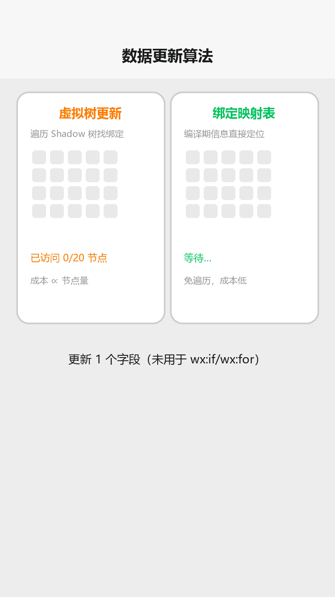
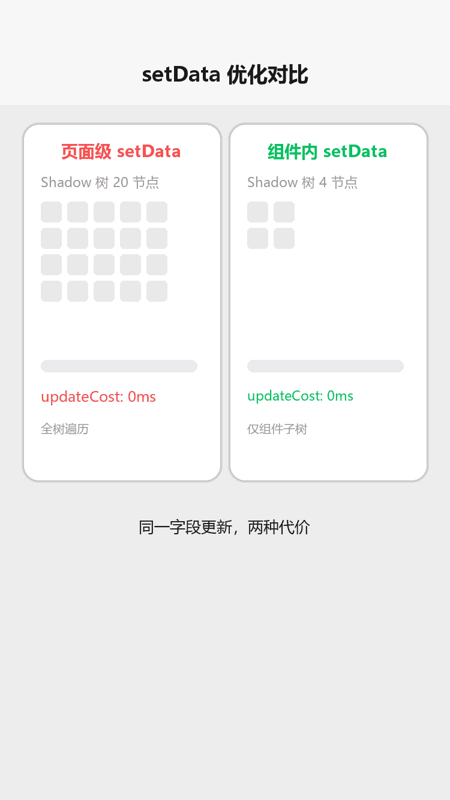

# 性能优化

## 为什么读这篇

前面的篇章教你「写得出」，这篇教你「跑得动」。小程序性能问题有两个特点：**一是它由架构决定**（双线程通信、Shadow 树 diff），不理解原理就只能背结论；**二是它有量化标准**（官方审计、性能面板、`setUpdatePerformanceListener`），可以测量而不是猜。

读完你会明白：为什么「拆分组件」比「少传数据」更能提升 `setData` 性能、为什么长列表要按需渲染、启动慢到底慢在哪一步、以及如何用工具定位瓶颈而不是凭感觉优化。

前置知识：[JS 逻辑层与数据驱动](../02-基础/03-JS逻辑层与数据驱动.md)（setData 基础）、[WXML 数据绑定与渲染](../02-基础/01-WXML数据绑定与渲染.md)（wx:key）、[项目结构](../01-入门/03-项目结构.md)（分包概念）。

## 一、数据更新机制：性能的核心战场

`setData` 是小程序最容易引发性能问题的接口。要优化它，先要知道它内部做了什么。

### 1.1 一次 setData 的完整路径

```
逻辑层 JS 线程                     视图层（渲染线程）
─────────────                     ─────────────────
setData({...})
  │
  ├─ 1. 数据深拷贝（防止逻辑层继续引用）
  │
  ├─ 2. 序列化 + 跨线程通信 ────────▶ 3. 反序列化
  │     （这是主要开销来源之一）          │
  │                                      ├─ 4. 执行数据更新算法
  │                                      │     （diff：找出要改的绑定）
  │                                      │
  │                                      └─ 5. 更新 DOM / 原生渲染树
  │
  └─ 6. 回调（setData 的第二个参数）
```

三个关键成本：**数据拷贝与序列化**（和数据量正相关）、**跨线程通信**（固定开销 + 数据量）、**数据更新算法**（和 Shadow 树规模正相关）。

### 1.2 数据更新算法：虚拟树 vs 绑定映射表

这是官方文档明确描述的机制（[数据更新策略](https://developers.weixin.qq.com/miniprogram/dev/framework/component-framework/data-update-strategy)），也是理解一切 setData 建议的钥匙：

| 算法 | 原理 | 成本特征 |
|---|---|---|
| **虚拟树更新** | 对整棵 Shadow 树做深度优先遍历，找出哪些数据绑定需要更新 | 与 Shadow 树**节点总量、节点复杂度**显著正相关 |
| **绑定映射表更新** | 依靠编译期信息**直接定位**需要更新的绑定表达式，不遍历树 | 更新数据量小时显著更快 |

框架的**自动选择策略**（glass-easel）：

两种算法对比（渲染示意图动画：左虚拟树逐节点遍历，右绑定映射表直接命中目标绑定）：



> 满足以下**全部**条件时用绑定映射表更新：
> 1. 单独更新一个数据字段；
> 2. 该字段没有被用于 `wx:if` / `wx:for` / `let:` 节点及其子孙节点。
>
> 否则，回退到虚拟树更新。

这个机制直接解释了两条最重要的优化结论：

- **为什么「拆分组件」排第一**：虚拟树更新的成本与 Shadow 树节点量正相关。把大页面拆成小组件后，更新发生在**小组件的 Shadow 树范围内**（子组件属性更新只递归触发子组件自身的更新），每次遍历的节点量骤降。官方明确说：影响数据更新性能的两个因素中，**Shadow 树节点量的影响比数据量更大**。
- **为什么「只传变化的字段」有用**：小范围更新更容易命中绑定映射表算法（免遍历），同时降低拷贝与通信的数据量。

### 1.3 一个反直觉的结论

新手默认「数据量大就慢，所以要少传数据」。官方结论是：

拆组件优化对比（渲染示意图动画：页面级 setData 遍历 20 节点 updateCost 高，组件内 setData 仅 4 节点更快）：



> **节点量的影响 > 数据量的影响。**

所以把一个 500 节点的巨型页面用 `setData` 更新 1 个字段，可能比在一个 20 节点的组件里更新 1KB 数据更慢。**先拆组件，再谈精简数据。**

## 二、setData 六条军规（官方建议 + 原理）

官方[《合理使用 setData》](https://developers.weixin.qq.com/miniprogram/dev/framework/performance/tips/runtime_setData.html)给出六条，逐条对应上面的机制：

### ① 合理划分组件，避免 Shadow 树过大

```xml
<!-- ❌ 整个页面一个巨大 Shadow 树，任何字段更新都要全树遍历 -->
<view>
  <view wx:for="{{list}}"> ... 100 个节点 ... </view>
</view>

<!-- ✅ 拆成组件：更新局限在组件的 Shadow 树内 -->
<list-item wx:for="{{list}}" wx:key="id" item="{{item}}" />
```

### ② 控制数据更新频率

官方原话：过于频繁（**毫秒级**）的 `setData` 会导致三个连锁后果——逻辑层 JS 线程持续繁忙（无法响应事件、无法完成页面切换）、视图层持续忙碌（通信耗时上升、渲染延迟）、用户操作无反馈（滑动卡顿）。

- ✅ 连续更新合并：把在一个事件循环里的多次 setData 合并成一次
- ❌ 不要在滚动回调（`bindscroll`）里每次 setData

```js
// ❌ 滚动回调高频 setData
onPageScroll(e) { this.setData({ scrollTop: e.scrollTop }); }

// ✅ 只在关键阈值更新，或用节流
onPageScroll(e) {
  if (Math.abs(e.scrollTop - this._lastTop) > 100) {
    this._lastTop = e.scrollTop;
    this.setData({ showTopBtn: e.scrollTop > 500 });
  }
}
```

### ③ 无法避免的频繁更新：缩小更新范围

倒计时、秒杀计时这类必须高频更新的场景：**封装为独立小组件**（Shadow 树尽量小），并可用 CSS [`contain`](https://developer.mozilla.org/en-US/docs/Web/CSS/contain) 限制布局/样式/绘制的计算范围。**避免在大组件内高频更新。**

### ④ data 只放渲染相关数据

`data` 里与渲染无关的字段被 setData 时会触发**额外的渲染流程与通信**，纯属浪费。官方建议：

```js
Page({
  data: { list: [] },              // ✅ 只放 WXML 用到的
  onLoad() {
    this.userData = { userId: 'x' };  // ✅ 渲染无关数据挂非 data 字段
  }
})
```

需要参与渲染但不在 WXML 直接输出、仅用于计算/监听的，用**纯数据字段**（`pureDataPattern`）+ `observers`。

### ⑤ setData 只传发生变化的数据

```js
// ❌ 官方点名反例：一次性传整个 data
this.setData(this.data);

// ✅ 只传变化字段（小更新还可能命中绑定映射表算法）
this.setData({ 'list[3].done': true });
```

### ⑥ 控制后台态页面的数据更新

逻辑层是**单线程**的，后台页面更新会抢占前台资源；某些平台渲染层各 WebView 还共享线程。**切后台的高频更新（尤其倒计时）应停止或延迟到 onShow 后**。

## 三、启动性能：用户等待的第一印象

启动分两步：**下载代码包**（网络耗时）→ **注入并执行**（CPU 耗时）。优化对应两条线。

### 3.1 代码包体积：硬限制与分包

官方硬限制（[分包加载](https://developers.weixin.qq.com/miniprogram/dev/framework/subpackages.html)）：

| 限制 | 数值 |
|---|---|
| 单个分包 / 主包 | **≤ 2M** |
| 整个小程序所有分包之和 | **≤ 30M**（服务商代开发的小程序 ≤ 20M） |

分包的核心思想：**主包只放启动页面、tabBar 页面和公共资源，其余按功能拆分包，用户进入时才下载。**

```json
{
  "pages": ["pages/index/index"],
  "subpackages": [
    { "root": "packageA", "pages": ["pages/detail/detail"] },
    { "root": "packageB", "pages": ["pages/mine/mine"] }
  ],
  "preloadRule": {
    "pages/index/index": { "network": "all", "packages": ["packageA"] }
  }
}
```

四种分包能力（按需选用）：

| 能力 | 作用 |
|---|---|
| 普通分包 | 进入分包页面时下载；可使用主包资源，反之不行 |
| [独立分包](https://developers.weixin.qq.com/miniprogram/dev/framework/subpackages/independent.html) | 不依赖主包即可运行，适合活动页/广告落地页（可独立于主包下载） |
| [分包预下载](https://developers.weixin.qq.com/miniprogram/dev/framework/subpackages/preload.html) | 进入某页面时**提前下载**可能用到的分包，消除后续跳转等待 |
| [分包异步化](https://developers.weixin.qq.com/miniprogram/dev/framework/subpackages/async.html) | 跨分包异步引用 JS/组件，减少重复代码 |

### 3.2 按需注入：只执行用到的代码

默认情况下小程序会**注入所有页面的 JS**。开启按需注入后只注入当前页面所需：

```json
{
  "lazyCodeLoading": "requiredComponents"
}
```

官方[《代码包体积优化》](https://developers.weixin.qq.com/miniprogram/dev/framework/performance/tips/start_optimizeA.html)将其列为启动优化首推手段之一：**最直接的启动优化是降低代码包大小**，因为它直接决定下载耗时。

其余体积手段：删除无用代码/资源、图片压缩与 CDN 化（大图片走网络而非打包）、避免重复依赖、`miniprogram-ci` 自动构建分析包体积。

### 3.3 启动性能的测量

用开发者工具的「体验评分 / 性能」面板观察：**启动耗时**（冷启动）、**首次渲染耗时**、**下载耗时**、**注入耗时**。优化前后对比同一指标，避免凭感觉。

## 四、渲染性能

### 4.1 长列表：按需渲染

WebView 下长列表快速滑动容易出现白屏与卡顿，根因是**一次渲染全部节点**。两条路：

- **`recycle-view`**（官方扩展组件 [recycle-view](https://developers.weixin.qq.com/miniprogram/dev/extended/component-plus/recycle-view.html)）：只渲染可视区域内的节点，滚动时回收复用。
- **Skyline 按需渲染**：Skyline 渲染引擎（基础库 ≥ 3.0.2、微信客户端 ≥ 8.0.40）内建长列表优化，仅渲染在屏节点并回收超出可视区域的节点。

### 4.2 wx:key：不只是「消除警告」

`wx:key` 决定列表更新时节点的复用策略。给稳定 key（如 id），diff 时框架能识别「节点 A 移动了位置」并**复用节点只做位移**；不给 key，框架可能按位置比对导致**内容错位或整列重建**。列表越长、更新越频繁，差别越大（详见 [WXML 数据绑定与渲染](../02-基础/01-WXML数据绑定与渲染.md)）。

### 4.3 图片与动画

- 图片：用 `lazy-load`（懒加载）+ 合适尺寸（避免加载 2000px 大图显示 200px 缩略图）+ CDN 压缩
- 动画：优先 CSS 动画/`wx.createAnimation`（走渲染层），避免用高频 setData 驱动动画（走双线程通信，代价高）

## 五、定位瓶颈：用数据说话

| 工具 | 用途 |
|---|---|
| 开发者工具「性能 / 体验评分」面板 | 启动耗时、渲染耗时、内存、FPS |
| [setUpdatePerformanceListener](https://developers.weixin.qq.com/miniprogram/dev/framework/update-perf-stat) | **组件级**数据更新性能统计：定位哪个组件更新耗时高 |
| [官方性能审计文档](https://developers.weixin.qq.com/miniprogram/dev/framework/audits/performance.html) | 性能指标定义与自查清单 |
| `console.time` / `console.timeEnd` | 逻辑层代码耗时 |

`setUpdatePerformanceListener` 的用法（定位更新热点组件）：

```js
Component({
  lifetimes: {
    attached() {
      this.setUpdatePerformanceListener({ withDataPaths: true }, (res) => {
        // res.updateCost：本次更新耗时(ms)
        // res.dataPaths：本次更新的数据路径
        console.log('更新耗时', res.updateCost, res.dataPaths);
      });
    }
  }
})
```

## 常见错误 / 避坑

1. **只优化数据量、不拆组件**：违背「节点量影响 > 数据量」的核心结论，收益有限。先拆 Shadow 树。
2. **`this.setData(this.data)` 图省事**：官方点名反例，拷贝 + 通信 + 全量 diff 三重浪费。
3. **滚动/输入回调里无节流 setData**：毫秒级调用会让逻辑层与视图层同时繁忙，页面卡死而无明显报错。
4. **把非渲染数据放进 data**：触发无意义的渲染流程；用普通字段或纯数据字段。
5. **切后台后继续倒计时 setData**：抢占前台资源且用户不可见；onHide 停、onShow 恢复。
6. **分包拆分后启动反而变慢**：独立分包/预下载配置不当；用性能面板测量下载与注入耗时再调。
7. **不看指标凭感觉优化**：没有基线就没有收益判断；用 `setUpdatePerformanceListener` 与性能面板量化。

## 验证

- [ ] 说出虚拟树更新与绑定映射表更新的区别，以及框架选择它们的**两个条件**
- [ ] 用一个真实页面，把「大页面直接 setData」与「拆成组件后 setData」的 `updateCost` 用 `setUpdatePerformanceListener` 对比，记录数字
- [ ] 复现一次滚动回调高频 setData 导致的卡顿，加节流后对比 FPS
- [ ] 给项目配置分包 + `lazyCodeLoading`，用性能面板对比启动耗时
- [ ] 说出主包与总分包的体积硬限制（2M / 30M）
- [ ] 给长列表加上 `wx:key` 与 `recycle-view`，观察滑动流畅度变化

## 延伸阅读

- 本库上一篇：[网络请求与数据](../03-进阶/03-网络请求与数据.md)
- 本库：[JS 逻辑层与数据驱动](../02-基础/03-JS逻辑层与数据驱动.md)（setData 基础）
- 官方：[合理使用 setData](https://developers.weixin.qq.com/miniprogram/dev/framework/performance/tips/runtime_setData.html)
- 官方：[数据更新策略（算法原理）](https://developers.weixin.qq.com/miniprogram/dev/framework/component-framework/data-update-strategy)
- 官方：[分包加载](https://developers.weixin.qq.com/miniprogram/dev/framework/subpackages.html)
- 官方：[代码包体积优化](https://developers.weixin.qq.com/miniprogram/dev/framework/performance/tips/start_optimizeA.html)
- 官方：[性能审计](https://developers.weixin.qq.com/miniprogram/dev/framework/audits/performance.html)
