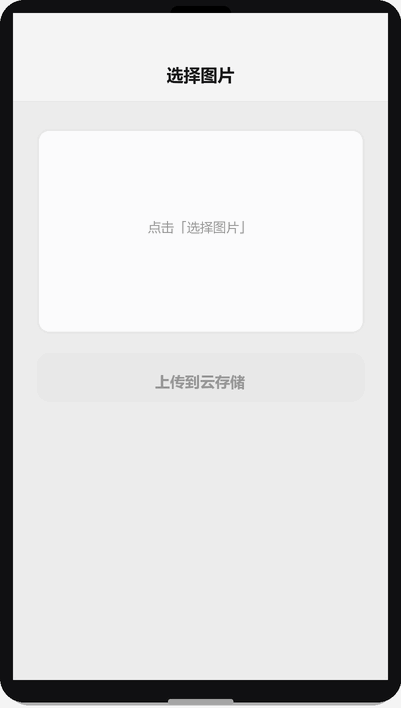

# 媒体能力：选图、拍照与录音

## 为什么读这篇

做真实项目（头像上传、晒图、反馈截图、语音留言）必然撞上媒体获取。很多新手卡在第一个问题上：`chooseMedia` 返回的文件到底在哪？为什么显示一次、重启就没了？

这篇讲清楚媒体能力的完整链路：**获取（本地临时文件）→ 使用（预览/上传）→ 持久化（云存储或 CDN）**，以及为什么微信要把这个链路设计成三段的机制原因。

前置知识：[内置组件](../03-进阶/01-内置组件.md)（button/image 基础）、[云存储](../04-云开发/04-云存储.md)（上传落库）。

## 一、获取：chooseMedia 是现在的唯一入口

微信把「选图、拍照、录像、录音」统一进了 `wx.chooseMedia`（[官方文档](https://developers.weixin.qq.com/miniprogram/dev/api/media/video/wx.chooseMedia.html)）。旧的 `wx.chooseImage` / `wx.chooseVideo` 已不再维护，新代码一律用 `chooseMedia`。

```js
wx.chooseMedia({
  count: 9,                 // 最多可选 9 个
  mediaType: ['image', 'video'],   // 可选：image 图片 / video 视频
  sourceType: ['album', 'camera'], // 来源：相册 / 相机
  sizeType: ['compressed'],        // 图片尺寸：compressed 压缩 / original 原图
  maxDuration: 10,          // 视频最长 10 秒
  camera: 'back',
  success: (res) => {
    console.log(res.tempFiles);   // [{ tempFilePath, size, fileType, ... }]
  }
})
```

**注意**：`chooseMedia` 只在「用户点击后」才能调用（必须在 `bindtap` 等用户手势回调里同步调用），这是微信对媒体权限的硬约束——不能进页面就自动弹相册。

### 1.1 返回的是什么：本地临时文件

`res.tempFiles[0].tempFilePath` 长这样：

```
wxfile://tmp_xxx/xxx.jpg        // 真机
http://tmp/xxx.jpg              // 模拟器
```

关键事实：**这是你本机上的一个临时文件，不是线上文件**。它有以下生命周期约束：

| 性质 | 说明 |
|---|---|
| 本地存在 | 文件在你的设备上，没上传前其他用户看不到 |
| 会话内有效 | 本次使用期间有效；小程序退出（或重启）后临时文件可能被清理 |
| 可用于预览 | `<image src="{{tempFilePath}}">` 直接显示没问题 |

### 1.2 为什么是「临时文件」而不是直接给线上 URL

这是设计取舍，理解它就不会写错上传逻辑：

1. **速度**：从相册选图是本地 IO，毫秒级返回；如果先上传再返回 URL，用户要等网络。
2. **隐私**：用户「选了但没提交」的图片，不应该在用户决定之前就上传到服务器——那等于未经同意收集内容。
3. **权限分离**：媒体选择（客户端能力）与存储（云端能力）是两个独立决策点，微信把决定权交给开发者：你可以在提交时才上传。

所以链路必然是：**选择（本地）→ 预览（本地）→ 用户确认 → 上传（持久化）**。跳过了上传，文件就只有你自己能看到。

选择到上传的完整链路（渲染示意图动画：点击按钮 → 弹出拍照/相册来源 → 选中图片进入预览 → 上传云存储成功）：



## 二、使用：预览与基本信息

### 2.1 预览大图

```js
wx.previewImage({
  urls: [tempFilePath],   // 可以是本地临时路径或线上 URL
  current: tempFilePath
})
```

### 2.2 拿到文件信息

`res.tempFiles` 每项包含：`tempFilePath`（路径）、`size`（字节数）、`fileType`（image/video）、`duration`（视频时长）。这些信息在「上传前校验」（比如限制图片 ≤ 5M）时有用：

```js
const file = res.tempFiles[0];
if (file.size > 5 * 1024 * 1024) {
  wx.showToast({ title: '图片超过 5M，请压缩后重试', icon: 'none' });
  return;
}
```

## 三、录音：RecorderManager

录音走独立的 `wx.getRecorderManager()`（[官方文档](https://developers.weixin.qq.com/miniprogram/dev/api/media/recorder/wx.getRecorderManager.html)），返回一个全局单例管理器：

```js
const recorder = wx.getRecorderManager();

recorder.onStart(() => console.log('开始录音'));
recorder.onStop((res) => {
  // res.tempFilePath 同样指向本地临时文件
  console.log('录音文件', res.tempFilePath, res.duration);
});

recorder.start({
  duration: 60000,          // 最长 60 秒
  format: 'mp3',            // 真机支持 mp3/aac；模拟器仅支持 mp3
  sampleRate: 16000
});

// 停止：recorder.stop()
```

机制要点：录音同样产出**本地临时文件**，要走和图片一样的「上传持久化」链路。注意录音**必须用户授权**（`scope.record`），拒绝后无法录制。

## 四、持久化：这是媒体能力真正的分水岭

本地临时文件离开当前会话就不可靠，所以**要长期使用就必须上传**。两条路：

1. **云存储**（推荐，免服务器）：`wx.cloud.uploadFile` → 返回 `cloud://` 文件 ID，永久有效，详见 [云存储](../04-云开发/04-云存储.md)。
2. **自己的服务器**：`wx.uploadFile` → 你的后端存到 OSS/CDN，返回 https URL。

```js
// 云存储上传（云开发项目）
async function uploadTempFile(tempFilePath) {
  const ext = tempFilePath.split('.').pop();
  const cloudPath = `avatar/${Date.now()}-${Math.random().toString(36).slice(2)}.${ext}`;
  const res = await wx.cloud.uploadFile({
    cloudPath,               // 云端路径（可自定义目录结构）
    filePath: tempFilePath   // 本地临时文件路径
  });
  return res.fileID;         // cloud://env-id.xxx/avatar/xxx.jpg
}
```

> **上传后建议立即从临时路径切换为 cloud 路径**：把 `tempFilePath` 换成 `fileID` 存进 `data`，后续渲染直接用 `fileID`（云文件 ID 可以直接作为 image 的 src）。临时路径只保留「用户确认前」的短暂窗口。

## 常见错误 / 避坑

1. **把临时文件路径当永久路径存库**：重启后失效，图片变裂图。存库必须存上传后的 URL / fileID。
2. **进页面就调 chooseMedia**：微信要求用户手势回调内同步调用，非手势场景直接 fail（`errMsg: "chooseMedia:fail can only be invoked by user TAP gesture"`）。
3. **模拟器测相机**：模拟器没有相机，`sourceType: ['camera']` 在模拟器上选不到；真机预览测试。
4. **录音格式**：模拟器只支持 mp3，真机才支持 aac；格式参数写死会导致模拟器上播放失败。
5. **上传不校验大小**：超大原图（`sizeType: ['original']`）上传慢、烧流量；业务上先校验 `size` 再传。
6. **视频不设 maxDuration**：用户录 10 分钟视频，上传文件巨大；按场景限制时长。

## 验证

- [ ] 写一个页面：按钮 → `chooseMedia` 选图 → `<image>` 预览 → 上传云存储 → 刷新页面后图片仍能显示
- [ ] 在真机上测试相机来源与相册来源，观察 `tempFilePath` 前缀（真机 `wxfile://` vs 模拟器 `http://tmp/`）
- [ ] 说出「为什么返回临时文件而不是直接上传」的三个原因
- [ ] 用 RecorderManager 录一段音，解释为什么录音文件同样不能直接当永久链接用

## 延伸阅读

- 本库下一篇：[地图与定位](../03-进阶/06-地图与定位.md)
- 本库：[云存储](../04-云开发/04-云存储.md)（上传落库、临时链接、安全规则）
- 官方：[wx.chooseMedia](https://developers.weixin.qq.com/miniprogram/dev/api/media/video/wx.chooseMedia.html)
- 官方：[wx.getRecorderManager](https://developers.weixin.qq.com/miniprogram/dev/api/media/recorder/wx.getRecorderManager.html)
- 官方：[wx.previewImage](https://developers.weixin.qq.com/miniprogram/dev/api/media/image/wx.previewImage.html)
