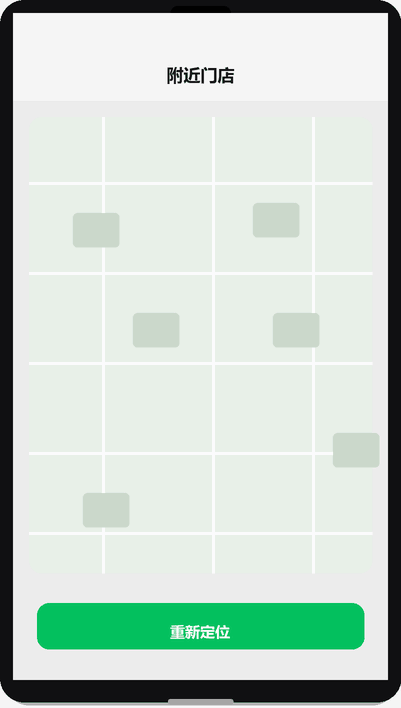

# 地图与定位

## 为什么读这篇

门店展示、打卡签到、配送路线、附近的人……定位是高频需求。但新手第一次真机跑 `getLocation` 常常遇到两个困惑：**授权弹窗为什么不受控制地出现**、**拿到的经纬度跟地图上标的对不上**。

这篇讲清定位链路的三层：授权（scope.userLocation）→ 取坐标（getLocation）→ 展示（map 组件 / 打开系统地图），重点讲透坐标系这个最容易踩的机制坑。

前置知识：[授权与隐私](../03-进阶/07-授权与隐私.md)（scope 授权模型）、[内置组件](../03-进阶/01-内置组件.md)。

## 一、定位的授权模型

定位是**敏感隐私能力**，微信对它的约束比普通 API 严格得多：

```
调用 getLocation / wx.startLocationUpdate
        │
        ▼
首次：系统弹「允许获取你的位置」授权框 ── 用户允许 → 直接返回坐标
        │
        │ 用户拒绝
        ▼
后续调用：不再弹框，直接 fail（errMsg: "authorize:fail auth deny"）
        ▼
只能引导用户去设置页手动打开（wx.openSetting）
```

三个机制事实：

1. **授权框由系统弹出，开发者无法自定义文案**。弹窗文案由微信统一提供，你只能在调用前通过业务 UI 解释用途。
2. **拒绝是「记仇」的**：`scope.userLocation` 一旦被拒，`wx.authorize` 再调用也不会弹框，只能走 `wx.openSetting` 引导用户手动开启。
3. **授权状态可以预先查询**：`wx.getSetting` 返回 `authSetting['scope.userLocation']`，据此决定「直接定位 / 引导授权 / 引导去设置」。

```js
// 定位的完整安全流程
async function getLocationSafe() {
  const setting = await wx.getSetting();
  if (setting.authSetting['scope.userLocation']) {
    // 已授权：直接定位
    return (await wx.getLocation({ type: 'gcj02' })).latitude;
  }
  // 未授权：先解释用途再发起授权
  const grant = await new Promise((resolve) => {
    wx.showModal({
      title: '需要位置权限',
      content: '用于展示附近的合作门店',
      success: (res) => resolve(res.confirm)
    });
  });
  if (!grant) return null;
  try {
    await wx.authorize({ scope: 'scope.userLocation' });
    return (await wx.getLocation({ type: 'gcj02' })).latitude;
  } catch (e) {
    // 被拒绝：引导去设置
    const open = await new Promise((res) => wx.showModal({
      title: '定位被拒绝',
      content: '请在设置中开启位置权限',
      confirmText: '去设置',
      success: (r) => res(r.confirm)
    }));
    if (open) wx.openSetting();
    return null;
  }
}
```

> 2023 年起隐私接口还有一层约束：调用 `getLocation` 前需要在 `app.json` 的 `requiredPrivateInfos` 声明（见 [授权与隐私](../03-进阶/07-授权与隐私.md)），并在小程序后台配置「用户隐私保护指引」。不声明直接调用会报 `privacy permission is not authorized`。

## 二、坐标系：为什么坐标和地图「对不上」

这是定位最反直觉的点。`getLocation` 的 `type` 参数有两个选项：

| type | 坐标系 | 说明 |
|---|---|---|
| `wgs84` | 国际标准 GPS 坐标 | 原始 GPS 数据，国外地图通用 |
| `gcj02` | 火星坐标系（加密偏移） | **中国境内地图通用**（腾讯/高德/百度系） |

**机制**：中国政府规定公开地图必须使用加密后的 GCJ-02 坐标（防测绘），原始 WGS-84 坐标在国内是不允许直接叠加到公开地图上的。所以你用 `type: 'wgs84'` 拿到的坐标贴到腾讯地图上，会发现**偏移几十米到几百米**——不是定位坏了，是坐标系没对上。

```js
// ✅ 在国内地图展示，用 gcj02
const loc = await wx.getLocation({ type: 'gcj02' });
// loc.latitude / loc.longitude 可直接喂给 map 组件

// ❌ 用 wgs84 的坐标去叠腾讯地图 → 明显偏移
```

**实务规则**：国内项目一律 `type: 'gcj02'`。只有做跨境/科学用途（并自行处理偏移转换）才用 wgs84。

定位与门店标记演示（渲染示意图动画：地图上定位蓝点出现 → 门店标记弹出并显示距离）：



## 三、map 组件：展示与标记

```xml
<map
  latitude="{{lat}}"
  longitude="{{lng}}"
  scale="14"
  markers="{{markers}}"
  show-location
  style="width: 100%; height: 400rpx;"
/>
```

```js
Page({
  data: {
    lat: 39.9042, lng: 116.4074,
    markers: [{
      id: 1,
      latitude: 39.9042,
      longitude: 116.4074,
      title: '目标门店',
      iconPath: '/assets/pin.png',   // 自定义标记图标（本地路径）
      width: 28, height: 28,
      callout: { content: '门店 A', display: 'ALWAYS' }
    }]
  }
})
```

map 组件要点：

- **markers 是数组**：动态更新时给每个 marker 稳定 `id`（类似 wx:key），框架按 id 做 diff 复用，否则整组重建。
- **`show-location`** 在地图中心画蓝点表示当前位置（不需要额外传坐标）。
- **`scale`** 控制缩放级别（3~20），动态定位时配合 `include-points` 让多个标记都可见。

### 打开系统地图导航

```js
wx.openLocation({
  latitude: 39.9042,
  longitude: 116.4074,
  name: '目标门店',
  address: '北京市…',
  scale: 18
});
```

`wx.openLocation` 会拉起微信内置地图（用户可进一步「导航」到系统地图 App）。**机制细节**：openLocation 的坐标同样按 GCJ-02 解释（[官方文档](https://developers.weixin.qq.com/miniprogram/dev/api/location/wx.openLocation.html)），所以与 getLocation 的 gcj02 结果可以直接衔接。

## 四、边界：模拟器与真机的差异

| 场景 | 表现 |
|---|---|
| 模拟器 | 可在开发者工具「模拟器 → 位置」里设置经纬度；`wx.authorize` 弹窗照常出现 |
| 真机首次 | 系统弹权限框；拒绝后不再弹 |
| 定位失败 | 返回 fail（errMsg 含原因），常见：没开定位服务、室内 GPS 弱、隐私声明未配置 |
| 持续定位 | `wx.startLocationUpdate` 后台持续更新（耗电），配合 `onLocationChange` 监听；页面级用 `wx.onLocationChange` 即可 |

**避坑**：不要用 `wx.getLocation` 高频轮询模拟持续定位——`getLocation` 每次都是一次完整的定位请求（耗电、慢），持续场景用 `startLocationUpdate` + 监听回调。

## 常见错误 / 避坑

1. **wgs84 坐标直接叠国内地图**：偏移几十米；国内一律 gcj02。
2. **不查授权状态就调 getLocation**：拒绝过之后每次调用直接 fail，且不再弹授权框；用 `getSetting` 查状态分流。
3. **忘了 requiredPrivateInfos 声明**：定位/相册等隐私接口 2023 年后必须先在 app.json 声明，否则报 `privacy permission is not authorized`。
4. **markers 无稳定 id**：地图上多个标记更新时整组闪动重建。
5. **用 getLocation 轮询做持续定位**：每次完整定位请求，耗电且慢；用 startLocationUpdate。
6. **只在模拟器测**：模拟器位置是手填的，无法验证真机授权链路；发布前真机走一遍授权 → 拒绝 → 设置页引导。

## 验证

- [ ] 写一个「附近门店」页：getLocation(gcj02) → map 组件显示蓝点 + 门店标记 → 点击门店调 openLocation
- [ ] 完整走一遍授权流程：首次授权 → 拒绝 → 再调（观察不再弹框）→ 引导 openSetting
- [ ] 用 `type: 'wgs84'` 和 `type: 'gcj02'` 各取一次坐标，贴到地图上对比偏移，说出原因
- [ ] 在 app.json 配置 `requiredPrivateInfos` 后重启验证不再报隐私错误
- [ ] 说出「拒绝后 wx.authorize 为什么不弹框」的机制原因

## 延伸阅读

- 本库上一篇：[媒体能力](../03-进阶/05-媒体能力.md)；下一篇：[授权与隐私](../03-进阶/07-授权与隐私.md)
- 本库：[授权与隐私](../03-进阶/07-授权与隐私.md)（scope 模型、隐私指引、requiredPrivateInfos）
- 官方：[wx.getLocation](https://developers.weixin.qq.com/miniprogram/dev/api/location/wx.getLocation.html)
- 官方：[map 组件](https://developers.weixin.qq.com/miniprogram/dev/component/map.html)
- 官方：[wx.openLocation](https://developers.weixin.qq.com/miniprogram/dev/api/location/wx.openLocation.html)
- 官方：[用户隐私保护指引](https://developers.weixin.qq.com/miniprogram/dev/framework/user-privacy/)
