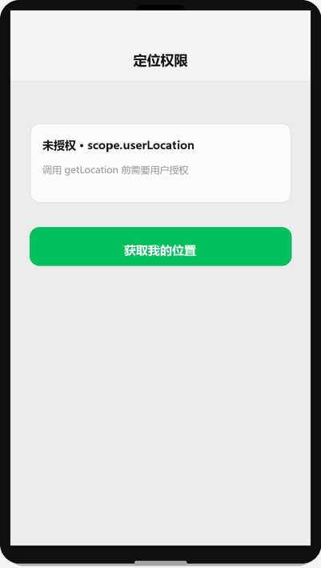

# 授权与隐私

## 为什么读这篇

「授权」是新手最常困惑的系统：为什么有时 `wx.authorize` 能弹框、有时不能？为什么 `wx.getUserProfile` 拿不到头像昵称了？为什么 2023 年后明明代码没改，`getLocation` 突然报 `privacy permission is not authorized`？

这篇把授权体系讲成一张完整的图：**scope 权限模型 → 系统弹窗机制 → 用户信息获取的政策演变 → 隐私声明（requiredPrivateInfos）**，并给出拒绝后的正确引导闭环。

前置知识：[网络请求与数据](../03-进阶/03-网络请求与数据.md)（登录态）、[地图与定位](../03-进阶/06-地图与定位.md)（定位授权的实例）。

## 一、scope 模型：每个敏感能力一个开关

小程序把敏感能力分成一个个 **scope**（授权作用域），每个 scope 独立授权、独立记忆：

| scope | 对应能力 |
|---|---|
| `scope.userLocation` | 获取位置 |
| `scope.record` | 录音 |
| `scope.camera` | 相机 |
| `scope.writePhotosAlbum` | 保存图片到相册 |
| `scope.userInfo` | 获取用户信息（**已废弃**，见第三节） |

授权状态只有三态：**已授权 / 未授权 / 已拒绝**（拒绝=未授权的特例，但行为完全不同）。

### 1.1 弹窗由系统弹出，开发者只有「发起权」

关键机制：**授权弹窗不是小程序画的，是微信客户端弹出的**。开发者能做的只是「发起授权请求」，弹窗长什么样、什么时候弹，由系统决定。这带来两个推论：

1. 你**无法自定义**授权弹窗文案——只能在弹窗前用自己页面的 UI 先解释用途（为什么需要这个权限）。
2. `wx.authorize` **不是总能弹框**：它只在「该 scope 从未被处理过」时弹一次。如果用户之前点过拒绝，再调 `wx.authorize` 直接走 fail 回调，**不再弹框**。

```js
// ❌ 错误认知：拒绝后 authorize 还能再弹
wx.authorize({ scope: 'scope.userLocation' });

// ✅ 正确闭环：查状态 → 解释 → 发起 → 拒绝则引导设置
const s = await wx.getSetting();
if (!s.authSetting['scope.userLocation']) {
  // …解释用途…
  try {
    await wx.authorize({ scope: 'scope.userLocation' });
  } catch (e) {
    wx.showModal({
      title: '需要定位权限',
      confirmText: '去设置',
      success: (r) => r.confirm && wx.openSetting()
    });
  }
}
```

### 1.2 为什么这么设计

「用户拒绝后不让再弹」是**反骚扰机制**：如果每次调用都能弹框，恶意小程序可以用弹窗轰炸用户。微信把选择权完全交给用户，且拒绝是强记忆的（用户明确表态过的事不再追问）。代价是开发者必须把「引导去设置」做进产品流程——这是设计上故意的摩擦，防止用户在被骚扰中误授权。

授权弹窗演示（渲染示意图动画：点击获取位置 → 微信系统授权框滑出（拒绝/允许）→ 允许后显示已授权与坐标）：



## 二、wx.authorize 的边界：哪些能力能「预授权」

不是所有敏感能力都能通过 `wx.authorize` 预授权。规则是：

- **能预授权**：`scope.userLocation`、`scope.record`、`scope.camera`、`scope.writePhotosAlbum` 等——因为它们「能力明确、用途单一」，授权后可随时调用对应 API。
- **不能预授权**：部分能力只能在**对应 API 被调用时**由系统弹窗（如保存相册在 `wx.saveImageToPhotosAlbum` 调用时弹）。

> 准确列表以 [官方 scope 列表](https://developers.weixin.qq.com/miniprogram/dev/framework/open-ability/authorize.html) 为准。写代码前先查文档，不要凭「感觉能授权」就调 `wx.authorize`。

## 三、用户信息：getUserProfile 的收紧史（2021 年大改）

这是授权体系里变化最大、教程资料最过时的一块。

- **2018-2021**：`wx.getUserInfo` 可拿头像昵称，授权弹窗由小程序自定义（可加文案），被大量滥用收集用户信息。
- **2021 年 4 月后**（[官方公告](https://developers.weixin.qq.com/community/develop/doc/00022c683e8a80b29bed2142b56c01)）：头像昵称获取规则调整，`wx.getUserInfo` 不再弹窗、直接返回匿名信息；`wx.getUserProfile` 保留但**每次调用都必须用户主动点击**（页面产生点击事件后才可调用），且返回的 `userInfo` 已非真实头像昵称。
- **现状**：头像昵称改由用户**自主填写**——`button open-type="chooseAvatar"` 让用户选头像，`input type="nickname"` 让用户填昵称。**服务器端拿不到用户头像昵称的「真实」数据，只能拿到用户填的**。

> 官方对 `getUserProfile` 的原文（[wx.getUserProfile](https://developers.weixin.qq.com/miniprogram/dev/api/open-api/user-info/wx.getUserProfile.html)）：「页面产生点击事件（例如 `button` 上 `bindtap` 的回调中）后才可调用，**每次请求都会弹出授权窗口**」——注意它不「记仇」也不限量，但开发者应妥善保管用户已填写的头像昵称，避免重复弹窗骚扰。

```xml
<!-- 头像昵称填写能力（当前正确姿势） -->
<button open-type="chooseAvatar" bindchooseavatar="onAvatar">
  <image src="{{avatarUrl}}" mode="aspectFill" />
</button>
<input type="nickname" placeholder="请输入昵称" bindblur="onNickname" />
```

```js
Page({
  data: { avatarUrl: '' },
  onAvatar(e) {
    // e.detail.avatarUrl 是临时文件路径，需上传后存 URL
    this.setData({ avatarUrl: e.detail.avatarUrl });
  },
  onNickname(e) {
    // e.detail.value 是用户填写的昵称
    console.log('昵称', e.detail.value);
  }
})
```

**机制原因**：微信认为「头像昵称」是用户的社交资产，不应被小程序静默收集（隐私泄露与滥用风险），改为「用户主动提供」模式。产品上需要的「微信身份」应靠 `wx.login` 拿 openid（身份标识），而不是头像昵称（展示数据）——两者是不同用途（详见 [网络请求与数据](../03-进阶/03-网络请求与数据.md)）。

## 四、隐私保护指引（2023 年起）：requiredPrivateInfos

2023 年 9 月后，**隐私相关接口**（定位、相册、麦克风、摄像头等）新增双重前置约束（[官方隐私保护指引](https://developers.weixin.qq.com/miniprogram/dev/framework/user-privacy/)）：

1. **代码侧**：在 `app.json` 声明 `requiredPrivateInfos`（接口级）与 `__usePrivacyCheck__`（组件级，如内置的隐私相关组件）：

```json
{
  "requiredPrivateInfos": ["getLocation", "chooseMedia", "chooseImage"]
}
```

2. **后台侧**：小程序管理后台配置「用户隐私保护指引」，说明收集哪些信息、用于什么目的。用户首次触发隐私接口时，微信会弹「隐私协议提示」。

**为什么要有这一层**：`scope` 管的是「这个设备能力能不能用」，隐私指引管的是「收集到的数据拿去干什么」。设备权限是系统层面的，数据用途是平台合规层面的——微信要对「小程序收集了数据但用户不知道拿去干嘛」负责，所以强制告知。

**常见报错**：未声明就调用隐私接口 → `errMsg: "getLocation:fail privacy permission is not authorized"`。修复：`requiredPrivateInfos` 加上接口名 + 后台配置指引。注意 `wx.onNeedPrivacyAuthorization` 可自定义隐私弹窗，官方默认弹窗不够用时可接管。

## 常见错误 / 避坑

1. **照抄 2019 年的 getUserInfo 教程**：拿不到真实头像昵称；改用 chooseAvatar + nickname input。
2. **拒绝后反复调 wx.authorize**：不弹框还直接 fail；查 getSetting 状态，走 openSetting 引导。
3. **漏配 requiredPrivateInfos**：2023 年后定位/相册直接报隐私错误；声明接口名 + 后台配指引。
4. **自定义授权弹窗**：系统弹窗不可自定义文案；先用自己页面解释，再发起系统授权。
5. **把 openid 和头像昵称混为一谈**：openid 是身份标识（服务器可信），头像昵称是用户提供数据（可能为空/假）；登录校验用 openid，展示用头像昵称。
6. **授权后不检查状态变化**：用户在系统设置里关了权限，下次调用依然 fail；每次调用前 getSetting 检查最稳。

## 验证

- [ ] 写一个页面：位置授权完整闭环（查状态 → 解释 → 授权 → 拒绝后 openSetting），真机走一遍「拒绝 → 再进页面」路径
- [ ] 用 chooseAvatar + nickname input 实现头像昵称填写，解释为什么服务器拿不到「真实」头像
- [ ] 配置 requiredPrivateInfos 前后各调一次 getLocation，记录报错差异
- [ ] 说出「拒绝后 wx.authorize 不再弹框」的机制原因
- [ ] 说出 scope 授权与隐私指引分别管什么（设备能力 vs 数据用途）

## 延伸阅读

- 本库上一篇：[地图与定位](../03-进阶/06-地图与定位.md)；下一篇：[分享与订阅消息](../03-进阶/08-分享与订阅消息.md)
- 本库：[网络请求与数据](../03-进阶/03-网络请求与数据.md)（登录态与 openid）
- 官方：[授权 scope 列表](https://developers.weixin.qq.com/miniprogram/dev/framework/open-ability/authorize.html)
- 官方：[用户隐私保护指引](https://developers.weixin.qq.com/miniprogram/dev/framework/user-privacy/)
- 官方：[头像昵称填写能力](https://developers.weixin.qq.com/miniprogram/dev/framework/open-ability/userProfile.html)
