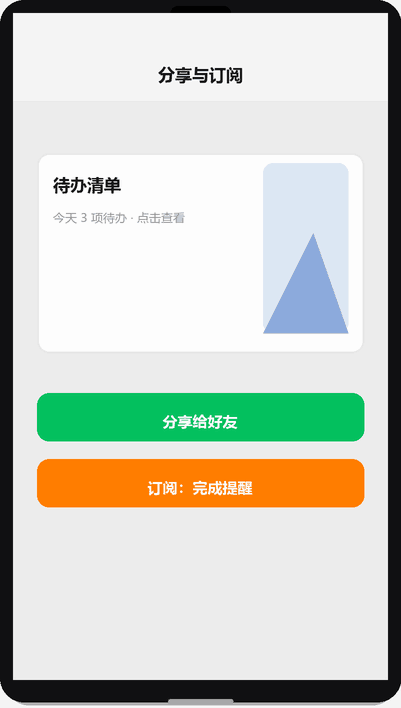

# 分享与订阅消息

## 为什么读这篇

小程序两大增长/留存武器：**分享**（用户帮你拉新）和**订阅消息**（把用户叫回来）。它们都「看着简单、细节全是坑」：为什么 `onShareAppMessage` 写了却不触发？为什么订阅消息授权后**只收到一条**？

这篇讲透两个机制模型：分享的「菜单授权模型」与订阅的「一次授权一条消息」模型，以及各自的触发时机。

前置知识：[页面生命周期与事件](../02-基础/04-页面生命周期与事件.md)（生命周期）、[云开发](../04-云开发/01-云开发入门.md)（服务端下发订阅消息需要云函数/后端）。

## 一、分享：三种入口，一套配置

### 1.1 入口与触发条件

| 入口 | 触发方式 | 说明 |
|---|---|---|
| 右上角菜单「转发」 | 页面配置 `onShareAppMessage` | 页面级函数，必须实现 |
| 页面内按钮 | `<button open-type="share">` | 点击即触发分享，同样走 `onShareAppMessage` |
| 朋友圈 | 页面配置 `onShareTimeline`（`wx.showShareMenu` 开启） | 分享到朋友圈仅支持**单页模式**（无页面栈） |

```js
Page({
  onShareAppMessage() {
    return {
      title: '帮我看看这个待办清单',   // 分享卡片标题
      path: '/pages/index/index?from=share',  // 分享落地页（可带参数）
      imageUrl: '/assets/share-card.png'      // 自定义封面（默认截屏）
    };
  },
  onShareTimeline() {
    return { title: '待办清单，一起用', query: 'from=timeline' };
  }
})
```

### 1.2 机制：分享不是「发消息」，是「生成卡片」

分享的本质是**生成一张带路径的卡片**，接收方点卡片 → 打开小程序 → 进入 `path` 指定的页面。所以：

1. `path` 必须存在且能**独立承载内容**（接收方可能从任何位置进入，要处理 `onLoad(options)` 里的分享参数）。
2. **必须实现 `onShareAppMessage` 才会出现「转发」菜单**；没实现，右上角菜单里就没有转发项。
3. 分享卡片封面默认是当前页面截图，`imageUrl` 可自定义（建议 5:4 比例）。

**为什么路径参数要自己解析**：分享卡片携带 `query` 参数（如 `?from=share&id=123`），接收方页面在 `onLoad(options)` 里能拿到 `options.from` / `options.id`。这是小程序唯一的「跨用户传参」通道——没有浏览器 URL 那样的完整链接，所有分享传播都靠这个 path 参数。

## 二、订阅消息：一次授权，一条消息

订阅消息是「服务号模板消息」在小程序里的替代品（模板消息已于 2020 年下线，新能力就是订阅消息）。

### 2.1 反直觉的核心模型：一次授权 = 一条消息

这是订阅消息最容易被误解的点：

```text
用户点「订阅」按钮（requestSubscribeMessage）
        │
        ▼
系统弹窗（一次最多展示 3 个模板，勾选后允许）
        │
        ▼
授权 N 条（每个模板 = 1 条消息额度）
        │
        ▼
服务端下发 1 条 → 额度 -1 → 归零
```

**用户每授权一次，你只能发一条对应模板的消息。** 想发第二条，必须让用户**再次点订阅**。

```js
// 页面：请求订阅（必须在用户点击回调里调用）
wx.requestSubscribeMessage({
  tmplIds: ['模板ID1'],       // 后台申请的模板 ID
  success: (res) => {
    // res['模板ID1'] === 'accept' 表示用户接受
  }
})
```

```js
// 云函数：下发消息（服务端）
const cloud = require('wx-server-sdk');
cloud.init({ env: cloud.DYNAMIC_CURRENT_ENV });

exports.main = async (event) => {
  const { openid } = cloud.getWXContext();
  try {
    await cloud.openapi.subscribeMessage.send({
      touser: openid,
      templateId: '模板ID1',
      page: 'pages/index/index',
      data: {
        thing1: { value: '待办提醒' },
        time2: { value: '2026-10-08 20:00' }
      }
    });
    return { code: 0 };
  } catch (e) {
    return { code: -1, errMsg: e.errMsg };
  }
};
```

### 2.2 为什么是「一次一条」

这是**防骚扰设计**，和授权弹窗不重复弹是同一套逻辑：

- 服务号模板消息时代可以「订阅一次，长期轰炸」，被投诉到关闭。
- 订阅消息把**授权粒度**和**消息数量**绑死：用户每点一次，只给一条额度。用户想被提醒 3 次，就得点 3 次订阅。
- 结果：订阅消息的质量门槛很高——**必须让用户「每次授权都值得」**，比如「下单成功后订阅发货提醒」（用户刚有明确诉求，愿意点）。

**实务推论**：订阅入口不能放在页面角落，要放在「用户刚完成一个有期待的动作之后」（下单完成页、报名成功页）。这就是为什么所有小程序都在成功页弹订阅。

### 2.3 长期订阅：仅部分行业开放

存在「一次性授权、长期有效」的**长期订阅消息**，但**只对特定行业类目开放**（政务、医疗、交通、金融等公共服务类）。普通电商/工具类小程序**不能申请**长期订阅，只能用一次性订阅。

判断自己的类目能否用长期订阅，以 [小程序后台消息能力申请页](https://developers.weixin.qq.com/miniprogram/dev/framework/open-ability/subscribe-message.html) 的实际可选项为准——申请时后台会明确提示当前主体是否支持。

### 2.4 边界与触发时机

| 场景 | 行为 |
|---|---|
| 用户点「总是保持以上选择」 | 下次请求订阅时**不再弹窗**，按上次勾选直接 accept |
| 用户拒绝订阅 | 下次 `wx.requestSubscribeMessage` 仍可弹（与授权 scope 不同，订阅不记仇） |
| 消息送达 | 用户主动进入过小程序，才可收到（微信要求用户有「互动」才能触达） |
| 下发频率 | 后台对单用户有频率限制（防骚扰），超限报错 |
| 下发时机 | 必须**有业务触发**：订单发货、报名成功等；纯营销推送会被限制/投诉 |

**机制要点**：订阅消息的送达前提是「用户与小程序有互动记录」——微信不让你给从未打开过小程序的用户发消息。这决定了订阅消息的定位是**召回**（把用过的用户叫回来），不是拉新。

分享与订阅演示（渲染示意图动画：点击分享 → 分享面板滑出（微信好友/朋友圈）→ 订阅通知弹窗勾选模板）：



## 常见错误 / 避坑

1. **忘了实现 onShareAppMessage**：右上角根本没有转发项；每个页面按需实现。
2. **以为订阅一次能发多条**：一次授权一条；设计订阅入口时按「用户会点几次」规划。
3. **订阅入口放在首页角落**：用户无诉求不点；放「刚完成期待动作后」（成功页）。
4. **下发消息不判断用户是否有互动记录**：报 `user not exist or not interacted`；先引导用户进过小程序。
5. **分享 path 不带参或落地页不处理参数**：接收方打开空白页；onLoad 解析 options。
6. **把订阅消息当营销工具群发**：频率限制 + 投诉 + 模板被封；只做业务触发。

## 随堂测验

**Q1**: 开发者在页面里写了 `onShareAppMessage` 函数，但发现右上角菜单里没有出现「转发」选项。以下哪个是最可能的原因？
- [ ] A. 必须在 app.json 里开启分享开关
- [ ] B. `onShareAppMessage` 没有 return 正确的对象（缺少 title 或 path）
- [ ] C. 只有 `<button open-type="share">` 才能触发分享，菜单转发不支持
- [ ] D. 分享功能需要企业主体才能使用

<details><summary>答案</summary>

**B**. 必须实现 `onShareAppMessage` 且返回包含 title/path 的对象，右上角菜单才会出现转发项；没有实现或返回不正确，菜单里就没有转发选项。

</details>

**Q2**: 关于订阅消息的「一次授权一条消息」模型，以下场景描述正确的是？
- [ ] A. 用户授权一次后，开发者可以在一个月内随时发送多条消息
- [ ] B. 用户每授权一次，开发者只能发送一条对应模板的消息；想发第二条必须让用户再次点订阅
- [ ] C. 所有小程序都可以申请长期订阅，不受行业限制
- [ ] D. 订阅消息和 scope 授权一样，拒绝后再次调用不会弹框

<details><summary>答案</summary>

**B**. 订阅消息的授权粒度和消息数量绑死：一次授权 = 一条额度，这是防骚扰设计。与 scope 授权不同，订阅消息拒绝后下次仍可弹框（不记仇）。

</details>

**Q3**: 关于订阅消息的长期订阅，以下说法正确的是？
- [ ] A. 所有小程序都可以申请长期订阅消息
- [ ] B. 长期订阅只对政务、医疗、交通、金融等特定行业类目开放，普通电商/工具类不能申请
- [ ] C. 长期订阅和一次性订阅在使用方式上完全一样
- [ ] D. 长期订阅一次授权后可以无限发送消息

<details><summary>答案</summary>

**B**. 长期订阅只对特定行业（政务、医疗、交通、金融等公共服务类）开放，普通小程序只能用一次性订阅；申请时后台会提示当前主体是否支持。

</details>

**Q4**: 分享卡片的 `path` 参数为 `/pages/detail/detail?id=123&from=share`，接收方打开后在哪里获取这些参数？
- [ ] A. 在页面的 `onShow` 生命周期里通过 `this.options` 获取
- [ ] B. 在页面的 `onLoad(options)` 里通过 `options.id` 和 `options.from` 获取
- [ ] C. 通过 `wx.getStorageSync` 读取分享参数
- [ ] D. 分享参数无法被接收方获取，需要另外的传参方式

<details><summary>答案</summary>

**B**. 分享卡片的 path 参数通过 `onLoad(options)` 接收，`options` 对象包含 URL 中的所有 query 参数；落地页必须能独立承载内容并处理分享参数。

</details>

## 验证

- [ ] 给任意页面实现 onShareAppMessage，真机从右上角转发，接收方打开后确认 path 参数被解析
- [ ] 在「下单成功页」加订阅入口，云函数下发一条订阅消息，确认只收到一条
- [ ] 说出「一次授权一条」的设计原因（防骚扰模型）
- [ ] 说出长期订阅的开放限制与判断方法
- [ ] 说出订阅消息的送达前提（用户互动记录）对产品设计的约束

## 延伸阅读

- 本库上一篇：[授权与隐私](../03-进阶/07-授权与隐私.md)；下一篇：[Skyline 与适配](../03-进阶/09-Skyline与适配.md)
- 本库：[云函数](../04-云开发/02-云函数.md)（服务端下发订阅消息）
- 官方：[onShareAppMessage](https://developers.weixin.qq.com/miniprogram/dev/reference/api/Page.html#onShareAppMessage-Object-object)
- 官方：[订阅消息](https://developers.weixin.qq.com/miniprogram/dev/framework/open-ability/subscribe-message.html)
- 官方：[wx.requestSubscribeMessage](https://developers.weixin.qq.com/miniprogram/dev/api/open-api/subscribe-message/wx.requestSubscribeMessage.html)