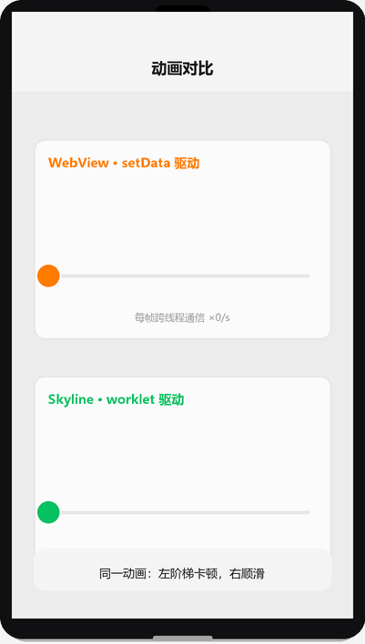

# Skyline 渲染引擎与多端适配

## 为什么读这篇

微信从 2022 年起力推 **Skyline 渲染引擎**：号称「新一代渲染引擎，更接近原生 App 体验」。它和小程序默认的 WebView 渲染到底差在哪？要不要切？切了有什么坑？这是进阶开发者必须想清楚的问题。

同时，**多端适配**（刘海屏、圆角屏、不同机型）是每个上线项目都会撞的现实问题。这篇把渲染引擎讲透，再把 safe-area 适配讲完。

前置知识：[性能优化](../03-进阶/04-性能优化.md)（双线程架构与 setData 成本）、[页面生命周期与事件](../02-基础/04-页面生命周期与事件.md)。

## 一、两个渲染引擎：WebView 与 Skyline

小程序的渲染层历史上基于 **WebView**（每个页面一个 WebView 实例）。Skyline 是 2022 年起推出的**自研原生渲染引擎**，不依赖 WebView。

| 维度 | WebView（默认） | Skyline（可选） |
|---|---|---|
| 渲染实现 | 浏览器内核解析渲染 | 自研原生渲染（不依赖 WebView） |
| 页面载体 | 每页面一个 WebView | 单实例统一渲染 |
| 动画 | JS 驱动（setData 跨线程） | **worklet 动画**：渲染线程直接驱动，免 setData |
| 导航 | 系统默认导航栏 | 自定义导航（navigation）更接近原生 |
| 长列表 | 需 recycle-view 优化 | 内建按需渲染 |
| 接入条件 | 无 | 微信客户端与基础库版本要求见[官方支持表](https://developers.weixin.qq.com/miniprogram/dev/framework/runtime/skyline/migration/compatibility.html)（分端版本不同：安卓 8.0.33+、iOS 8.0.34+、工具 Stable 1.06.2307260+） |

### 1.1 机制：Skyline 解决了什么

WebView 渲染的最大成本是**双线程通信**：逻辑层 JS 在 JSCore，视图层在 WebView，两者隔一道桥（详见 [性能优化](../03-进阶/04-性能优化.md)）。每次 UI 变化都要 `setData` 序列化 → 跨线程 → 更新 DOM，开销随数据量和频率放大。

Skyline 的核心机制是 **worklet 动画**：动画的每一帧**直接在渲染线程计算**，不再经过逻辑层和通信桥（[官方文档：Skyline 渲染引擎](https://developers.weixin.qq.com/miniprogram/dev/framework/runtime/skyline/introduction.html)）。类似场景对比：

| 动画方式 | 每帧路径 | 60fps 时每秒成本 |
|---|---|---|
| setData 驱动（WebView） | 逻辑层 → 序列化 → 通信 → 视图层 | 每秒 60 次全链路通信 |
| worklet 动画（Skyline） | 渲染线程本地计算 | 0 次跨线程通信 |

这就是 Skyline 官方宣称「更接近原生 App 流畅度」的机制来源：**把动画从「跨线程请求」变成「渲染线程本地执行」**。

WebView 与 Skyline 动画对比（渲染示意图动画：同一小球动画，左侧 WebView 阶梯式卡顿前进，右侧 Skyline 连续平滑前进）：



```js
// Skyline 专属：worklet 动画（WXS 语言，运行在渲染线程）
import { animate } from 'skyline/worklet';

Page({
  onLoad() {
    animate('box', [
      { transform: 'translateX(0)' },
      { transform: 'translateX(200px)' }
    ], { duration: 600, iterations: Infinity, easing: 'ease-in-out' });
  }
})
```

### 1.2 边界：Skyline 的「支持度」是最大坑

Skyline 是全新渲染引擎，**不等于 WebView 的超集**，差异是真实的：

- **组件差异**：部分组件在 Skyline 下行为不同或不支持（如 `web-view` 在 Skyline 下受限、部分表单组件样式差异）。官方维护 [基础组件支持与差异](https://developers.weixin.qq.com/miniprogram/dev/framework/runtime/skyline/component.html)。
- **样式差异**：部分 CSS 特性（如部分伪类、position: fixed 语义）有差异，官方有 [WXSS 样式支持与差异](https://developers.weixin.qq.com/miniprogram/dev/framework/runtime/skyline/wxss.html)。
- **代码量**：Skyline 需引入 skyline 专属包（`skyline/worklet` 等），多一份维护。

**混合架构（推荐路径）**：`app.json` 配置 `renderer: "skyline"` + 页面级 `"renderer": "webview"` 逐页回退，让**核心体验页跑 Skyline、功能复杂页回退 WebView**：

```json
{
  "renderer": "skyline",
  "rendererOptions": {
    "skyline": {
      "defaultDisplayBlock": true,
      "disableABTest": true
    }
  },
  "pages": [
    "pages/index/index",
    { "path": "pages/web/web", "renderer": "webview" }
  ]
}
```

> **决策建议**：新项目、页面简单（列表/详情/宫格）且追求流畅动画 → 直接 Skyline；页面重度依赖 web-view/复杂表单 → 保留 WebView 混合。切换前用官方 [迁移文档](https://developers.weixin.qq.com/miniprogram/dev/framework/runtime/skyline/migration/) 逐条核对组件与样式。

## 二、多端适配：safe-area 与刘海屏

不管哪个渲染引擎，机型差异（刘海屏、圆角屏、底部横条）都必须处理。核心是 **safe-area（安全区域）**：屏幕上有「系统 UI 占用的区域」（顶部状态栏/刘海、底部 Home 横条），业务内容要避开。

### 2.1 机制：safe-area-inset 是怎么来的

CSS 环境变量 `env(safe-area-inset-top)` / `env(safe-area-inset-bottom)` 由系统注入，返回**当前设备的非安全区域像素值**：

- 无刘海机型：`inset-bottom = 0`（无横条时无偏移）
- iPhone X 系列：`inset-bottom ≈ 34px`（横条高度）、`inset-top ≈ 44px`（刘海）
- 安卓全面屏：底部手势条机型 `inset-bottom` 有值

```css
/* 底部操作栏适配：避开 Home 横条 */
.footer {
  padding-bottom: env(safe-area-inset-bottom);
  /* 老机型兼容（iOS < 11.2 用 constant） */
  padding-bottom: constant(safe-area-inset-bottom);
}
```

**为什么 iOS 早期版本要写两行**：`constant()` 是 iOS 11.0-11.1 的旧语法，11.2 起改名为 `env()`。两行都写，老系统读旧语法、新系统读新语法——顺序上 `constant` 在前、`env` 在后（后者覆盖前者）。

**为什么不能全局 padding**：不同机型 inset 值不同（0/34/44…），写死 34px 会让无横条机型底部空一块；用环境变量让系统给值，机型自适应。

### 2.2 顶部适配：自定义导航栏

默认导航栏由系统渲染，会自动避开刘海，无需处理。**一旦用自定义导航**（`navigationStyle: "custom"`，Skyline 自定义导航或追求沉浸式时），顶部内容就裸露在刘海下：

```js
// 获取状态栏高度与胶囊位置（小程序官方提供）
const info = wx.getWindowInfo();
console.log(info.statusBarHeight);      // 状态栏高度，如 44
const capsule = wx.getMenuButtonBoundingClientRect();  // 胶囊按钮位置
```

自定义导航时把导航栏高度算为：`statusBarHeight + 胶囊高度 + 间距`，顶部文字/按钮放在这个高度以下，避免被刘海和胶囊遮挡。

### 2.3 常见机型差异清单

| 问题 | 表现 | 处理 |
|---|---|---|
| 底部内容被横条遮挡 | 按钮被手势条盖住 | `env(safe-area-inset-bottom)` 加 padding |
| 顶部被刘海遮挡 | 自定义导航时标题进入刘海 | statusBarHeight + 胶囊高度定导航栏高度 |
| 安卓机型字体/布局差异 | 安卓默认字号可调，rpx 布局可能溢出 | 关键布局不用纯 px；rpx 为主，必要时 `wx.getWindowInfo()` 动态计算 |
| 横屏/折叠屏 | 窗口尺寸突变 | 监听 `wx.onWindowResize` 重算布局 |

## 常见错误 / 避坑

1. **无脑切 Skyline**：不核对组件/样式差异表，web-view 页面直接挂；用混合架构逐页回退。
2. **只写 env() 不写 constant()**：iOS 11.0/11.1 用户 padding 失效（老系统占比低但真实存在）。
3. **safe-area 写死 34px**：无横条机型底部空一块；用环境变量。
4. **自定义导航不处理刘海**：标题被刘海吃；statusBarHeight + 胶囊高度计算。
5. **以为 Skyline 自动解决所有性能**：worklet 动画快，但逻辑层 setData 成本不变；大页面该拆组件还拆组件。
6. **适配只看 iPhone**：安卓全面屏手势条、不同厂商状态栏高度都要真机验证。

## 验证

- [ ] 在项目里加 `renderer: "skyline"`，把列表页跑 Skyline、含 web-view 的页回退 WebView，真机对比流畅度与功能完整性
- [ ] 用 worklet 动画实现一个 60fps 过渡，对比同效果 setData 动画的卡顿差异（逻辑层 console.time 观察）
- [ ] 给底部操作栏加 `constant()` + `env()` 双声明，在 iPhone X 与无刘海安卓机上验证 padding 差异
- [ ] 自定义导航栏：用 getWindowInfo + getMenuButtonBoundingClientRect 算出导航高度，真机验证不被刘海/胶囊遮挡
- [ ] 说出 Skyline worklet 动画比 setData 动画快一条数量级的机制原因

## 延伸阅读

- 本库上一篇：[分享与订阅消息](../03-进阶/08-分享与订阅消息.md)
- 本库：[性能优化](../03-进阶/04-性能优化.md)（双线程架构、setData 成本、长列表）
- 官方：[Skyline 渲染引擎](https://developers.weixin.qq.com/miniprogram/dev/framework/runtime/skyline/introduction.html)
- 官方：[Skyline 迁移指南](https://developers.weixin.qq.com/miniprogram/dev/framework/runtime/skyline/migration/)
- 官方：[Skyline 支持与差异（组件/WXSS）](https://developers.weixin.qq.com/miniprogram/dev/framework/runtime/skyline/component.html)
- 官方：[safe-area 环境变量](https://developers.weixin.qq.com/miniprogram/dev/framework/view/wxss.html)
- 官方：[wx.getMenuButtonBoundingClientRect](https://developers.weixin.qq.com/miniprogram/dev/api/ui/menu/wx.getMenuButtonBoundingClientRect.html)
