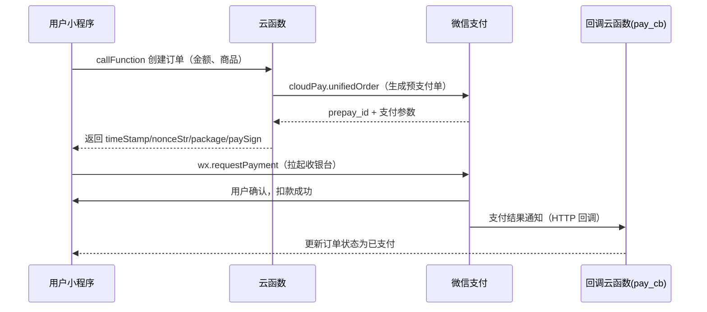
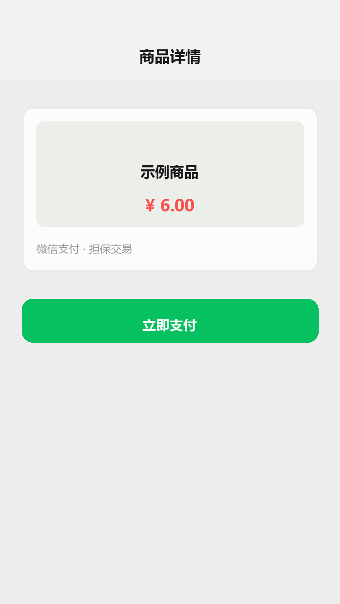

# 微信支付：云调用接入与支付链路

## 为什么读这篇

商业小程序绕不开支付。新手最容易掉进的坑是把「前端调 `wx.requestPayment`」当成全部——实际上那只是链路最后一环：**先有预支付单（统一下单），才能拉起支付；支付结果要等回调通知，还要防重复回调**。

这篇用**云开发云调用**讲完整链路：统一下单 → 拉起支付 → 结果回调 → 查询与退款。云调用方式免证书、免签名计算（[官方说明](https://developers.weixin.qq.com/miniprogram/dev/wxcloudservice/wxcloud/reference-sdk-api/open/pay/CloudPay.unifiedOrder.html)），是本库云开发体系里最省事的落地路径。前置知识：[云函数](../04-云开发/02-云函数.md)（部署与调用）、[云数据库](../04-云开发/03-云数据库.md)（订单落库）。

> 接入前先在[微信公众平台](https://mp.weixin.qq.com/)「功能 → 微信支付」申请开通（需企业主体）。个人主体小程序无法开通微信支付。

## 一、支付全链路：六个环节



注意顺序：**支付结果不来自前端回调，来自微信服务器的异步通知**。`wx.requestPayment` 的 success 只代表「用户完成了收银台流程」，不保证资金到账——最终以回调云函数收到通知、查单确认后为准。

## 二、统一下单：云函数里三步

云函数内用 `wx-server-sdk` 的 `cloud.cloudPay.unifiedOrder`（[官方文档](https://developers.weixin.qq.com/miniprogram/dev/wxcloudservice/wxcloud/reference-sdk-api/open/pay/CloudPay.unifiedOrder.html)）：

```js
// cloudfunctions/createOrder/index.js
const cloud = require('wx-server-sdk');
cloud.init({ env: cloud.DYNAMIC_CURRENT_ENV });

exports.main = async (event) => {
  const { totalFee, body } = event;              // totalFee 单位：分
  const res = await cloud.cloudPay.unifiedOrder({
    body,                                        // 商品描述
    outTradeNo: `${Date.now()}_${Math.random().toString(36).slice(2, 8)}`, // 商户订单号，全局唯一
    subMchId: '你的商户号',                       // 微信支付商户号 mchid
    totalFee,                                    // 订单金额（分）
    envId: '你的云环境ID',                        // 云环境名
    functionName: 'payCallback'                  // 支付结果回调云函数名
  });
  // res.payment 就是给 wx.requestPayment 用的参数
  return res.payment;   // { timeStamp, nonceStr, package, signType, paySign }
};
```

机制上它与微信支付原生 [JSAPI 统一下单](https://pay.weixin.qq.com/doc/v3/merchant/4012791883) 是同一件事：在微信支付后台生成**预支付交易单**，返回 `prepay_id`。区别是云调用走私有安全链路——不需要商户 API 密钥、证书、手动计算签名，`subMchId` 直接填商户号即可。

**订单必须先落库**：下单同时把订单写入云数据库（状态 `pending`），回调来了再翻转为 `paid`。前端只依赖返回的 `payment` 参数，别在前端拼金额。

## 三、拉起支付：wx.requestPayment

```js
// pages/pay/index.js
Page({
  async onPay() {
    const { payment } = await wx.cloud.callFunction({
      name: 'createOrder',
      data: { totalFee: 600, body: '示例商品' }   // 6.00 元 = 600 分
    });
    // 调起微信收银台；timeStamp/nonceStr/package/signType/paySign 全部来自云函数
    await wx.requestPayment(payment);
    // 到这里只代表收银台流程走完，等回调云函数确认后才算支付成功
  }
})
```

[wx.requestPayment 官方文档](https://developers.weixin.qq.com/miniprogram/dev/api/payment/wx.requestPayment.html)。参数里 `package` 的格式是 `prepay_id=xxx`，由统一下单返回。



支付流程演示：商品页点「立即支付」→ 确认支付弹层（金额核对）→ 支付成功 → 订单状态变为「已支付」。

**金额单位是分**：官方示例 `totalFee: 1` 即 1 分。前后端都必须以「分」为整数传递，避免浮点误差——这是支付对接最常见的 bug 来源。

## 四、结果回调：pay_cb 云函数

支付成功后，微信服务器调用你指定的回调云函数（`functionName` 指向它）。回调云函数负责：**验单 → 幂等更新订单 → 返回给微信**。

```js
// cloudfunctions/payCallback/index.js
const cloud = require('wx-server-sdk');
cloud.init({ env: cloud.DYNAMIC_CURRENT_ENV });

exports.main = async (event) => {
  // 入参字段与微信支付「支付结果通知」通知参数一致（官方 v2 通知参数表）：
  // return_code / result_code / out_trade_no / total_fee / transaction_id / openid
  // 1. 校验：成功且金额一致
  if (event.return_code !== 'SUCCESS' || event.result_code !== 'SUCCESS') {
    return { errcode: 1, errmsg: 'pay failed' };
  }
  const db = cloud.database();
  const order = await db.collection('orders').where({ outTradeNo: event.out_trade_no }).get();
  if (!order.data.length) return { errcode: 1, errmsg: 'order not found' };
  // 2. 幂等：已经是 paid 就直接返回成功，防止重复回调重复处理
  if (order.data[0].status === 'paid') return { errcode: 0, errmsg: '' };
  if (order.data[0].totalFee !== event.total_fee) return { errcode: 1, errmsg: 'amount mismatch' };
  // 3. 落库 + 业务动作（发货/发放权益）
  await db.collection('orders').where({ outTradeNo: event.out_trade_no }).update({
    data: { status: 'paid', transactionId: event.transaction_id, paidAt: Date.now() }
  });
  // 返回协议固定：errcode=0 表示处理成功；否则微信会继续重试回调
  return { errcode: 0, errmsg: '' };
};
```

**为什么必须幂等**：微信支付会**重试通知**（直到你返回 `errcode: 0` 为止），网络抖动也会导致同一笔订单多次回调。只有 `paid` 状态的幂等判断才能防止「用户付一次钱、业务被处理两次」。

回调里拿到的 `event` 是微信服务器通知解析后的 JS 对象（官方[支付结果回调云函数协议](https://developers.weixin.qq.com/miniprogram/dev/wxcloudservice/wxcloud/reference-sdk-api/open/pay/paymentCallback.html)）；自建服务接入时则要对 HTTP 回调做**平台证书验签**，云调用已封装。

## 五、查询与退款

- **查单**：`cloud.cloudPay.queryOrder({ outTradeNo })`（[文档](https://developers.weixin.qq.com/miniprogram/dev/wxcloudservice/wxcloud/reference-sdk-api/open/pay/CloudPay.queryOrder.html)）——用户支付后主动查一次，可缩短「回调未到」时的等待
- **退款**：`cloud.cloudPay.refund({ outTradeNo, outRefundNo, refundFee, totalFee })`（[文档](https://developers.weixin.qq.com/miniprogram/dev/wxcloudservice/wxcloud/reference-sdk-api/open/pay/CloudPay.refund.html)）——`outRefundNo` 退款单号必填且唯一；退款也是异步结果，同样要做回调/查询闭环
- **对账**：退款与对账单建议在服务端定时核对，别只信前端状态

## 常见错误 / 避坑

1. **金额用元做浮点运算**：`6.00` 元 × `0.1` 折扣 = `0.6000000000000001`。一律转分（整数）再算。
2. **把 `wx.requestPayment` 的 success 当支付成功**：用户取消、断网、指纹失败时它也会返回；发货/放权益必须以回调 + 查单为准。
3. **回调不幂等**：同一订单重复处理（重复发货、重复加积分）。用 `status` 翻转 + 唯一 `outTradeNo` 双重防重。
4. **订单号重复**：`outTradeNo` 必须全局唯一（一次下单一个号）；用时间戳+随机串或数据库自增。
5. **个人主体开不了支付**：先确认主体类型与[微信支付申请](https://pay.weixin.qq.com/)条件，再写代码。

## 验证

- [ ] 用云函数完成一次 `unifiedOrder`，打印出 `payment` 的四个字段，理解 `package` 内容
- [ ] 在模拟器/真机拉起收银台，走完支付（测试环境可用沙箱/小额真付）
- [ ] 构造「重复回调」场景，确认订单状态只被处理一次（幂等生效）
- [ ] 发起一笔退款并查单，确认状态流转
- [ ] 说出「为什么支付结果不能依赖前端回调」的三个原因

## 延伸阅读

- 本库上一篇：[调试与排错](../03-进阶/11-调试与排错.md)
- 本库下一篇：[云开发入门](../04-云开发/01-云开发入门.md)
- 本库：[云函数](../04-云开发/02-云函数.md)（云调用与身份获取）
- 官方：[CloudPay.unifiedOrder](https://developers.weixin.qq.com/miniprogram/dev/wxcloudservice/wxcloud/reference-sdk-api/open/pay/CloudPay.unifiedOrder.html)
- 官方：[wx.requestPayment](https://developers.weixin.qq.com/miniprogram/dev/api/payment/wx.requestPayment.html)
- 官方：[微信支付商户平台](https://pay.weixin.qq.com/)
