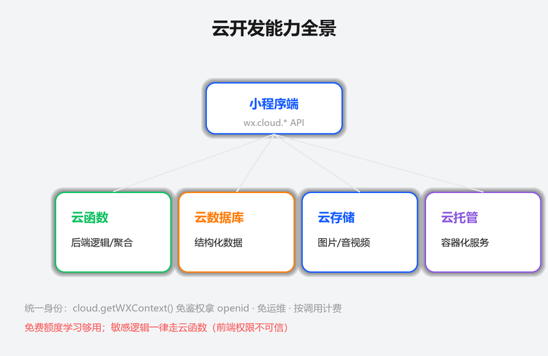
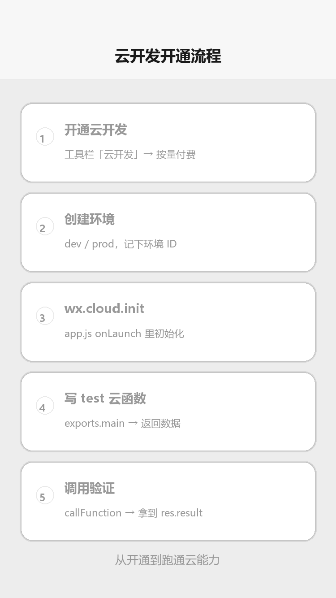

# 云开发入门

## 为什么读这篇

小程序做真实业务必须要有后端，但自己租服务器、配域名、写鉴权很重。**云开发（CloudBase）**是腾讯云为小程序提供的 Serverless 一体化后端：云函数（跑逻辑）、云数据库（存数据）、云存储（放文件）、云托管（跑容器），免运维、按量付费、与微信生态深度打通（免配域名、天然拿到用户身份）。这篇带你开通并初始化第一个云环境。

前置知识：[网络请求与数据](../03-进阶/03-网络请求与数据.md)（理解为什么需要后端）；能跑通 [环境准备](../01-入门/02-环境准备.md)。

## 云开发能做什么

能力全景（概念示意图：小程序端通过 wx.cloud.* 调用云函数/云数据库/云存储/云托管四大能力）：



| 能力 | 对应传统后端 | 用途 |
|---|---|---|
| 云函数 | 服务器接口 | 业务逻辑、数据库聚合、第三方 API 代理、敏感操作 |
| 云数据库 | 数据库（MongoDB 系） | 结构化数据：用户、订单、文章 |
| 云存储 | 文件服务器/CDN | 图片、音视频上传与访问 |
| 云托管 | 容器/负载均衡 | 跑完整后端服务（Node/Java 等），托管已有服务 |

优势对比自建后端：

| 维度 | 自建后端 | 云开发 |
|---|---|---|
| 域名/HTTPS | 备案 + 配置服务器域名 | 免配（微信内部通道） |
| 运维 | 自己扛扩容、监控、备份 | 平台托管 |
| 用户身份 | 自己实现 login 体系 | `cloud.getWXContext()` 直接拿 openid |
| 成本 | 包月服务器 | 按调用/存储量计费，冷启动基本不花钱 |

## 第一步：开通云开发

云开发开通流程（渲染示意图动画：开通 → 创建环境 → init → 写云函数 → 调用验证）：



1. 在开发者工具打开项目，点工具栏「云开发」（或「云开发控制台」入口）
2. 按提示开通：选择**按量付费**模式（有免费额度，个人学习够用）
3. 创建**环境**：起名如 `dev`（开发）与 `prod`（生产），环境 ID 形如 `cloud1-xxxxxxx`

注意：

- 每个环境是独立的资源集合（数据库/函数/存储隔离）
- **免费额度有限**：云函数调用量、数据库读写次数、存储容量都有上限，学习期够用，正式商用关注计费（[CloudBase 定价](https://cloudbase.net/)）
- 环境 ID 后面初始化要用，别删错

## 第二步：初始化 wx.cloud

小程序端在 `app.js` 的 `onLaunch` 里初始化：

```js
// app.js
App({
  onLaunch() {
    if (!wx.cloud) {
      console.error('请使用 2.2.3 或以上的基础库以使用云能力');
      return;
    }
    wx.cloud.init({
      env: 'cloud1-xxxxxxx',   // 环境 ID
      traceUser: true          // 上报用户访问（可在控制台看统计）
    });
  }
})
```

要点：

- `wx.cloud.init` 全局只需调用一次，放在 `onLaunch`
- `env` 指定用哪个环境；不传则用默认环境（推荐显式指定，避免环境混淆）
- `traceUser: true` 让平台记录调用者 openid，方便审计与统计

## 第三步：验证云环境连通

写一个最简云函数并调用（完整教程见 [云函数](../04-云开发/02-云函数.md)）：

**云函数**（右键 `cloudfunctions/` 目录 → 新建 Node.js 云函数 `ping`）：

```js
// cloudfunctions/ping/index.js
exports.main = async (event, context) => {
  return { pong: true, time: Date.now() };
};
```

**小程序端调用**：

```js
wx.cloud.callFunction({
  name: 'ping',
  success(res) {
    console.log(res.result);   // { pong: true, time: ... }
  }
})
```

跑通这个「小程序 → 云函数 → 回包」闭环，云开发基础链路就通了。

## 一个完整的最小业务流

以「发布留言」为例，串起三件套（每件详见对应文章）：

1. 小程序端把留言文本通过 `wx.cloud.callFunction` 发给云函数
2. 云函数 `cloud.getWXContext()` 拿到用户 openid，写入云数据库
3. 列表页从云数据库查询展示；图片上传走云存储

```text
小程序 ──callFunction──▶ 云函数 ──写入──▶ 云数据库
   ▲                                        │
   └──────────────查询展示◀─────────────────┘
```

## 常见错误 / 避坑

1. **忘记 wx.cloud.init**：调用任何云能力都报 `Cloud API isn't enabled` 或 `env check invalid`；确认 app.js 已初始化且环境 ID 正确。
2. **环境 ID 写错/删错**：init 里 env 与开通的环境不一致，函数调用 404；在控制台「环境 → 环境设置」核对 ID。
3. **基础库过旧**：云能力要求基础库 ≥ 2.2.3，工具里检查「详情 → 本地设置 → 调试基础库」。
4. **免费额度当无限用**：数据库读写、函数调用超限会报错或计费；学习期注意控制循环调用（如 setInterval 高频查询）。
5. **把敏感逻辑放小程序端**：数据库权限、密钥不能依赖前端；涉及安全的数据操作必须在云函数里做（[云数据库权限](../04-云开发/03-云数据库.md)有详解）。

## 验证

- [ ] 开通云开发，创建 dev 环境，记下环境 ID
- [ ] app.js 完成 wx.cloud.init
- [ ] 创建并部署 `ping` 云函数，小程序端调用成功拿到回包
- [ ] 在云开发控制台看到函数调用记录与日志

## 延伸阅读

- 本库上一篇：[微信支付](../03-进阶/12-微信支付.md)
- 本库下一篇：[云函数](../04-云开发/02-云函数.md)
- 官方：[云开发快速开始](https://developers.weixin.qq.com/miniprogram/dev/wxcloud/quick-start/miniprogram.html)
- 官方：[CloudBase 文档](https://docs.cloudbase.net/)