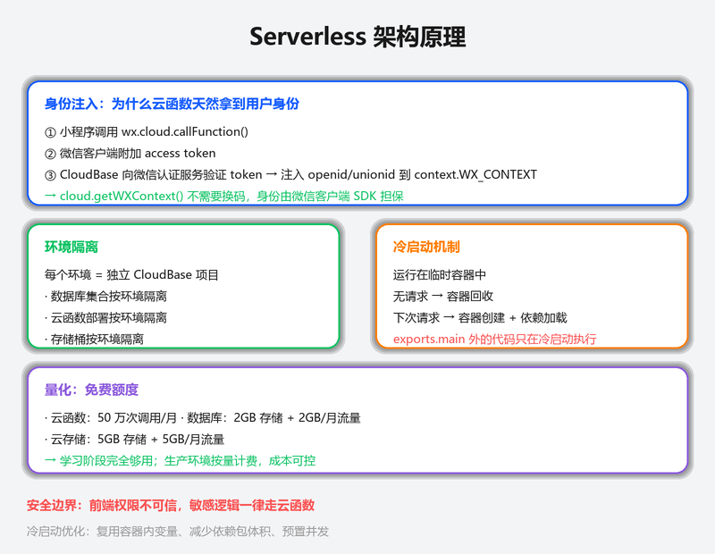
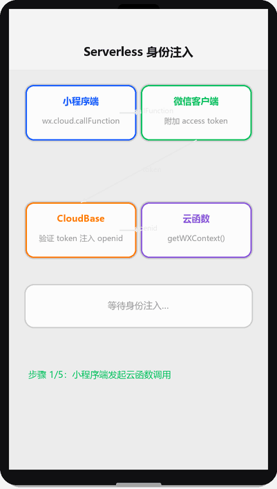

# 云开发入门

## 为什么读这篇

小程序做真实业务必须要有后端，但自己租服务器、配域名、写鉴权很重。**云开发（CloudBase）**是腾讯云为小程序提供的 Serverless 一体化后端：云函数（跑逻辑）、云数据库（存数据）、云存储（放文件）、云托管（跑容器），免运维、按量付费、与微信生态深度打通（免配域名、天然拿到用户身份）。这篇带你开通并初始化第一个云环境。

前置知识：[网络请求与数据](../03-进阶/03-网络请求与数据.md)（理解为什么需要后端）；能跑通 [环境准备](../01-入门/02-环境准备.md)。

> 📺 配套视频 · 第 6 集：[《云开发入门》](../assets/videos/video-06-cloud.mp4)（75 秒 · 竖屏 720×1280）——云函数、云数据库、云存储能力全景与开通流程动画演示。点击在 GitHub 内置播放器打开（仓库 Markdown 不支持内嵌播放器）。

## 云开发能做什么

能力全景（概念示意图：小程序端通过 wx.cloud.* 调用云函数/云数据库/云存储/云托管四大能力）：


| 能力 | 对应传统后端 | 用途 |
|---|---|---|
| 云函数 | 服务器接口 | 业务逻辑、数据库聚合、第三方 API 代理、敏感操作 |
| 云数据库 | 数据库（MongoDB 系） | 结构化数据：用户、订单、文章 |
| 云存储 | 文件服务器/CDN | 图片、音视频上传与访问 |
| 云托管 | 容器/负载均衡 | 跑完整后端服务（Node/Java 等），托管已有服务 |

优势对比自建后端：

| 维度 | 自建后端 | 云开发 |
|---|---|---|
| 域名/HTTPS | 备案 + 配置服务器域名 | 免配（微信内部通道） |
| 运维 | 自己扛扩容、监控、备份 | 平台托管 |
| 用户身份 | 自己实现 login 体系 | `cloud.getWXContext()` 直接拿 openid |
| 成本 | 包月服务器 | 按调用/存储量计费，冷启动基本不花钱 |

## Serverless 架构原理

在动手开通之前，先理解云开发背后的三个机制——知道「为什么安全」「为什么免运维」「为什么有冷启动」，后面写代码时才不会踩坑。

Serverless 架构演示（渲染示意图动画：身份注入流程、环境隔离、冷启动时间线）：





### 身份注入：为什么云函数天然拿到用户身份

自建后端需要自己实现登录体系（前端 `wx.login` 拿 code → 发给后端 → 后端调微信 `code2Session` 换 openid → 生成自定义 token）。云开发完全跳过了这个链路：

```text
小程序端 wx.cloud.callFunction({ name: 'todo', data: {...} })
    ↓ 微信客户端自动附加 access token
CloudBase 运行时收到请求
    ↓ 向微信认证服务验证 token（平台内部调用，不经公网）
    ↓ 验证通过，注入 openid/unionid/appid 到 context.WX_CONTEXT
云函数内 cloud.getWXContext() 直接读取
```

关键点：**openid 是由微信运行时注入的，不是小程序端传的**。小程序端无法伪造 openid——即使有人在请求里塞一个 `openid: "fake_id"`，云函数拿到的 `getWXContext().openid` 仍然是真实值（平台会忽略客户端传的 openid 字段，只用自己注入的）。

这就是云开发安全模型的根基：敏感操作（写数据库、调支付、删文件）放在云函数里，用 `getWXContext().openid` 做权限判断，而不是信任客户端传来的任何身份字段。

### 环境隔离：每个环境是一个独立世界

「环境」不是一个数据库——它是 CloudBase 的**完整资源命名空间**：

| 资源 | 隔离方式 |
|---|---|
| 云数据库 | 每个环境独立的 MongoDB 实例，集合名可以相同但数据完全隔离 |
| 云存储 | 每个环境独立的存储桶，文件路径互不干扰 |
| 云函数 | 每个环境独立部署，同名函数在不同环境是不同实例 |
| 配额 | 每个环境独立的免费额度和计费账户 |

实践意义：

- **开发/生产分离**：创建 `dev` 和 `prod` 两个环境，开发阶段在 `dev` 里随便折腾，不影响线上数据
- **切换环境**：`wx.cloud.init({ env: 'prod' })` 一行切换，所有 `wx.cloud.*` 调用自动指向对应环境的资源
- **不要混用**：一个小程序可以初始化多个环境，但通常一个就够了——多环境增加管理成本

### 冷启动：为什么第一次调用总是慢

云函数运行在**临时容器**里。当一段时间没有请求时（通常几分钟），平台会回收容器释放资源。下次请求到来时：

```text
请求到达 → 没有可用容器 → 冷启动：
    ① 分配新容器（~200ms）
    ② 下载函数代码（~100ms）
    ③ 安装依赖（如果用「云端安装依赖」，npm install ~1-3s）
    ④ 执行模块初始化代码（exports.main 外的代码）
    ⑤ 调用 exports.main 处理请求
```

冷启动总耗时通常 1-5 秒，取决于依赖量和初始化逻辑。后续请求复用容器（热启动），耗时降到 10-50ms。

优化策略：

1. **把初始化逻辑放在 `exports.main` 外面**：`cloud.init()` 等只在冷启动时执行一次，热启动直接跳过
2. **减少依赖体积**：`node_modules` 越大，下载和解压越慢
3. **预置并发**（付费功能）：平台保持一定数量的热容器，消除冷启动

```javascript
// 推荐写法：初始化在 main 外，只冷启动时执行
const cloud = require('wx-server-sdk')
cloud.init({ env: cloud.DYNAMIC_CURRENT_ENV })  // 冷启动时执行一次

exports.main = async (event, context) => {
  // 每次请求都执行的业务逻辑
  const wxContext = cloud.getWXContext()
  // ...
}
```

### 量化：免费额度够不够用

| 资源 | 免费额度（按量付费） | 超出后计费 |
|---|---|---|
| 云函数调用 | 50 万次/月 | 0.15 元/万次 |
| 云数据库存储 | 2 GB | 0.01 元/GB/天 |
| 云数据库读 | 5 万次/天 | 0.1 元/万次 |
| 云存储容量 | 5 GB | 0.0043 元/GB/天 |
| CDN 流量 | 5 GB/月 | 0.18 元/GB |

个人学习和小型工具类小程序，免费额度通常够用。日活超过 1000 后建议关注用量趋势，提前优化（加缓存、减少冗余调用）。

## 第一步：开通云开发

云开发开通流程（渲染示意图动画：开通 → 创建环境 → init → 写云函数 → 调用验证）：


1. 在开发者工具打开项目，点工具栏「云开发」（或「云开发控制台」入口）
2. 按提示开通：选择**按量付费**模式（有免费额度，个人学习够用）
3. 创建**环境**：起名如 `dev`（开发）与 `prod`（生产），环境 ID 形如 `cloud1-xxxxxxx`

注意：

- 每个环境是独立的资源集合（数据库/函数/存储隔离）
- **免费额度有限**：云函数调用量、数据库读写次数、存储容量都有上限，学习期够用，正式商用关注计费（[CloudBase 定价](https://cloudbase.net/)）
- 环境 ID 后面初始化要用，别删错

## 第二步：初始化 wx.cloud

小程序端在 `app.js` 的 `onLaunch` 里初始化：

```js
// app.js
App({
  onLaunch() {
    if (!wx.cloud) {
      console.error('请使用 2.2.3 或以上的基础库以使用云能力');
      return;
    }
    wx.cloud.init({
      env: 'cloud1-xxxxxxx',   // 环境 ID
      traceUser: true          // 上报用户访问（可在控制台看统计）
    });
  }
})
```

要点：

- `wx.cloud.init` 全局只需调用一次，放在 `onLaunch`
- `env` 指定用哪个环境；不传则用默认环境（推荐显式指定，避免环境混淆）
- `traceUser: true` 让平台记录调用者 openid，方便审计与统计

## 第三步：验证云环境连通

写一个最简云函数并调用（完整教程见 [云函数](../04-云开发/02-云函数.md)）：

**云函数**（右键 `cloudfunctions/` 目录 → 新建 Node.js 云函数 `ping`）：

```js
// cloudfunctions/ping/index.js
exports.main = async (event, context) => {
  return { pong: true, time: Date.now() };
};
```

**小程序端调用**：

```js
wx.cloud.callFunction({
  name: 'ping',
  success(res) {
    console.log(res.result);   // { pong: true, time: ... }
  }
})
```

跑通这个「小程序 → 云函数 → 回包」闭环，云开发基础链路就通了。

## 一个完整的最小业务流

以「发布留言」为例，串起三件套（每件详见对应文章）：

1. 小程序端把留言文本通过 `wx.cloud.callFunction` 发给云函数
2. 云函数 `cloud.getWXContext()` 拿到用户 openid，写入云数据库
3. 列表页从云数据库查询展示；图片上传走云存储

```text
小程序 ──callFunction──▶ 云函数 ──写入──▶ 云数据库
   ▲                                        │
   └──────────────查询展示◀─────────────────┘
```

## 常见错误 / 避坑

1. **忘记 wx.cloud.init**：调用任何云能力都报 `Cloud API isn't enabled` 或 `env check invalid`；确认 app.js 已初始化且环境 ID 正确。
2. **环境 ID 写错/删错**：init 里 env 与开通的环境不一致，函数调用 404；在控制台「环境 → 环境设置」核对 ID。
3. **基础库过旧**：云能力要求基础库 ≥ 2.2.3，工具里检查「详情 → 本地设置 → 调试基础库」。
4. **免费额度当无限用**：数据库读写、函数调用超限会报错或计费；学习期注意控制循环调用（如 setInterval 高频查询）。
5. **把敏感逻辑放小程序端**：数据库权限、密钥不能依赖前端；涉及安全的数据操作必须在云函数里做（[云数据库权限](../04-云开发/03-云数据库.md)有详解）。

## 随堂测验

**Q1**: 小程序调用 `wx.cloud.callFunction` 时报 `Cloud API isn't enabled`，最可能的原因是什么？
- [ ] A. 云函数代码有语法错误
- [ ] B. 没有在 `app.js` 的 `onLaunch` 里调用 `wx.cloud.init`
- [ ] C. 云函数没有部署成功
- [ ] D. 网络不稳定导致请求超时

<details><summary>答案</summary>

**B**. 任何云能力调用前必须先 `wx.cloud.init` 初始化，否则平台报 `Cloud API isn't enabled`，参见[常见错误](#常见错误--避坑)第 1 条。

</details>

**Q2**: 你的小程序有 dev 和 prod 两个云环境，`wx.cloud.init` 时不传 `env` 参数会发生什么？
- [ ] A. 报错，必须显式指定环境
- [ ] B. 自动使用 dev 环境
- [ ] C. 使用默认环境，可能导致调用到错误的环境
- [ ] D. 随机选择一个可用环境

<details><summary>答案</summary>

**C**. 不传 `env` 会使用默认环境，多环境时容易混淆，文章推荐显式指定环境 ID 以避免环境混淆。

</details>

**Q3**: 以下哪个场景**不应该**在小程序端直接操作，而必须放在云函数里？
- [ ] A. 展示一篇公开文章的内容
- [ ] B. 用户点击按钮切换自己待办的完成状态
- [ ] C. 根据用户的充值金额增加对应积分
- [ ] D. 从云数据库查询当前用户创建的列表

<details><summary>答案</summary>

**C**. 涉及金额/积分等敏感计算必须放云函数，前端可被绕过，只有云函数才能保证安全校验，参见[安全铁律](#权限设置安全第一课)。

</details>

**Q4**: 关于云开发环境的描述，以下哪项是正确的？
- [ ] A. 多个环境共享同一个数据库和云存储
- [ ] B. 每个环境是独立的资源集合，数据库/函数/存储互相隔离
- [ ] C. 环境一旦创建就不能删除
- [ ] D. 免费额度下可以无限制调用云函数

<details><summary>答案</summary>

**B**. 每个环境是独立的资源集合（数据库/函数/存储隔离），这是云开发的基本隔离模型，参见[开通云开发](#第一步开通云开发)。

</details>

**Q5**: 小明在云函数里用 `cloud.getWXContext().openid` 做权限判断。有人试图在小程序端调用 `wx.cloud.callFunction` 时在 data 里传入 `{ openid: "admin_fake" }` 来伪造身份。会发生什么？
- [ ] A. 云函数拿到的 openid 是 "admin_fake"，因为客户端传什么就是什么
- [ ] B. 云函数拿到的 openid 是用户的真实 openid，平台注入的值会覆盖客户端传的值
- [ ] C. 调用会报错，因为 data 里不允许传 openid 字段
- [ ] D. 云函数拿到的 openid 是 undefined，因为身份验证失败

<details><summary>答案</summary>

**B**. 云函数的 `getWXContext().openid` 由微信运行时注入（客户端请求到达 CloudBase 后，平台向微信认证服务验证 token 后注入），与客户端 data 里传的值无关。即使 data 里有 openid 字段，`getWXContext()` 返回的仍然是平台注入的真实值——这是云开发安全模型的根基。

</details>

## 验证

- [ ] 开通云开发，创建 dev 环境，记下环境 ID
- [ ] app.js 完成 wx.cloud.init
- [ ] 创建并部署 `ping` 云函数，小程序端调用成功拿到回包
- [ ] 在云开发控制台看到函数调用记录与日志

## 延伸阅读

- 本库上一篇：[微信支付](../03-进阶/12-微信支付.md)
- 本库下一篇：[云函数](../04-云开发/02-云函数.md)
- 官方：[云开发快速开始](https://developers.weixin.qq.com/miniprogram/dev/wxcloud/quick-start/miniprogram.html)
- 官方：[CloudBase 文档](https://docs.cloudbase.net/)