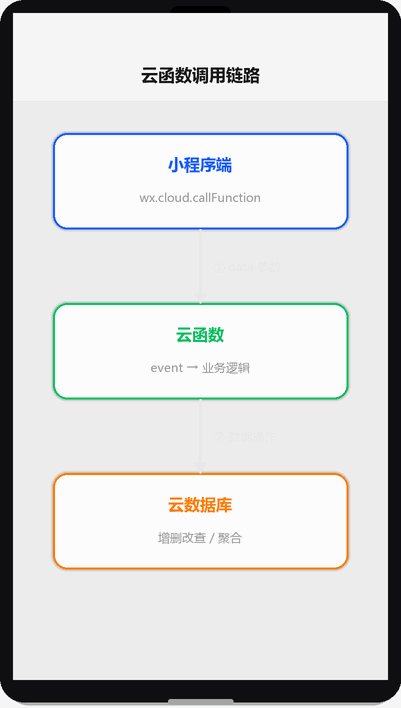

# 云函数

## 为什么读这篇

云函数是云开发的「后端逻辑」载体：跑在小程序之外的服务端代码。前端不该做的（密钥、聚合、跨域代理）都放这里。这篇讲透：云函数怎么写、怎么调、怎么拿用户身份、怎么定时跑。

前置知识：[云开发入门](../04-云开发/01-云开发入门.md)（已开通环境、init 完成）。

## 云函数是什么

调用链路演示（渲染示意图动画：小程序端 callFunction → 云函数处理 → 云数据库操作 → 结果返回）：



一段跑在腾讯云 Node.js 环境里的函数，特点：

- **免部署服务器**：右键上传即部署，平台托管
- **按调用计费**：无调用不计费（免费额度内）
- **与小程序天然打通**：`wx.cloud.callFunction` 调用，`cloud.getWXContext()` 拿用户身份
- **适合**：业务逻辑、数据库聚合、第三方 API 代理、定时任务

不适合：长连接（WebSocket）、超长任务（平台有执行时长限制，默认几秒~几十秒级）。

## 创建与部署

项目根目录建 `cloudfunctions/`，每个函数一个目录：

```
cloudfunctions/
└── getTodoList/
    ├── index.js
    └── package.json   # 依赖声明（如需要 npm 包）
```

**index.js 最小结构**：

```js
// cloudfunctions/getTodoList/index.js
const cloud = require('wx-server-sdk');
cloud.init({ env: cloud.DYNAMIC_CURRENT_ENV });  // 用调用方环境

exports.main = async (event, context) => {
  // event：小程序端传来的参数
  // context：运行信息（函数名、内存等）
  return {
    code: 0,
    data: '云函数返回值'
  };
};
```

部署方式（开发者工具）：

1. `cloudfunctions/` 目录上右键 → **创建 Node.js 云函数**
2. 写完代码，目录右键 → **上传并部署（云端安装依赖）**
3. 有依赖时选「云端安装依赖」，本地装的 node_modules 不用传

也可以在控制台在线编辑/部署。

## 参数传递与返回值

**小程序端调用**：

```js
wx.cloud.callFunction({
  name: 'getTodoList',
  data: { page: 1, size: 20 },      // 传给 event
  success(res) {
    console.log(res.result);         // 云函数 return 的值
  },
  fail(err) { console.error(err); }
})
```

**云函数端接收**：

```js
exports.main = async (event, context) => {
  const { page = 1, size = 20 } = event;
  // ...业务逻辑
  return { code: 0, list: [...], total: 100 };
};
```

规则：

- 传入：`data` → `event`（自动 JSON 序列化）
- 传出：`return` 的值 → `res.result`（可序列化的对象）
- 错误处理：云函数内 throw 会在小程序端走 `fail` 回调（errMsg 带信息）

```js
// 云函数内主动报错
if (!openid) {
  throw new Error('未登录');
}
```

## 获取用户身份：cloud.getWXContext()

云函数内**免鉴权**拿到当前调用用户：

```js
exports.main = async (event, context) => {
  const wxContext = cloud.getWXContext();
  // {
  //   openid: 'oXXXX...',      // 用户唯一标识（核心身份）
  //   appid: 'wxXXX...',
  //   unionid: 'oYYYY...'      // 开放平台统一身份（企业主体才有）
  // }
  return { openid: wxContext.openid };
};
```

用途：

- 数据归属：写库时存 openid，查询只查自己的数据
- 免登录：不需要 wx.login + code2session 那套（[网络请求与数据](../03-进阶/03-网络请求与数据.md) 里自建后端的登录在这里被简化掉了）
- 注意：**openid 不能伪造**（由微信侧注入），这是云开发安全性的根基

## 定时触发器

云函数除了被小程序调用，还能**定时执行**（如每日统计、定时清理）。在函数目录建 `config.json`：

```json
{
  "triggers": [
    {
      "name": "dailyStat",
      "type": "timer",
      "config": "0 0 3 * * * *"
    }
  ]
}
```

cron 格式（7 段：秒 分 时 日 月 周 年），`0 0 3 * * * *` = 每天凌晨 3 点。

部署后在控制台可看到触发器；定时触发时 `event` 为触发信息（非小程序参数），且 `getWXContext().openid` 为空（没有具体用户）。

## 典型场景

### 场景一：数据库聚合（小程序端做不了的事）

小程序端云数据库查询能力有限（不能跨集合 join、聚合受限），复杂统计放云函数：

```js
const db = cloud.database();
exports.main = async (event) => {
  const { _ } = db.command;
  const res = await db.collection('orders')
    .aggregate()
    .group({ _id: '$status', count: $.sum(1) })
    .end();
  return res.list;
};
```

### 场景二：第三方 API 代理

小程序端有域名白名单限制（[网络请求与数据](../03-进阶/03-网络请求与数据.md)），云函数**没有**——可以请求任意 HTTPS 服务，还能藏密钥：

```js
exports.main = async (event) => {
  const res = await new Promise((resolve, reject) => {
    // 用 got / axios 或原生 https 请求第三方
    // 密钥（API Key）只写在云函数里，不外泄
  });
  return res.data;
};
```

### 场景三：写库前的安全校验

敏感写操作放云函数（权限设置宽松的集合也能被保护）：

```js
exports.main = async (event) => {
  const { openid } = cloud.getWXContext();
  const { content } = event;
  if (!content || content.length > 500) throw new Error('内容不合法');
  const db = cloud.database();
  await db.collection('messages').add({
    data: { openid, content, createTime: Date.now() }
  });
  return { code: 0 };
};
```

## 常见错误 / 避坑

1. **忘记 `cloud.init`**：函数里第一行就要 `cloud.init({ env: cloud.DYNAMIC_CURRENT_ENV })`，否则数据库操作报环境错误。
2. **本地调试与云端环境不一致**：本地调试用本地 node_modules，云端用「云端安装依赖」；依赖版本不一致导致线上行为不同，部署选云端安装。
3. **return 不可序列化内容**：返回 `undefined`/`NaN`/函数等会导致小程序端 res.result 异常；只返回纯对象。
4. **误以为小程序端能拿到 getWXContext**：`getWXContext` 只在云函数里可用，小程序端拿 openid 只能靠调用云函数返回。
5. **定时触发器改了不重新部署**：config.json 的 trigger 修改后需要重新上传部署才生效。
6. **云函数超时**：默认超时较短（几秒到几十秒，可配置），内部有长循环/慢第三方请求时提前超时；把慢逻辑拆到独立函数并调大超时配置。

## 验证

- [ ] 创建 `getTodoList` 云函数：接收 page/size 参数，返回假数据列表，小程序端调用并渲染
- [ ] 云函数里用 `cloud.getWXContext()` 返回当前 openid，小程序端打印确认
- [ ] 实现「写入留言」云函数：校验长度、存 openid、写入云数据库（[云数据库](../04-云开发/03-云数据库.md)配合）
- [ ] 给一个函数配每日定时触发器并部署，控制台确认触发器列表
- [ ] 故意在云函数里 throw，观察小程序端 fail 回调与错误信息

## 延伸阅读

- 本库上一篇：[云开发入门](../04-云开发/01-云开发入门.md)
- 本库下一篇：[云数据库](../04-云开发/03-云数据库.md)
- 官方：[云函数](https://developers.weixin.qq.com/miniprogram/dev/wxcloud/guide/functions.html)
- 官方：[wx-server-sdk](https://developers.weixin.qq.com/miniprogram/dev/wxcloud/reference-sdk-api/Cloud.html)
