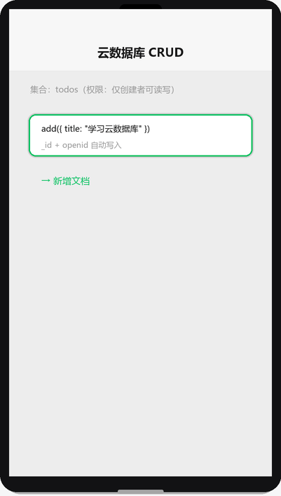

# 云数据库

## 为什么读这篇

数据是业务的命根子。云数据库是 MongoDB 系的文档数据库，小程序端可直接读写，也能在云函数里操作。这篇讲透：数据模型（集合/文档）、**权限模型（四种权限，安全的关键）**、增删改查 API、查询/排序/分页，以及「什么时候该走小程序端、什么时候必须走云函数」。

前置知识：[云开发入门](../04-云开发/01-云开发入门.md)、[云函数](../04-云开发/02-云函数.md)。

## 数据模型

```text
云数据库
└── 集合 collection（类似表）
    └── 文档 document（类似行，JSON 对象）
        └── 字段 field（类似列，_id/openid/title...）
```

- 集合不需要预定义字段结构（动态 schema），但**同一集合内保持字段一致**是好习惯
- 每个文档自动带 `_id`（唯一主键）
- 存用户相关数据时，**约定存 openid 字段**做归属标识

## 权限设置（安全第一课）

云开发控制台 → 数据库 → 权限设置，四种模式：

| 权限 | 谁可读 | 谁可写 | 适用 |
|---|---|---|---|
| 所有用户可读，仅创建者可读写 | 所有人 | 仅创建者 | **默认推荐**：内容社区、公开列表 |
| 仅创建者可读写 | 仅创建者 | 仅创建者 | 私密数据（订单、草稿） |
| 所有用户可读 | 所有人 | 所有人 | 只读公开数据（配置、公告） |
| 所有用户不可读写 | 无 | 无 | 敏感数据（**必须走云函数**） |

**安全铁律**：

- 小程序端直连数据库时，**权限设置就是你的安全防线**——读/写按 openid 隔离，别人改不了你的数据（前提是权限选对）
- 涉及敏感逻辑（金额、积分、跨用户操作）**不要依赖前端权限**，一律走云函数校验（云函数端操作**不受权限限制**，天然是管理员）

判断口诀：

> 前端能做的事：公开读 + 只改自己的数据 → 前端直连。
> 前端不能做的事：改别人的数据、算钱、藏密钥 → 云函数。

## 小程序端增删改查

CRUD 操作演示（渲染示意图动画：add 新增 → where 查询 → update 更新 → remove 删除）：



### 初始化

```js
// 页面里
const db = wx.cloud.database();          // 小程序端实例
const todos = db.collection('todos');    // 集合引用
```

### 增加 add

```js
todos.add({
  data: {
    title: '学习云数据库',
    done: false,
    createTime: Date.now()
  }
}).then(res => {
  console.log('新文档 _id:', res._id);
});
```

注意：小程序端 add **自动带上 openid 字段**（记录创建者），这是权限隔离的基础。

### 查询 get / where

```js
// 查全部（小程序端一次最多 20 条）
const res = await todos.get();
console.log(res.data);

// 条件查询
const res2 = await todos
  .where({ done: false })
  .orderBy('createTime', 'desc')
  .limit(20)
  .get();
```

查询操作符（`db.command`）：

```js
const _ = db.command;
await todos.where({
  createTime: _.gt(Date.now() - 86400000),   // 最近一天
  title: db.RegExp({ regexp: '云', options: 'i' }) // 模糊匹配
}).get();
```

常用操作符：`_.eq`/`_.neq`、`_.gt`/`_.gte`/`_.lt`/`_.lte`、`_.in`、`_.and`/`_.or`。

### 更新 update

```js
await todos.doc('文档_id').update({
  data: { done: true }
});

// 条件更新：给所有未完成的加个标记
await todos.where({ done: false }).update({
  data: { expired: true }
});
```

注意：`update` 是**部分更新**（只改传的字段）；要整体替换用 `set`。doc(id) 不存在时 update 会报错（查不到）。

### 删除 remove

```js
await todos.doc('文档_id').remove();

// 条件删除（谨慎：会删掉匹配的所有文档）
await todos.where({ expired: true }).remove();
```

**删除不可撤销**，生产环境建议软删除（加 `deleted: true` 字段过滤）。

## 分页与排序

```js
async function loadPage(page, size = 20) {
  const res = await todos
    .orderBy('createTime', 'desc')
    .skip((page - 1) * size)
    .limit(size)
    .get();
  return res.data;
}
```

限制（小程序端）：

- `get` 默认/最多返回 20 条（可用 `limit` 设 ≤20；云函数里可达 100/1000）
- `skip` 深分页性能差，大数据量改用「游标」方式（按上次最后一条的字段值继续查）

```js
// 游标分页（推荐）
const lastTime = this.data.lastTime;
const res = await todos
  .where({ createTime: _.lt(lastTime) })
  .orderBy('createTime', 'desc')
  .limit(20)
  .get();
```

## 云函数端操作（管理员视角）

云函数里用 `cloud.database()`，**不受前端权限限制**：

```js
// 云函数 updateUserScore
const cloud = require('wx-server-sdk');
cloud.init({ env: cloud.DYNAMIC_CURRENT_ENV });
const db = cloud.database();

exports.main = async (event) => {
  const { userId, delta } = event;
  // 管理员逻辑：任意改任何人的数据（记得自己校验合法性！）
  const res = await db.collection('users').doc(userId).update({
    data: { score: _.inc(delta) }
  });
  return { code: 0, updated: res.stats.updated };
};
```

云函数端优势：`_.inc` 原子自增（避免并发覆盖）、跨集合操作、聚合、拿 openid 归属校验（[云函数](../04-云开发/02-云函数.md)）。

## 数据库运行机制

### 权限模型的实现原理

四种权限设置背后，是一条**查询层面的过滤链路**：

1. 小程序端发起 `collection.get()` → 请求到达云开发网关
2. 网关校验调用者的 openid（从微信客户端 token 中提取）
3. 按集合权限规则，在**查询层面**注入 openid 条件——不是查完再过滤，而是查询条件本身被改写。所以「仅创建者可读写」下你根本看不到别人的文档（查询结果里不包含它们）
4. 云函数操作数据库时，以**管理员身份**执行——没有 openid 约束、不受集合权限限制。这是设计决策：服务端逻辑需要跨用户操作能力，安全性由开发者自己保证

**自定义安全规则**（高级）：四种预设权限不够用时，可以在控制台写 JSON 规则表达式控制字段级读写。例如 `{"read": true, "write": "auth.openid == doc.authorId"}` 实现「所有人可读、仅作者可写」。

### 查询执行与索引机制

每次 `get()` 都是一次完整的**网络往返**：小程序端序列化查询条件 → 云端数据库引擎执行 → 结果序列化返回。理解这条链路才能理解性能瓶颈在哪：

- **索引**：云数据库自动为 `_id` 和 `_openid` 建索引。自定义索引在控制台创建（支持复合索引）。**无索引的查询全表扫描**——数据量超过几千条后性能急剧下降。`where` 条件中用到的字段，尤其是排序字段（`orderBy`），应该建索引
- **量化限制**：
  - 小程序端单次 `get()` 最多 20 条，云函数 100 条（`aggregate` 可达 1000 条）
  - `where` 条件最多 20 个表达式
  - `update`/`remove` 默认只影响 1 条文档（小程序端 `where` 批量操作需要 `multi: true` 参数）
  - 单个文档大小上限 16MB，集合无文档数上限但受总存储空间限制
- **实时推送 `watch()`**：基于 WebSocket 长连接，服务端数据变更时主动推送到小程序端。限制：最多 5 个并发 watch、每个 watch 最多 5000 文档变更/分钟。适合做实时看板/聊天，不适合高频批量更新场景

### 为什么前端权限不能替代云函数校验

集合权限设为「所有用户可读，仅创建者可读写」能保护大部分场景，但**前端权限有本质局限**：

- 前端只能校验「是不是你自己」，不能校验「操作是否合法」。比如：积分兑换——前端能确认是你本人操作，但无法防止你篡改请求参数把 100 积分换成 10000
- 涉及金额、库存、跨用户转账等场景，**必须在云函数中做服务端校验**——云函数不受前端权限限制，但你可以自己写校验逻辑
- 判断口诀：改自己的公开数据 → 前端直连；算钱/改别人数据/藏密钥 → 云函数

## 常见错误 / 避坑

1. **权限设错导致数据泄露/改不了**：列表页显示「没有权限」或别人能改你的数据，先查集合权限设置；「仅创建者可读写」下他人文档你查不到。
2. **get 一次只回 20 条**：以为全量数据丢了，其实是分页限制；用 limit + skip/游标翻页（[实战项目](../06-实战/01-待办清单实战.md)有完整分页）。
3. **doc(id) 更新报错**：文档不存在时 `update` 抛错；先 get 判断存在性或用 where 更新。
4. **前端直接改别人数据**：权限是「仅创建者」但前端代码调了 remove → 报权限错误；需要跨用户操作（管理员、客服）必须走云函数。
5. **字段名不一致**：add 时字段拼错（createTime/create_time），后续查询永远为空；写库前统一字段命名约定。
6. **软删除 vs 硬删除**：硬删后无法恢复且统计错乱；生产数据用 deleted 标记。

## 随堂测验

**Q1**: 一个集合权限设为「仅创建者可读写」，用户 A 在小程序端执行 `todos.get()` 查询，结果会是什么？
- [ ] A. 返回集合中所有文档
- [ ] B. 返回空数组，因为小程序端不能直接查询
- [ ] C. 只返回用户 A 自己创建的文档
- [ ] D. 报错，提示没有权限

<details><summary>答案</summary>

**C**. 「仅创建者可读写」权限下，小程序端查询会按 openid 自动隔离，只能看到自己创建的文档，参见[权限设置](#权限设置安全第一课)。

</details>

**Q2**: 小程序端执行 `todos.get()` 不指定 `limit`，最多能返回多少条数据？
- [ ] A. 10 条
- [ ] B. 20 条
- [ ] C. 50 条
- [ ] D. 不限制，返回全部

<details><summary>答案</summary>

**B**. 小程序端 `get` 默认/最多返回 20 条，云函数里可达 100/1000 条，这是小程序端的分页限制，参见[分页与排序](#分页与排序)。

</details>

**Q3**: 需要在云函数中实现「用户点赞计数 +1」，且要保证并发安全（多人同时点赞不会覆盖），应该用哪种方式？
- [ ] A. 先 `get` 拿到当前值，加 1 后 `update` 写回
- [ ] B. 使用 `db.command.inc(1)` 原子自增
- [ ] C. 使用 `set` 方法整体替换文档
- [ ] D. 在小程序端计算好新值再传给云函数

<details><summary>答案</summary>

**B**. `_.inc` 是原子操作，数据库层面保证并发安全，避免「先读后写」的竞态覆盖问题，参见[云函数端操作](#云函数端操作管理员视角)。

</details>

**Q4**: 集合权限设为「所有用户可读，仅创建者可读写」，用户 B 在小程序端对用户 A 创建的文档执行 `doc(id).remove()`，结果是什么？
- [ ] A. 删除成功，因为所有用户可读意味着也能删
- [ ] B. 报权限错误，因为只有创建者才能写（删）
- [ ] C. 删除成功但会通知创建者
- [ ] D. 文档被标记为已删除但不会真正删除

<details><summary>答案</summary>

**B**. 该权限下写入/删除仅限创建者，用户 B 的操作会被权限系统拦截并报权限错误，参见[权限设置](#权限设置安全第一课)。

</details>

**Q5**: 集合权限设为「仅创建者可读写」，用户 A 在小程序端执行 `todos.get()`，查询结果中不包含用户 B 创建的文档。以下关于这个行为的描述，哪个是正确的？
- [ ] A. 数据库先查出所有文档，再在返回前过滤掉非 A 创建的文档
- [ ] B. 网关在查询层面注入 openid 条件，查询本身就只匹配 A 的文档
- [ ] C. 小程序端 SDK 自动在本地过滤了不属于 A 的文档
- [ ] D. 用户 B 的文档被加密存储，A 无法解密

<details><summary>答案</summary>

**B**. 权限校验在查询层面注入 openid 条件（不是查完再过滤），查询本身就只匹配调用者创建的文档，这是云数据库权限模型的实现方式，参见[权限模型的实现原理](#权限模型的实现原理)。

</details>

## 验证

- [ ] 建 `todos` 集合，权限设为「仅创建者可读写」
- [ ] 小程序端完成一轮 CRUD：add → where 查询 → update done → remove
- [ ] 实现分页：orderBy + skip/limit 翻两页，再改成游标方式
- [ ] 用 `_.inc` 在云函数里实现点赞计数（并发安全）
- [ ] 两个账号（两个测试微信号）验证：A 改不了 B 的数据（权限隔离生效）

## 延伸阅读

- 本库上一篇：[云函数](../04-云开发/02-云函数.md)
- 本库下一篇：[云存储](../04-云开发/04-云存储.md)（云开发三件套最后一件）
- 官方：[云数据库](https://developers.weixin.qq.com/miniprogram/dev/wxcloud/guide/database.html)
- 官方：[数据库权限](https://developers.weixin.qq.com/miniprogram/dev/wxcloud/guide/database/security-rules.html)