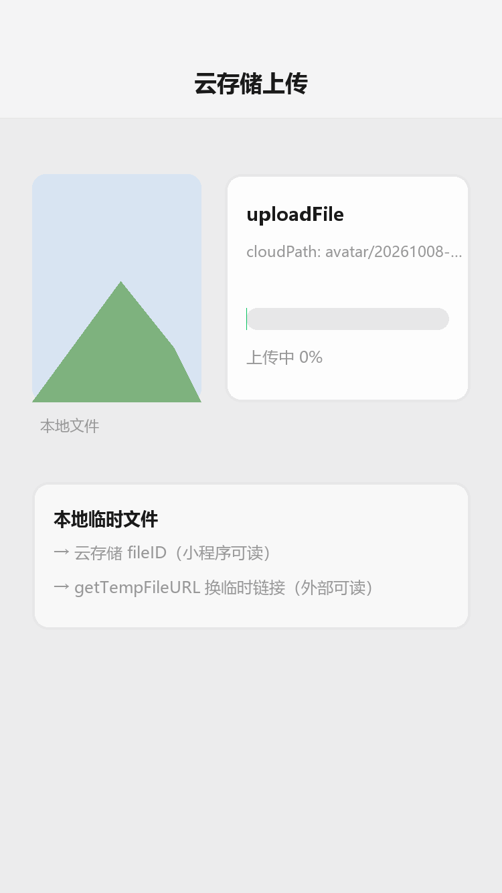

# 云存储

## 为什么读这篇

云开发三件套（云函数、云数据库、云存储）前两件已覆盖，云存储是**存文件**的那件：图片、音视频、导出文件。它的核心机制和其他存储完全不同——文件 ID 是 `cloud://` 协议，**不能直接给外部用**，要先换临时链接。

这篇讲透：上传 → cloud:// 文件 ID → 临时链接 → 下载/删除 的完整链路，以及为什么这么设计。

前置知识：[云开发入门](../04-云开发/01-云开发入门.md)、[媒体能力](../03-进阶/05-媒体能力.md)（本地临时文件）。

## 一、上传：从本地临时文件到云端

```js
// 前端：上传本地文件到云存储
async function uploadToCloud(tempFilePath) {
  const ext = tempFilePath.split('.').pop();
  const cloudPath = `images/${Date.now()}-${Math.random().toString(36).slice(2)}.${ext}`;
  const res = await wx.cloud.uploadFile({
    cloudPath,               // 云端路径（目录 + 文件名）
    filePath: tempFilePath   // 本地临时文件路径（chooseMedia 产出）
  });
  return res.fileID;         // 如 cloud://dev-env-abc.636c-.../images/xxx.jpg
}
```

**机制要点 1：cloudPath 决定文件怎么组织**。云存储按「目录/文件名」逻辑组织（类似对象存储），`cloudPath` 由你指定。常见组织方式：

- `avatar/{openid}.jpg` — 按用户隔离
- `orders/{orderId}/receipt.jpg` — 按业务对象归类
- 文件名加时间戳/随机串避免覆盖

**机制要点 2：uploadFile 传的是本地路径，不是 URL**。上传时文件还在用户设备上（见 [媒体能力](../03-进阶/05-媒体能力.md) 的临时文件机制），`uploadFile` 把本地文件推流到云端。

## 二、cloud:// 文件 ID：不能直接用的「地址」

上传后返回的 `res.fileID` 形如 `cloud://环境ID.xxx/目录/文件名`。它有两个关键特性：

1. **直接可读**：`<image src="{{fileID}}">` 能显示——小程序端认识 cloud:// 协议。
2. **外部不可用**：浏览器、其他服务**读不了** cloud://（不是标准 URL）。

需要把文件给「小程序之外」的场景（分享、打印、第三方服务、网页展示），必须**换成临时链接**：

```js
// 前端或云函数均可调用
const res = await wx.cloud.getTempFileURL({
  fileList: [fileID]
});
const url = res.fileList[0].tempFileURL;   // 形如 https://xxx.tcb.qcloud.la/xxx.jpg
```

### 2.1 为什么是「临时链接」，不能直接给永久 URL

这是云存储最核心的设计取舍（[官方文档：云存储](https://developers.weixin.qq.com/miniprogram/dev/wxcloud/guide/storage.html)）：

1. **权限边界**：文件存进云存储后，谁有权限看？如果 uploadFile 直接返回永久公网 URL，等于**任何人都能访问**——隐私文件（订单、用户上传）就裸奔了。临时链接由**有权访问的人**在调用时生成，链接本身带签名。
2. **回收与控制**：临时链接有过期时间，超时失效，防止链接被转发滥用（转发出去的链接会过期，而不是永久有效）。
3. **与云数据库一致的安全模型**：云数据库的文档靠权限规则保护，云文件靠「调用者身份 + 临时链接」保护——两套机制都要求**访问行为经过平台**。

**实务规则**：小程序内部展示用 `fileID`；外部要用时（分享卡片、浏览器页面、PDF 导出）才换临时链接。

上传到云存储的流程演示（渲染示意图动画：本地文件 → 上传进度条推进 → 上传完成返回 fileID → 链路提示）：



## 三、下载与删除

```js
// 下载到本地临时文件（用于转发文件/导出等场景）
const res = await wx.cloud.downloadFile({ fileID });
// res.tempFilePath 是本地临时文件，可再交给 wx.openDocument 等

// 删除
const del = await wx.cloud.deleteFile({ fileList: [fileID] });
// del.fileList[0].status === 0 表示删除成功
```

**边界**：`downloadFile` 只能在**小程序端**下载（需要登录态）；云函数里做「下载 → 处理 → 上传」用 `cloud.downloadFile`，但云函数环境只读临时文件后要自行处理（如转存、压缩）。

## 四、配额与安全规则

| 维度 | 说明 |
|---|---|
| 容量/流量 | 按量付费（免费额度有限，见 [价格](https://developers.weixin.qq.com/miniprogram/dev/wxcloud/billing/)）；生产项目关注文件总量与 CDN 流量 |
| 单文件大小 | 官方对单文件上传有大小上限（见官方文档，超大文件用分块/自行 CDN） |
| 安全规则 | 云存储支持按「文件路径前缀 + 登录态」配置权限，如「仅创建者可写、所有人可读」 |

**与数据库的安全模型对比**：数据库靠「集合权限规则」，存储靠「路径 + 临时链接」，两者都要在**控制台显式配置**。默认云存储权限是「所有用户可读、仅创建者可写」——如果你的文件是私密的，务必改权限。

## 常见错误 / 避坑

1. **把 fileID 直接塞给第三方**（如分享卡片、网页、邮件）：对方打不开；先 getTempFileURL 换链接。
2. **上传不校验大小/类型**：超大文件占配额烧流量；上传前用 chooseMedia 的 `size` 校验。
3. **不组织 cloudPath**：全堆根目录，后续清理/统计无从下手；按业务建目录。
4. **私密文件用默认权限**：默认「所有用户可读」，订单截图会被任意人读到；改权限。
5. **临时链接缓存过度**：链接会过期，缓存后过期期展示失败；短时缓存或每次现取。
6. **删除文件不同步删数据库记录**：文件删了记录还在 → 展示裂图；业务上先删记录再删文件（或云函数事务处理）。

## 验证

- [ ] 打通完整链路：chooseMedia 选图 → uploadFile → fileID 显示 → 删除文件 + 删记录
- [ ] 把 fileID 与 getTempFileURL 的链接分别贴到浏览器打开，记录差异（一个能开一个不能）
- [ ] 在云开发控制台改存储权限为「仅创建者可写」，验证他人不可删
- [ ] 说出「为什么云存储不直接返回永久公网 URL」的两个原因
- [ ] 用云函数实现：读 fileID → 换临时链接 → 返回给前端（分享卡片用）

## 延伸阅读

- 本库上一篇：[云数据库](../04-云开发/03-云数据库.md)
- 本库：[媒体能力](../03-进阶/05-媒体能力.md)（本地临时文件 → 云存储的入口）
- 本库：[云函数](../04-云开发/02-云函数.md)（服务端存取文件）
- 官方：[云存储](https://developers.weixin.qq.com/miniprogram/dev/wxcloudservice/wxcloud/guide/storage.html)
- 官方：[wx.cloud.uploadFile](https://developers.weixin.qq.com/miniprogram/dev/wxcloudservice/wxcloud/reference-sdk-api/storage/uploadFile/client.uploadFile.html)
- 官方：[wx.cloud.getTempFileURL](https://developers.weixin.qq.com/miniprogram/dev/wxcloudservice/wxcloud/reference-sdk-api/storage/Cloud.getTempFileURL.html)
