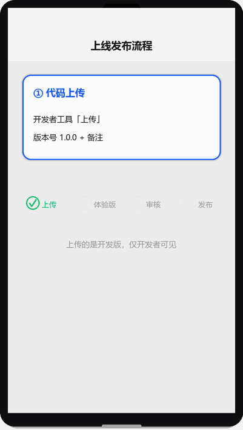

# 上线发布

## 为什么读这篇

代码写完只是开始：小程序要经过「上传 → 体验 → 审核 → 发布」四步才能真正被用户使用。审核有规范、发布有回退、运营要更新。这篇把上线全流程和运营期该知道的坑讲清楚。

前置知识：完成 [实战项目](../06-实战/01-待办清单实战.md) 或至少有一个能跑的真机项目；有可用的 AppID（非测试号）。

> 📺 配套视频 · 第 9 集：[《上线发布》](../assets/videos/video-09-release.mp4)（75 秒 · 竖屏 720×1280）——上传 → 体验版 → 审核 → 发布全流程、版本回退与更新机制。点击在 GitHub 内置播放器打开（仓库 Markdown 不支持内嵌播放器）。

## 上线全流程总览

发布流程演示（渲染示意图动画：代码上传 → 体验版 → 提交审核 → 发布 → 运营期回退，含进度条与各步要点）：




## 第一步：代码上传

1. 开发者工具点右上角「上传」
2. 填**版本号**（如 `1.0.0`）与**项目备注**（本次改了什么，方便追溯）
3. 上传成功后进入 mp 后台「管理 → 版本管理」可见

注意：

- 上传的是**开发版**，仅开发者/体验者可测
- 版本号语义化（主.次.修），小程序**不能覆盖发布过的版本号**，每次递增
- 上传前确认：AppID 正确、`project.config.json` 的 appid 与后台一致

## 第二步：体验版

后台「版本管理 → 开发版本 → 选为体验版」：

- 生成**体验版二维码**，发给体验成员扫码测试
- 体验成员在 mp 后台「成员管理」添加，或在小程序中「成员管理 → 体验成员」
- 体验版与线上版互不影响，是发布前的真实环境验证

**上线前体验版必须测**（至少）：

- [ ] 首屏加载、页面跳转、tab 切换
- [ ] 登录态（换设备登录是否正常）
- [ ] 核心业务流：增删改查、支付（如有）
- [ ] 弱网/断网表现（请求失败提示）
- [ ] iPhone + Android 各测一轮（rpx 缩放、机型适配）

## 第三步：提交审核

后台「版本管理 → 提交审核」，关键点：

### 类目选择

- 小程序需选**服务类目**（如「工具 > 效率」），与业务对应
- 涉及特殊行业（医疗、金融、教育、直播等）需要**资质文件**，提前准备
- 类目选错会被驳回；不确定先查 [运营规范](https://developers.weixin.qq.com/miniprogram/product/)

### 审核规范要点（高频驳回原因）

| 驳回原因 | 规避 |
|---|---|
| 功能无法体验 | 审核人员需要能完整走通核心流程，测试账号/引导要给足 |
| 内容涉及敏感类目 | 类目与资质匹配，内容自查 |
| 诱导分享/关注 | 禁止强制分享、诱导关注公众号换奖励 |
| 隐私不合规 | 有隐私协议（[用户隐私保护指引](https://developers.weixin.qq.com/miniprogram/dev/framework/user-privacy/) 配置），收集信息要声明 |
| 功能与描述不符 | 审核页填写的功能描述与真实功能一致 |

- 审核一般 1~7 天（工作日）；加急有额度（每月几次），谨慎用
- 审核期间**不要改动并重新上传**核心功能（审核的是提交时的版本）

## 第四步：发布上线

审核通过后：

- **全量发布**：所有人可见（新版本立即生效，部分用户可能稍晚收到）
- **分批发布**：按比例灰度（如 10% → 50% → 100%），降低风险，适合大改动
- 发布后线上版本可在「版本管理」查看

**注意**：发布不是终点——发布后第一周盯数据（[运营数据](https://developers.weixin.qq.com/miniprogram/dev/framework/open-ability/data-analysis.html)）：崩溃率、请求错误率、用户反馈；异常立即回退。

## 回退与紧急处理

线上出问题（接口挂了、功能崩溃）：

1. 后台「版本管理 → 线上版本 → 回退」：一键回退到上一稳定版本
2. 回退后立刻修复并重新走上传 → 审核 → 发布
3. 紧急线上问题（如数据泄露）先**下架/暂停服务**再修，不要边跑边改

## 运营期：版本更新检查

小程序更新不像 App 有商店更新提示，默认下次冷启动拉新版本。要主动提示更新用 `wx.getUpdateManager`：

```js
// app.js 或首页
const updateManager = wx.getUpdateManager();
updateManager.onUpdateReady(() => {
  wx.showModal({
    title: '更新提示',
    content: '新版本已准备好，是否重启应用？',
    success(res) {
      if (res.confirm) {
        updateManager.applyUpdate();  // 强制应用新版本
      }
    }
  });
});
```

场景：修复紧急 bug 后希望用户尽快更新时用；一般版本不用弹。

## 运营期注意事项

- **域名/资质变更**：服务器域名新增要提前配置（生效有延迟）
- **隐私合规**：每次加新接口/新收集字段，同步更新隐私指引
- **违规记录**：被投诉/违规会限流或下架，内容型产品重点盯
- **数据**：用官方数据分析（访问、留存、漏斗）持续迭代

## 机制理解：为什么小程序要「审核」而 H5 不用

这不是流程负担，而是**平台责任模型**的必然：

- **H5 的信任单位是域名**：内容自己托管，浏览器不担保，出事责任自担。
- **小程序的信任单位是平台**：代码运行在微信客户端内，微信对**用户体验和安全负连带责任**（崩溃、诈骗、违规内容都会算到微信头上），所以必须在上线前审查。审核本质是把「事后追责」前移成「事前审查」。

这个模型解释了三条实务规则：

1. **为什么类目要和资质匹配**：审核不只是看代码，还看「这个主体有没有资格做这件事」——医疗/金融/教育类目涉及公共利益，微信要替用户把第一道关。
2. **为什么「功能无法体验」是最常见驳回**：审查员只能按你描述的功能去试，试不通就无法确认产品真实状态，只能驳回。审核说明写得越像操作手册，通过越快。
3. **为什么上线后不能随便改**：线上版本一旦发布，代码包已进入用户客户端；再改代码要重新走「上传 → 审核 → 发布」，因为微信只对**审核过的版本**背书。这就是「上线当天改代码要重走流程」的底层原因。

## 常见错误 / 避坑

1. **测试号直接想上线**：测试号（无真实 AppID）不能上传发布；上线必须用真实注册的 AppID。
2. **审核材料不全被打回**：涉及资质类目提前准备；「功能无法体验」类驳回最多，审核说明里写清测试方法。
3. **版本号重复**：已发布的版本号不能再传同号；每次迭代递增。
4. **上线当天改代码**：审核的是提交的版本，发布前改动要重新提交审核；改完重走流程。
5. **忽视隐私指引**：收集用户信息未配置隐私协议，审核驳回 + 线上可能被拦截 API（隐私相关接口强校验）。
6. **回退操作不了解**：线上出问题时不会回退，导致问题持续；上线前先熟悉后台回退入口。

## 随堂测验

**Q1**: 开发者在审核期间发现一个小问题，立即修改代码并重新上传了新版本，此时审核状态会怎样？
- [ ] A. 审核自动切换到新版本
- [ ] B. 审核继续审查旧版本，新上传的版本需要重新提交审核
- [ ] C. 审核自动终止，需要等新版本上传完成后再开始
- [ ] D. 新旧版本同时审核，哪个先过就发布哪个

<details><summary>答案</summary>

**B**. 审核的是提交时的版本，审核期间重新上传不影响正在审核的版本，改动需要重新走「上传→审核→发布」流程，参见[常见错误](#常见错误--避坑)第 4 条。

</details>

**Q2**: 小程序线上版本突然出现严重 bug（如核心功能崩溃），第一时间应该做什么？
- [ ] A. 立即修改代码并上传新版本
- [ ] B. 在后台「版本管理」执行回退到上一稳定版本
- [ ] C. 在开发者工具中提交紧急审核
- [ ] D. 发公告让用户卸载重装

<details><summary>答案</summary>

**B**. 线上出问题应先在后台一键回退到上一稳定版本止血，然后再修复并重新走上传→审核→发布流程，参见[回退与紧急处理](#回退与紧急处理)。

</details>

**Q3**: 以下关于小程序审核机制的描述，哪项最能解释「为什么小程序需要审核而 H5 不需要」？
- [ ] A. 小程序代码量比 H5 大，需要更多时间检查
- [ ] B. 小程序运行在微信客户端内，平台对用户体验和安全负连带责任，必须事前审查
- [ ] C. H5 技术更成熟，bug 更少
- [ ] D. 小程序开发者数量多，审核是为了限制竞争

<details><summary>答案</summary>

**B**. 小程序的信任单位是平台，代码运行在微信客户端内，微信对用户体验和安全负连带责任，审核本质是把「事后追责」前移成「事前审查」，参见[机制理解](#机制理解为什么小程序要审核而-h5-不用)。

</details>

**Q4**: 关于 `wx.getUpdateManager` 的使用场景，以下哪种情况最适合主动弹窗提示用户更新？
- [ ] A. 每次发布新版本都弹窗
- [ ] B. 修复了紧急安全漏洞，需要用户尽快更新
- [ ] C. 只是调整了界面颜色
- [ ] D. 新增了非核心功能

<details><summary>答案</summary>

**B**. 修复紧急 bug 后希望用户尽快更新时用 `getUpdateManager` 弹窗提示，一般版本不需要弹，参见[版本更新检查](#运营期版本更新检查)。

</details>

## 验证

- [ ] 完成一次真实上传：版本号 + 备注规范
- [ ] 生成体验版二维码，用体验成员身份完整测一遍核心流程
- [ ] 提交审核，记录类目与审核材料清单
- [ ] （如已审核通过）完成一次全量发布，并在真机上确认新版本
- [ ] 在代码里接入 getUpdateManager，测试更新提示弹窗

## 延伸阅读

- 本库上一篇：[云存储](../04-云开发/04-云存储.md)
- 本库下一篇：[实战项目：待办清单](../06-实战/01-待办清单实战.md)（完整端到端案例）
- 官方：[版本管理](https://developers.weixin.qq.com/miniprogram/dev/framework/quickstart/release.html)
- 官方：[运营规范](https://developers.weixin.qq.com/miniprogram/product/)
