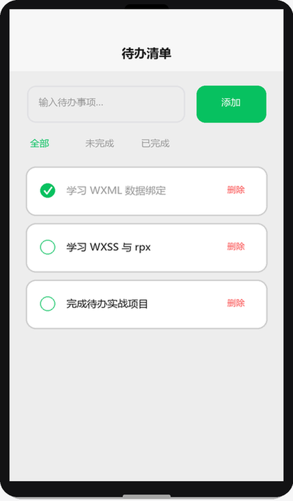
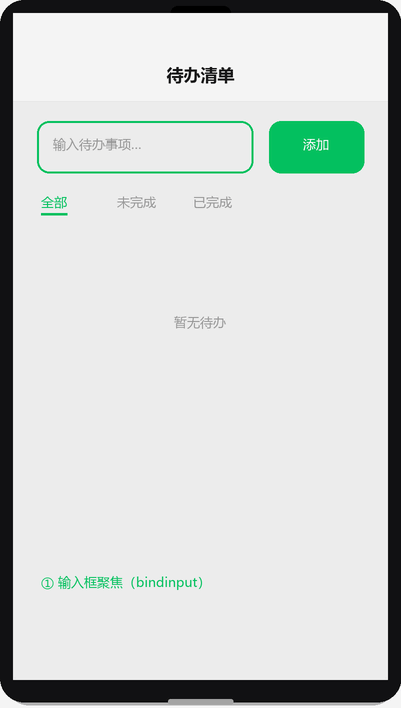

# 实战项目：待办清单

## 为什么读这篇

前面每篇都是零件，这篇把它们装成一台能跑的车。你将完成一个**真实可上线**的待办清单小程序：列表增删改查、筛选、云数据库持久化、真机可用。做完它，你就拥有了独立做小程序的能力基线。

前置知识：本库 [入门](../01-入门/01-认识小程序.md) → [基础](../02-基础/01-WXML数据绑定与渲染.md) → [进阶](../03-进阶/01-内置组件.md) → [云开发](../04-云开发/01-云开发入门.md) 全部内容；已开通云开发环境。

> 📺 配套视频 · 第 10 集：[《实战项目导览》](../assets/videos/video-10-practice.mp4)（90 秒 · 竖屏 720×1280）——三个实战项目总览，串联本库全部核心知识。点击在 GitHub 内置播放器打开（仓库 Markdown 不支持内嵌播放器）。

## 项目设计

**功能清单**：

1. 待办列表展示（未完成/已完成筛选）
2. 新增待办（输入 + 按钮）
3. 切换完成状态（点击勾选）
4. 删除待办（滑动或按钮）
5. 数据存云数据库，**按用户隔离**（每个人只看到自己的）

**技术选型**：原生小程序 + 云开发（云函数 + 云数据库）。全程不写后端服务器。

**效果示意**（渲染示意图，最终界面效果以真机为准）：



**目录结构**：

```text
todo-miniprogram/
├── app.js / app.json / app.wxss
├── cloudfunctions/
│   └── todo/                 # 唯一云函数：所有增删改查走这里
│       ├── index.js
│       └── package.json
└── pages/
    └── index/                # 单页足够
        ├── index.wxml / index.wxss / index.js / index.json
```

**为什么数据操作走云函数而不是前端直连数据库**：虽然云数据库前端也能读写，但统一走云函数可以集中做校验（长度、类型），且后续加功能（分享、统计）不用改权限模型。这符合 [云数据库](../04-云开发/03-云数据库.md) 的安全建议。

### 架构决策复盘：这个项目为什么这样设计

每个决策都有 tradeoff，想清楚它比照抄代码更重要：

| 决策 | 选它 | 放弃什么 | 什么情况会推翻 |
|---|---|---|---|
| 数据走云函数（非前端直连） | 校验集中、权限模型简单、后续扩展不用改集合权限 | 少写些样板代码；云函数有调用延迟与免费额度限制 | 只读公开数据、无安全要求的场景，前端直连更快 |
| 单页面 + 单云函数 | 学习曲线最低，一个文件讲完全部增删改查 | 代码组织粗糙；action 分支多了难维护 | 功能变多后拆多个云函数（getTodo/toggleTodo…） |
| openid 做归属字段 | 数据隔离开箱即用，无需自建用户表 | 无法跨设备同步用户偏好（openid 是应用级身份） | 需要用户资料、跨端登录时引入 unionid/用户表 |
| 集合权限设「所有用户不可读写」 | 双保险：即使前端被绕过，云函数仍是唯一入口 | 无法在控制台直接看/改数据（要开个临时管理函数） | 需要后台管理端直连时改用规则权限 |

复盘方式：每做完一个项目，把你做的每个「选 A 不选 B」列出来，写下推翻条件。这是从「会做」到「会设计」的分水岭。

### 踩坑回顾：开发过程中遇到的真实问题

| 症状 | 原因 | 修复 |
|---|---|---|
| 云函数调用报「function not found」 | 写了云函数代码但没有在开发者工具里右键「上传并部署」 | 右键 cloudfunctions/todo →「上传并部署：云端安装依赖」；每次改完云函数都要重新部署 |
| 不同用户看到了彼此的待办 | 云函数查询没加 openid 条件，返回了全集合数据 | `where` 里加 `_openid: openid`，写入时也带上 `_openid`；安全规则设「所有用户不可读写」做双保险 |
| 点击待办项没反应 | 用了 `catchtap` 但事件处理函数名拼错（大小写不一致） | 小程序事件名区分大小写；`catchtap` 会阻止冒泡，如果父级也需要收到事件就用 `bindtap` |
| 切换筛选 tab 后列表没刷新 | 在 `onLoad` 里获取数据，但 tab 切换不重新触发 `onLoad` | 把数据获取放到 `onShow` 里，或在 tab 切换的回调里手动调一次获取函数 |
| app.js 里环境 ID 写了占位符 | 忘记把 `'你的环境ID'` 替换成真实 ID，`wx.cloud.init` 静默失败 | 开通云开发后复制环境 ID，替换 app.js 里的占位符；project.config.json 的 appid 同理 |

每个坑都对应一个前面教程里的知识点。踩坑不可怕，可怕的是踩了同一个坑两次。

## 第一步：环境与骨架

1. 按 [环境准备](../01-入门/02-环境准备.md) 新建项目（真实 AppID）
2. 按 [云开发入门](../04-云开发/01-云开发入门.md) 开通云开发，记下环境 ID
3. app.js 初始化：

```js
// app.js
App({
  onLaunch() {
    if (!wx.cloud) {
      console.error('请使用 2.2.3 或以上的基础库以使用云能力');
      return;
    }
    wx.cloud.init({ env: '你的环境ID', traceUser: true });
  }
})
```

4. app.json 注册页面并配窗口：

```json
{
  "pages": ["pages/index/index"],
  "window": {
    "navigationBarTitleText": "待办清单",
    "navigationBarBackgroundColor": "#07c160",
    "navigationBarTextStyle": "white"
  },
  "sitemapLocation": "sitemap.json"
}
```

## 第二步：云函数 todo

**cloudfunctions/todo/index.js**（一个函数处理所有操作，action 区分）：

```js
const cloud = require('wx-server-sdk');
cloud.init({ env: cloud.DYNAMIC_CURRENT_ENV });
const db = cloud.database();
const todos = db.collection('todos');

exports.main = async (event) => {
  const { action, payload = {} } = event;
  const { openid } = cloud.getWXContext();   // 当前用户身份

  switch (action) {
    case 'list': {
      const { status, page = 1, size = 20 } = payload;
      const where = { openid };
      if (status !== 'all') where.done = status === 'done';
      const res = await todos
        .where(where)
        .orderBy('createTime', 'desc')
        .skip((page - 1) * size)
        .limit(size)
        .get();
      return { code: 0, list: res.data };
    }
    case 'add': {
      const { title } = payload;
      if (!title || title.length > 100) throw new Error('标题不合法');
      const res = await todos.add({
        data: { openid, title, done: false, createTime: Date.now() }
      });
      return { code: 0, id: res._id };
    }
    case 'toggle': {
      const { id, done } = payload;
      const res = await todos.where({ _id: id, openid }).update({
        data: { done: !!done }
      });
      return { code: 0, updated: res.stats.updated };
    }
    case 'remove': {
      const { id } = payload;
      await todos.where({ _id: id, openid }).remove();  // 只能删自己的
      return { code: 0 };
    }
    default:
      throw new Error(`未知操作: ${action}`);
  }
};
```

安全要点（对应 [云数据库权限](../04-云开发/03-云数据库.md)）：

- **每个操作都带 `openid` 条件**：toggle/remove 用 `where({ _id, openid })`，别人删不了你的数据
- **校验输入**：add 检查 title 长度
- 集合权限可设为「所有用户不可读写」（全部走云函数），最安全

上传部署后，在云开发控制台建 `todos` 集合，权限选「所有用户不可读写」。

## 第三步：页面

### index.wxml

```wxml
<view class="page">
  <!-- 输入区 -->
  <view class="input-bar">
    <input
      class="input"
      value="{{title}}"
      placeholder="输入待办事项"
      bindinput="onInput"
      bindconfirm="onAdd"
      confirm-type="done"
    />
    <button class="add-btn" bindtap="onAdd">添加</button>
  </view>

  <!-- 筛选 -->
  <view class="filter">
    <text class="filter-item {{status === 'all' ? 'active' : ''}}" data-status="all" bindtap="onFilter">全部</text>
    <text class="filter-item {{status === 'todo' ? 'active' : ''}}" data-status="todo" bindtap="onFilter">未完成</text>
    <text class="filter-item {{status === 'done' ? 'active' : ''}}" data-status="done" bindtap="onFilter">已完成</text>
  </view>

  <!-- 列表 -->
  <view class="list">
    <view class="todo-item {{item.done ? 'done' : ''}}"
      wx:for="{{list}}" wx:key="_id"
      bindtap="onToggle" data-id="{{item._id}}" data-done="{{item.done}}">
      <text class="todo-text">{{item.title}}</text>
      <text class="del" catchtap="onRemove" data-id="{{item._id}}">删除</text>
    </view>
    <view wx:if="{{list.length === 0}}" class="empty">暂无待办</view>
  </view>
</view>
```

### index.js

```js
Page({
  data: {
    title: '',
    status: 'all',
    list: []
  },

  onShow() {
    this.fetchList();
  },

  async fetchList() {
    const res = await this.callTodo('list', { status: this.data.status });
    this.setData({ list: res.list });
  },

  callTodo(action, payload) {
    return new Promise((resolve, reject) => {
      wx.cloud.callFunction({
        name: 'todo',
        data: { action, payload },
        success: (res) => {
          if (res.result.code === 0) resolve(res.result);
          else reject(new Error(res.result.errMsg));
        },
        fail: reject
      });
    });
  },

  onInput(e) {
    this.setData({ title: e.detail.value });
  },

  async onAdd() {
    const title = this.data.title.trim();
    if (!title) return;
    await this.callTodo('add', { title });
    this.setData({ title: '' });
    this.fetchList();
  },

  async onToggle(e) {
    const { id, done } = e.currentTarget.dataset;
    await this.callTodo('toggle', { id, done: !done });
    this.fetchList();
  },

  async onRemove(e) {
    const { id } = e.currentTarget.dataset;
    const { confirm } = await wx.showModal({ title: '确认删除？' });
    if (!confirm) return;
    await this.callTodo('remove', { id });
    this.fetchList();
  },

  onFilter(e) {
    const { status } = e.currentTarget.dataset;
    this.setData({ status });
    this.fetchList();
  }
})
```

### index.wxss（要点）

```css
.page { display: flex; flex-direction: column; min-height: 100vh; padding: 24rpx; }
.input-bar { display: flex; gap: 16rpx; margin-bottom: 24rpx; }
.input { flex: 1; border: 1rpx solid #ddd; border-radius: 12rpx; padding: 16rpx 24rpx; }
.add-btn { background: #07c160; color: #fff; font-size: 28rpx; }
.filter { display: flex; gap: 24rpx; margin-bottom: 16rpx; }
.filter-item.active { color: #07c160; font-weight: bold; }
.todo-item { display: flex; align-items: center; justify-content: space-between;
  background: #fff; border-radius: 12rpx; padding: 24rpx; margin-bottom: 16rpx; }
.todo-item.done .todo-text { text-decoration: line-through; color: #999; }
.del { color: #fa5151; padding: 8rpx 16rpx; }
.empty { text-align: center; color: #999; padding: 80rpx 0; }
```

## 第四步：联调与验证

完整操作流演示（渲染示意图动画，展示 输入 → 添加 → 勾选完成 → 删除 的界面变化）：



在开发者工具里：

1. 云函数目录右键「上传并部署」
2. 编译运行，走通：添加 → 列表出现 → 勾选 → 变已完成 → 删除
3. 切换筛选（全部/未完成/已完成）验证过滤正确
4. 打开 Console 确认无报错

**换账号验证数据隔离**（关键测试）：

- 预览生成二维码，用两个不同微信号扫码（需都在体验成员里）
- 各自添加数据，确认 A 看不到 B 的数据

## 第五步：上线

按 [上线发布](../05-发布/01-上线发布.md) 全流程：上传 → 体验版 → 审核 → 发布。

## 常见错误 / 避坑

1. **云函数未部署就调用**：`callFunction` 报 `FunctionName not found`；每次改完云函数重新上传部署。
2. **环境 ID 填错**：init 的 env 与函数所在环境不一致，调用失败或数据进错环境。
3. **toggle/remove 忘了 openid 条件**：`doc(id).update` 不带归属条件，等于任何人能改任何数据（云函数模式下没有前端权限兜底，**必须自己加**）。
4. **删除用 catchtap 而点击用 bindtap**：删除按钮不 catch 会冒泡触发整行 toggle，出现「点删除变完成」。
5. **onShow 每次刷新列表**：从筛选页/后台返回会重新拉数据——这正是我们想要的（数据最新），但注意高频操作时合理节流。
6. **`await wx.showModal(...)` 拿不到 `confirm`**：异步 API 不传 success/fail/complete 时直接返回 Promise（[基础库 2.10.2 起](https://developers.weixin.qq.com/miniprogram/dev/framework/app-service/api.html)），resolve 值就是 success 回调的那个 `res`——本工程 `onRemove` 正是这么写的。拿不到的两种情况：基础库低于 2.10.2（需自行用 Promise 包装），或传了回调又去 await（有回调就按回调方式执行，无返回值）。`wx.request`/`wx.uploadFile`/`wx.downloadFile` 本身有返回值（请求任务对象），不适用此规则。

## 随堂测验

**Q1**: 在待办清单的云函数中，`toggle` 操作的 `where` 条件是 `{ _id: id, openid }`，如果去掉 `openid` 条件只保留 `_id`，会产生什么安全问题？
- [ ] A. 切换操作会变慢
- [ ] B. 任何用户都能切换任何人的待办状态，数据归属保护失效
- [ ] C. 云函数会报错，因为必须带 openid
- [ ] D. 没有影响，因为 _id 已经是唯一的

<details><summary>答案</summary>

**B**. 不带 openid 条件意味着只要知道文档 _id 就能操作别人的数据，在云函数模式下没有前端权限兜底，必须自己加归属条件，参见[常见错误](#常见错误--避坑)第 3 条。

</details>

**Q2**: 在待办列表的 WXML 中，删除按钮用 `catchtap` 而不是 `bindtap`，原因是：
- [ ] A. `catchtap` 响应速度更快
- [ ] B. `catchtap` 阻止事件冒泡，防止删除时同时触发整行的 toggle 事件
- [ ] C. `catchtap` 支持长按删除
- [ ] D. `bindtap` 不能在 `wx:for` 循环中使用

<details><summary>答案</summary>

**B**. 删除按钮如果不用 `catchtap` 阻止冒泡，点击删除会同时触发父元素的 `bindtap`（toggle），出现「点删除变完成」的 bug，参见[常见错误](#常见错误--避坑)第 4 条。

</details>

**Q3**: 这个项目选择把所有数据操作统一走云函数而不是前端直连数据库，最主要的考虑是什么？
- [ ] A. 前端直连数据库性能太差
- [ ] B. 统一走云函数可以集中做校验，且后续扩展不用改权限模型
- [ ] C. 前端直连数据库的代码量更大
- [ ] D. 云函数可以绕过微信的所有限制

<details><summary>答案</summary>

**B**. 统一走云函数的好处是校验集中、权限模型简单、后续扩展（分享/统计）不用改集合权限，参见[架构决策复盘](#架构决策复盘这个项目为什么这样设计)。

</details>

**Q4**: 用户 A 和用户 B 分别使用这个待办清单小程序，各自添加了待办事项。关于数据隔离，以下哪个说法是正确的？
- [ ] A. 所有用户看到同一个待办列表
- [ ] B. 数据隔离靠集合权限实现，与 openid 无关
- [ ] C. 云函数中每个操作都用 openid 做 where 条件，保证 A 看不到 B 的数据
- [ ] D. 数据隔离需要额外建一张用户权限表

<details><summary>答案</summary>

**C**. 云函数中 list/toggle/remove 每个操作都带 openid 条件查询，保证每个用户只能操作自己的数据，参见[安全要点](#第二步云函数-todo)。

</details>

## 验证

- [ ] 完整功能跑通：增、查（含筛选）、改（勾选）、删
- [ ] 冷启动（杀掉小程序重进）数据仍在（云数据库持久化生效）
- [ ] 两个微信号验证数据隔离
- [ ] 云开发控制台能看到 todos 集合的数据与 openid 字段
- [ ] 走完一遍上传 → 体验版流程

## 延伸阅读

- 本库上一篇：[上线发布](../05-发布/01-上线发布.md)
- 本库下一篇：[实战项目：多页面导航](./02-多页面导航实战.md)
- 官方：[云开发实战指南](https://developers.weixin.qq.com/miniprogram/dev/wxcloud/quick-start/)