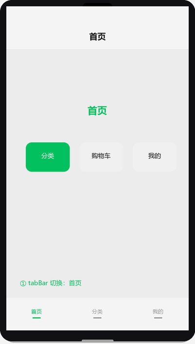

# 实战项目：多页面导航

## 为什么读这篇

前面的教程都是单页面，但真实小程序至少有几个 Tab、有详情页跳转。这篇用一个三 Tab 应用把页面导航的核心机制串起来：tabBar 配置、四种跳转 API 的区别、URL 传参 vs globalData vs 事件通道、onLoad 与 onShow 的触发时机。

前置知识：[项目结构](../01-入门/04-编程语言与技术栈.md)、[页面生命周期](../02-基础/04-页面生命周期与事件.md)。

示例工程：[`examples/navigation-miniprogram/`](../../examples/navigation-miniprogram/)

## 项目设计

**功能清单**：

1. 底部三个 Tab（首页 / 分类 / 我的）
2. 首页展示欢迎信息 + 跳转详情页按钮
3. 分类页展示列表，点击跳转详情并传参
4. 我的页展示 globalData 中的用户信息 + 页面加载次数
5. 详情页接收 URL 参数，显示来源页面

**技术选型**：纯前端，不涉及云开发。重点在导航机制，不在数据持久化。

页面导航流程演示（tabBar 切换 + navigateTo 跳详情 + navigateBack 返回）：



### 架构决策复盘：这个项目为什么这样设计

| 决策 | 选它 | 放弃什么 | 什么情况会推翻 |
|------|------|----------|----------------|
| tabBar 而非自定义导航栏 | 原生体验、性能好、配置简单 | 放弃了自定义导航栏的完全样式控制（动态菜单、动画过渡、非标布局） | 需要高度定制的导航交互时换 `custom: true`，代价是自行处理安全区和返回按钮 |
| URL 参数传 id | 简单直接、详情页可独立打开（分享链接可直接定位） | 放弃了事件通道的结构化传参能力（只能传字符串，长度受 URL 限制约 128 字符） | 需要传复杂对象或二进制数据时换事件通道，但详情页会失去独立打开的能力 |
| globalData 存用户信息 | 跨页共享、无需存储 API、读写零延迟 | 放弃了持久化能力（杀进程数据就丢，下次冷启动需重新获取） | 数据需要跨会话保留时换 `wx.setStorageSync` 或云数据库，代价是增加异步 IO |
| onShow 计数 | 演示 Tab 页不销毁的生命周期特征（切换触发 onShow 不触发 onLoad） | 放弃了 onLoad 初始化的简洁性（需要额外判断是否首次加载） | 需要每次进入都从服务器刷新数据时，把刷新逻辑放 onShow 并加 loading 态 |

### 踩坑回顾：开发过程中遇到的真实问题

| 症状 | 原因 | 修复 |
|------|------|------|
| `wx.navigateTo` 跳 tabBar 页没反应，控制台无报错 | tabBar 页只能用 `wx.switchTab`，`navigateTo` 对 tabBar 页静默失败 | 跳转前判断目标页是否在 `tabBar.list` 里，选对 API |
| 详情页 `onLoad(options)` 拿到 `undefined` | URL 拼错：少了 `/` 开头或参数用 `&` 而非 `=` 连接 | `console.log(options)` 打印检查；确认格式为 `/pages/detail/detail?id=1&title=xxx` |
| Tab 页切走再切回来，数据没刷新 | 刷新逻辑写在了 `onLoad` 里，但 Tab 页不销毁，`onLoad` 只触发一次 | 把需要每次进入都执行的逻辑移到 `onShow` |
| `getCurrentPages()` 返回空数组 | 在 `onLoad` 里调用时当前页面还没完全入栈 | 改用 `onShow` 获取，或用 `onLoad` 的 `options` 参数代替 |

## 第一步：项目骨架

1. 按 [环境准备](../01-入门/02-环境准备.md) 新建项目
2. 目录结构：

```text
navigation-miniprogram/
├── app.js / app.json / app.wxss
├── pages/
│   ├── home/        ← Tab 1
│   ├── category/    ← Tab 2
│   ├── profile/     ← Tab 3
│   └── detail/      ← 普通页面（不在 tabBar 里）
├── project.config.json
└── sitemap.json
```

## 第二步：配置 tabBar（要点）

app.json 里声明页面和 tabBar：

```json
{
  "pages": [
    "pages/home/home",
    "pages/category/category",
    "pages/profile/profile",
    "pages/detail/detail"
  ],
  "tabBar": {
    "color": "#999",
    "selectedColor": "#07c160",
    "list": [
      { "pagePath": "pages/home/home", "text": "首页" },
      { "pagePath": "pages/category/category", "text": "分类" },
      { "pagePath": "pages/profile/profile", "text": "我的" }
    ]
  }
}
```

**要点**：

- tabBar 的页面必须在 `pages` 数组里声明
- `pagePath` 不带 `.js` 后缀
- 最少 2 个、最多 5 个 Tab
- 图标可选（`iconPath` / `selectedIconPath`），本例省略

## 第三步：四种跳转 API

| API | 作用 | 能否跳 tabBar | 能否返回 |
|-----|------|:---:|:---:|
| `wx.switchTab` | 跳 tabBar 页 | 能 | 不能（关闭其他非 tabBar 页） |
| `wx.navigateTo` | 压栈跳转 | 不能 | 能（`navigateBack`） |
| `wx.redirectTo` | 替换当前页 | 不能 | 不能 |
| `wx.reLaunch` | 关闭所有页，打开新页 | 能 | 不能 |

首页跳转详情页：

```js
// pages/home/home.js
goDetail() {
  wx.navigateTo({
    url: '/pages/detail/detail?id=1&title=小程序导航'
  });
}
```

分类页动态跳转：

```js
// pages/category/category.js
onTap(e) {
  const id = e.currentTarget.dataset.id;
  wx.navigateTo({
    url: `/pages/detail/detail?id=${id}&title=${this.data.categories[id-1].name}`
  });
}
```

## 第四步：接收 URL 参数

详情页在 `onLoad(options)` 里接收参数：

```js
// pages/detail/detail.js
onLoad(options) {
  const from = getCurrentPages().length > 1
    ? getCurrentPages()[getCurrentPages().length - 2].route
    : '直接打开';
  this.setData({
    id: options.id || '',
    title: options.title || '未知',
    from: from
  });
}
```

`getCurrentPages()` 返回页面栈数组，倒数第二个就是来源页。

## 第五步：globalData 跨页共享（要点）

app.js 声明全局数据：

```js
App({
  globalData: {
    user: { name: '学习者', level: 1 }
  }
});
```

任意页面读取：

```js
const app = getApp();
this.setData({ userName: app.globalData.user.name });
```

## 第六步：onLoad vs onShow

Tab 页的生命周期有个关键区别：

- **onLoad**：页面第一次加载时触发（只一次）
- **onShow**：每次页面显示都触发（包括从其他页返回、Tab 切换）

```js
// pages/profile/profile.js
onLoad() {
  // 只在第一次进入时执行
  this.setData({ loadCount: 1 });
},
onShow() {
  // 每次 Tab 切回来都执行
  if (this.data.loadCount > 0) {
    this.setData({ loadCount: this.data.loadCount + 1 });
  }
}
```

**实践建议**：需要每次进入都刷新的数据（如未读数）放 `onShow`；只需初始化一次的（如页面配置）放 `onLoad`。

## 常见错误 / 避坑

**1. `wx.navigateTo` 跳 tabBar 页没反应？**
tabBar 页只能用 `wx.switchTab`。`navigateTo` 对 tabBar 页静默失败，不报错也不跳转。

**2. 详情页 `options` 拿到的是 undefined？**
检查 URL 拼写：`/pages/detail/detail?id=1`，注意路径以 `/` 开头、参数用 `=` 连接、多个参数用 `&` 分隔。

**3. globalData 的数据杀进程后就没了？**
这是正常的——globalData 在内存里，不持久化。需要持久化用 `wx.setStorageSync` 或云数据库。

## 随堂测验

**Q1**: 小明做一个三 Tab 应用，在首页用 `wx.navigateTo` 跳转到分类页（tabBar 页），但点击后页面没反应。最可能的原因是？
- [ ] A. `navigateTo` 的 URL 拼错了
- [ ] B. tabBar 页只能用 `wx.switchTab`，`navigateTo` 对 tabBar 页静默失败
- [ ] C. 分类页的 JS 文件有语法错误
- [ ] D. 需要在 `navigateTo` 里加 `success` 回调

<details><summary>答案</summary>

**B**。tabBar 页只能用 `wx.switchTab` 跳转。`wx.navigateTo` 对 tabBar 页会静默失败——不报错也不跳转。参见[常见错误 / 避坑](#常见错误--避坑)第 1 条。

</details>

**Q2**: Tab 页切走再切回来，哪个生命周期会再次触发？如果需要在每次切回时刷新未读消息数，应该把逻辑放在哪里？
- [ ] A. onLoad——每次显示都触发
- [ ] B. onShow——每次显示都触发
- [ ] C. onHide——每次隐藏后自动重新触发
- [ ] D. 都不会触发，Tab 页不会被重新加载

<details><summary>答案</summary>

**B**。Tab 页不会被销毁，切走时触发 `onHide`，切回来时触发 `onShow`。`onLoad` 只在首次加载时触发一次。刷新未读消息数这类需要每次进入都执行的逻辑应放 `onShow`。

</details>

**Q3**: 需要从详情页传一个复杂对象（如整个商品数据，包含名称、价格、图片数组）回首页，最合适的方式是？
- [ ] A. URL 参数拼接 `JSON.stringify` 后的字符串
- [ ] B. globalData 临时存储
- [ ] C. 事件通道（EventChannel）
- [ ] D. `wx.setStorageSync` 写入再读取

<details><summary>答案</summary>

**C**。事件通道（`eventChannel.emit`）是页面间通信的正式机制，支持传任意类型数据，结构清晰。URL 参数只能传字符串且长度受限；globalData 和 Storage 虽然能用但不够结构化，且需要手动清理。

</details>

**Q4**: 关于 `getCurrentPages()` 的使用，以下哪种说法是正确的？
- [ ] A. 在 `onLoad` 里调用一定能拿到当前页面
- [ ] B. 返回的数组第一个元素是当前页面
- [ ] C. 返回页面栈数组，倒数第二个是当前页面的来源页
- [ ] D. 只能在 Tab 页中使用

<details><summary>答案</summary>

**C**。`getCurrentPages()` 返回页面栈数组，最后一个元素是当前页面，倒数第二个是来源页。在 `onLoad` 里调用时当前页面可能还没完全入栈，建议在 `onShow` 里使用。

</details>

## 验证

- [ ] 用微信开发者工具打开 `examples/navigation-miniprogram/`
- [ ] 底部三个 Tab 可切换，首页和分类页点击按钮跳详情页
- [ ] 详情页显示传入的 id、title 和来源页面
- [ ] 切到「我的」Tab，再切回来，加载次数 +1

## 延伸阅读

- 本库上一篇：[实战项目：待办清单](./01-待办清单实战.md)
- 本库下一篇：[实战项目：商品列表](./03-商品列表实战.md)
- 本库：[页面生命周期与事件](../02-基础/04-页面生命周期与事件.md)（onLoad/onShow/onHide 完整机制）
- 本库：[项目结构](../01-入门/03-项目结构.md)（app.json 全局配置与 tabBar 字段）
- 官方：[页面路由](https://developers.weixin.qq.com/miniprogram/dev/framework/app-service/route.html)
- 官方：[tabBar 配置](https://developers.weixin.qq.com/miniprogram/dev/reference/configuration/tab-bar.html)
