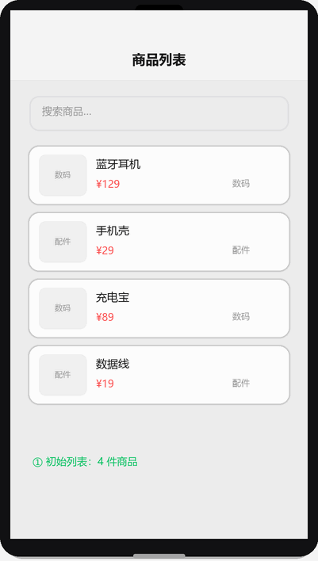
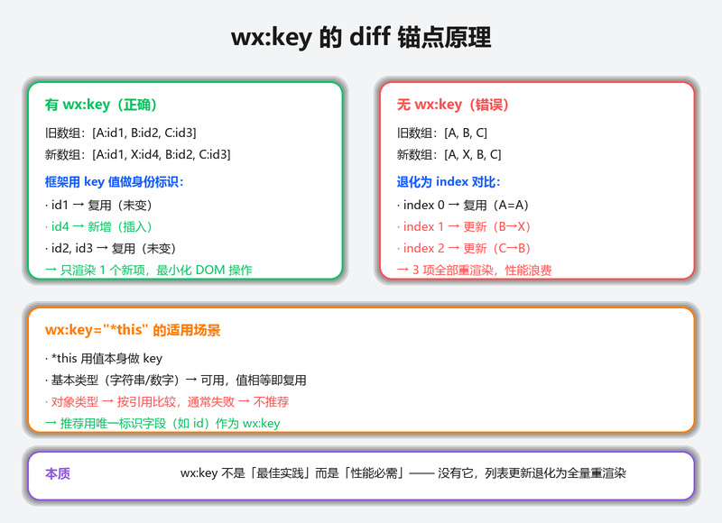

# 实战项目：商品列表

## 为什么读这篇

列表页是小程序最常见的形态——电商商品、新闻 feed、消息列表都属此类。这篇用一个「搜索 + 列表 + 详情」的商品应用，把 `wx:for` / `wx:key`、`scroll-view`、搜索过滤、`dataset` 传参这些列表页核心技能练到位。

前置知识：[WXML 数据绑定](../02-基础/01-WXML数据绑定与渲染.md)、[内置组件](../03-进阶/01-内置组件.md)、[多页面导航实战](./02-多页面导航实战.md)。

示例工程：[`examples/product-list-miniprogram/`](../../examples/product-list-miniprogram/)

## 项目设计

**功能清单**：

1. 商品列表展示（名称、价格、标签）
2. 搜索框实时过滤
3. scroll-view 滚动加载更多
4. 点击商品跳转详情页
5. 详情页动态设置导航栏标题

**技术选型**：纯前端，数据硬编码在 JS 里。重点在列表渲染与交互模式，不在数据源。

商品列表搜索过滤演示（输入关键词 → filter 过滤 → wx:key 精确 diff → 清空恢复）：



### 架构决策复盘：这个项目为什么这样设计

| 决策 | 选它 | 放弃什么 | 什么情况会推翻 |
|------|------|----------|----------------|
| 数据硬编码在 JS | 零依赖、开箱即用、教程聚焦列表渲染本身 | 放弃了动态数据能力（不能实时更新、数据量受代码体积限制、改数据需改代码重新上传） | 数据超过 50 条或需要实时更新时换 `wx.request` 从服务器拉取，代价是增加网络层和加载态处理 |
| `wx:key="id"` 而非 `*this` | 列表项有唯一 id，框架能精确 diff 出增删改 | 放弃了无 id 场景的便利性（必须保证每条数据有唯一字段，否则 key 冲突比不写更糟） | 数据无唯一 id 时退化为 `*this`，但会失去精确 diff 的优势，列表变化时全量重渲染 |
| scroll-view 而非页面滚动 | 可精确控制滚动区域、监听 `scrolltolower`、支持嵌套滚动 | 放弃了整页滚动的简单性（必须设固定高度，布局灵活性降低） | 简单场景（整页滚动、无嵌套滚动区域）用 `onReachBottom` 更简单，不需要固定高度 |
| 搜索在本地过滤 | 响应快（毫秒级）、无网络依赖、离线可用 | 放弃了服务端搜索的灵活性（不能模糊匹配、不能跨字段全文检索、大数据量时内存占用高） | 数据量超过 1000 条或需模糊匹配时改为服务端搜索，代价是增加网络请求和 loading 态 |
| `dataset` 传 id | 声明式、不拼字符串、框架自动解析到 `e.currentTarget.dataset` | 放弃了传复杂数据的能力（只能传字符串/数字，对象需 `JSON.stringify` 后传再解析） | 需要传复杂对象时用 `data-*` 的 JSON 字符串或事件通道，代价是序列化/反序列化的性能开销 |

### 踩坑回顾：开发过程中遇到的真实问题

| 症状 | 原因 | 修复 |
|------|------|------|
| 列表闪烁 / 重排 | 没设 `wx:key` 或 key 值不唯一 | 确保每条数据有唯一 id，`wx:key="id"` |
| scroll-view 滚动到底部不触发 `scrolltolower` | 没设固定高度，`scroll-view` 无法计算滚动区域 | CSS 里写 `height: calc(100vh - 200rpx)` 固定高度 |
| 搜索输入卡顿明显 | 每次 `bindinput` 都 `setData` 全量数据，频繁触发渲染 | 加 debounce（300ms 延迟合并输入事件） |
| 详情页导航栏标题没变 | `setNavigationBarTitle` 在 `setData` 之前调用，product 还是 null | 先确认 product 非 null 再设标题 |

## 第一步：列表渲染基础

`wx:for` 遍历数组，`wx:key` 告诉框架用什么字段标识每一项：

```xml
<view class="product-card" wx:for="{{products}}" wx:key="id" bindtap="goDetail" data-id="{{item.id}}">
  <view class="product-name">{{item.name}}</view>
  <view class="product-price">¥{{item.price}}</view>
</view>
```

**`wx:key` 为什么重要**：没有 key（或 key 不对），框架在列表变化时只能全量重渲染。有了唯一 key，框架能精确 diff 出哪些项变了、哪些没变，只更新变化的部分。

### wx:key 的 diff 锚点原理

框架在 `setData` 更新列表时，会拿新旧两个数组做对比。对比算法需要知道「新数组的第 i 项对应旧数组的哪一项」——这就是 wx:key 的作用：

```text
旧列表：[{id:1, name:'A'}, {id:2, name:'B'}, {id:3, name:'C'}]
新列表：[{id:1, name:'A'}, {id:3, name:'C'}]  // 删除了 id=2

wx:key="id" 时：
  框架对比 key 值 → 发现 id=2 被删除 → 只移除 id=2 对应的 DOM 节点
  id=1 和 id=3 的 DOM 节点保持不变（包括内部状态如 input 值、滚动位置）

无 wx:key 时：
  框架按 index 对比 → index 0 对 index 0（A→A 不变）、index 1 对 index 1（B→C 变了！）
  → 把 index 1 的 DOM 从 B 更新为 C、移除 index 2 的 DOM
  → 如果 B 那行有 input 正在输入，输入状态会「跳到」C 那行
```

`wx:key="*this"` 用项本身做 key——对字符串/数字数组有效（值唯一即可），对对象数组则按引用比较（`{}` !== `{}`），通常不是好选择。

wx:key diff 对比图（有 key vs 无 key 的 DOM 更新范围差异）：



## 第二步：搜索过滤

搜索框绑定 `bindinput`，在 JS 里过滤数据：

```js
onSearch(e) {
  const keyword = e.detail.value.trim().toLowerCase();
  const filtered = keyword
    ? ALL_PRODUCTS.filter(p => p.name.toLowerCase().includes(keyword))
    : ALL_PRODUCTS;
  this.setData({ keyword, filtered });
}
```

这就是数据驱动的核心——你不需要操作 DOM，只需要改 `data`，视图自动更新。

### debounce 的原理与量化

上面的 `onSearch` 每次 `bindinput` 都 `setData`——用户快速打字时，每个按键都触发一次跨线程序列化 + 渲染。量化分析：

| 方案 | setData 频率 | 每帧开销 |
|---|---|---|
| 无 debounce | ~10 次/秒（正常打字速度） | 每次 ~5-15ms（取决于列表长度） |
| 300ms debounce | ~3 次/秒 | 同上，但频率降低 70% |

`setData` 的成本链路：深拷贝 data → JSON 序列化 → 跨线程通信（逻辑层 → 渲染层）→ 反序列化 → diff 算法 → 更新 Shadow 树。列表越长，diff 越慢。300ms debounce 把连续按键合并为一次更新，用户感知不到延迟（300ms 在人类感知阈值以下），但渲染压力大幅降低。

```js
// debounce 实现
let searchTimer = null;
onSearch(e) {
  clearTimeout(searchTimer);
  const keyword = e.detail.value;
  searchTimer = setTimeout(() => {
    const filtered = keyword
      ? ALL_PRODUCTS.filter(p => p.name.toLowerCase().includes(keyword.toLowerCase()))
      : ALL_PRODUCTS;
    this.setData({ keyword, filtered });
  }, 300);
}
```

## 第三步：scroll-view 加载更多

`scroll-view` 配合 `bindscrolltolower` 实现「滚到底部加载更多」：

```xml
<scroll-view scroll-y class="product-list" bindscrolltolower="loadMore">
  <!-- 列表项 -->
  <view class="loading" wx:if="{{loading}}">加载中...</view>
</scroll-view>
```

```js
loadMore() {
  if (this.data.loading) return;
  this.setData({ loading: true });
  // 模拟网络请求
  setTimeout(() => {
    this.setData({ loading: false });
  }, 500);
}
```

**注意**：`scroll-view` 必须设固定高度，否则不生效。

### 为什么 scroll-view 必须固定高度

scroll-view 的滚动计算依赖 `scrollHeight - clientHeight`（内容总高度减去容器可见高度）。没有显式 CSS 高度时，容器会自动扩展到等于内容高度（`clientHeight = scrollHeight`），差值为 0，无法滚动。这是底层 WebView 的布局模型决定的——详见[内置组件 · scroll-view 原理](../03-进阶/01-内置组件.md)。

## 第四步：dataset 传参

点击列表项时，通过 `data-id` 把商品 id 传给事件处理函数：

```xml
<view bindtap="goDetail" data-id="{{item.id}}">
```

```js
goDetail(e) {
  const id = e.currentTarget.dataset.id;
  wx.navigateTo({ url: `/pages/detail/detail?id=${id}` });
}
```

`dataset` 是 WXML 里 `data-*` 属性的集合，小程序自动解析到 `e.currentTarget.dataset` 上。

## 第五步：详情页 + 动态标题

详情页根据 id 找到对应商品，动态设置导航栏标题：

```js
onLoad(options) {
  const id = parseInt(options.id, 10);
  const product = ALL_PRODUCTS.find(p => p.id === id) || null;
  this.setData({ product });
  if (product) {
    wx.setNavigationBarTitle({ title: product.name });
  }
}
```

`wx.setNavigationBarTitle` 可以在运行时修改页面标题，常用于详情页显示具体名称。

## 常见错误 / 避坑

**1. 列表渲染了但 `wx:key` 报错？**
`wx:key` 的值必须是数据项里存在的字段名。如果数据项是字符串数组，用 `*this`；如果是对象数组，用唯一标识字段（如 `id`）。

**2. scroll-view 滚动不生效？**
`scroll-view` 必须设固定高度（CSS 里写 `height: xxx`）。用 `calc()` 可以动态计算：`height: calc(100vh - 200rpx)`。

**3. 搜索输入没反应？**
检查 `bindinput` 是否绑对，`e.detail.value` 才是输入值。`bindchange` 只在失去焦点时触发，`bindinput` 是每次输入都触发。

## 随堂测验

**Q1**: 小明做一个商品列表，数据是对象数组 `[{id: 1, name: 'A'}, {id: 2, name: 'B'}]`。他用 `wx:key="*this"` 而不是 `wx:key="id"`，会发生什么？
- [ ] A. 页面报错，因为 `*this` 只能用于字符串数组
- [ ] B. 列表能渲染，但增删改时框架无法精确 diff，会全量重渲染
- [ ] C. 列表无法渲染，因为对象不能用 `*this` 做 key
- [ ] D. 和用 `wx:key="id"` 完全一样，没有区别

<details><summary>答案</summary>

**B**。`wx:key="*this"` 表示用整个项作为唯一标识。对对象数组来说，框架只能比较引用地址，无法精确知道哪个字段变了，导致列表变化时全量重渲染。有唯一 id 字段时应优先用 `wx:key="id"`。

</details>

**Q2**: `e.currentTarget.dataset.id` 和 `e.target.dataset.id` 的区别是什么？在列表项里嵌套了子元素（如 `<view bindtap="go" data-id="1"><text>商品名</text></view>`），点击文字时哪个能正确拿到 id？
- [ ] A. 完全一样，都能拿到
- [ ] B. `currentTarget` 是绑定事件的元素，`target` 是实际触发事件的元素；`currentTarget` 能正确拿到
- [ ] C. `target` 是绑定事件的元素，`currentTarget` 是实际触发事件的元素；`target` 能正确拿到
- [ ] D. 嵌套元素时两个都拿不到

<details><summary>答案</summary>

**B**。事件冒泡时，`target` 是最初触发事件的元素（可能是子元素 `<text>`），`currentTarget` 是绑定 `bindtap` 的那个元素（`<view>`）。`data-id` 写在 `<view>` 上，所以 `currentTarget.dataset.id` 才能正确拿到。用 `currentTarget` 更可靠。

</details>

**Q3**: 列表数据从服务器获取后，搜索过滤应该在哪里做？为什么？
- [ ] A. 在 WXML 里用 WXS 过滤——视图层处理更快
- [ ] B. 在 JS 里过滤 data，setData 更新视图——数据驱动，逻辑集中在逻辑层
- [ ] C. 直接操作 DOM 隐藏不匹配的项——避免重新渲染
- [ ] D. 每次搜索都重新请求服务器——保证数据最新

<details><summary>答案</summary>

**B**。小程序是数据驱动的，过滤逻辑在 JS 里做，结果通过 `setData` 更新到视图。不要操作 DOM（小程序没有 DOM API）。数据量大时可以考虑服务端搜索，但小数据量本地过滤响应更快。

</details>

**Q4**: `scroll-view` 的 `bindscrolltolower` 和页面的 `onReachBottom` 有什么区别？在什么场景下必须用 `scroll-view`？
- [ ] A. 完全一样，可以互换使用
- [ ] B. `bindscrolltolower` 是 scroll-view 内部滚动触发，`onReachBottom` 是页面滚动触发；页面内有多个独立滚动区域时必须用 scroll-view
- [ ] C. `onReachBottom` 性能更好，应该总是用它
- [ ] D. `bindscrolltolower` 只能在安卓上使用

<details><summary>答案</summary>

**B**。`bindscrolltolower` 是 `scroll-view` 组件内部的滚动事件，`onReachBottom` 是页面级别的滚动到底事件。当页面内有多个独立滚动区域（如左侧分类列表 + 右侧商品列表）时，必须用 `scroll-view` 分别控制。

</details>

## 验证

- [ ] 用微信开发者工具打开 `examples/product-list-miniprogram/`
- [ ] 列表展示 8 个商品，搜索框输入关键词实时过滤
- [ ] 滚动到底部显示「加载中」
- [ ] 点击商品跳转详情页，导航栏标题变为商品名

## 延伸阅读

- 本库上一篇：[实战项目：多页面导航](./02-多页面导航实战.md)
- 本库下一篇：[资源与工具](../07-资源/01-资源与工具.md)
- 本库：[WXML 数据绑定与渲染](../02-基础/01-WXML数据绑定与渲染.md)（wx:for/wx:key 基础语法）
- 本库：[内置组件](../03-进阶/01-内置组件.md)（scroll-view 完整属性参考）
- 本库：[性能优化](../03-进阶/04-性能优化.md)（长列表优化、recycle-view）
- 官方：[列表渲染](https://developers.weixin.qq.com/miniprogram/dev/reference/wxml/list.html)
- 官方：[scroll-view 组件](https://developers.weixin.qq.com/miniprogram/dev/component/scroll-view.html)
