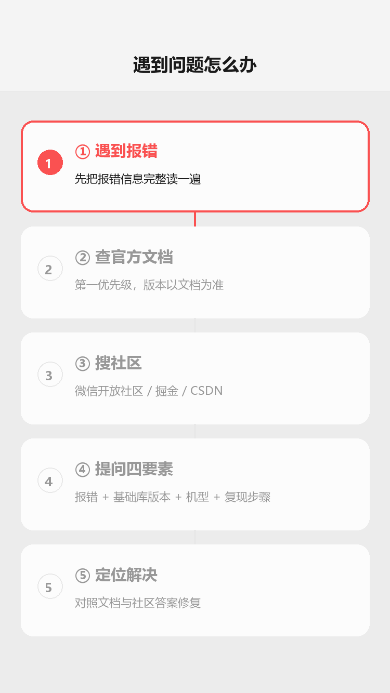

# 资源与工具

## 为什么读这篇

学完本库的路线，你需要知道「去哪查、去哪问、用什么工具、下一步学什么」。这篇是资源索引，全部是官方或高信噪比来源。

## 官方文档（第一优先级）

资源导航（概念示意图：官方文档 / 社区提问 / 工具链 三层资源结构）：

问题排查流程（渲染示意图动画：遇到报错 → 查官方文档 → 搜社区 → 提问四要素 → 定位解决）：

| 资源 | 链接 | 用途 |
|---|---|---|
| 小程序开发指南 | https://developers.weixin.qq.com/miniprogram/dev/framework/ | 框架总览，一切从这里出发 |
| 组件文档 | https://developers.weixin.qq.com/miniprogram/dev/component/ | 每个组件的属性/事件速查 |
| API 文档 | https://developers.weixin.qq.com/miniprogram/dev/api/ | wx.* 全部 API |
| 云开发文档 | https://developers.weixin.qq.com/miniprogram/dev/wxcloud/ | 云函数/数据库/存储 |
| 运营规范 | https://developers.weixin.qq.com/miniprogram/product/ | 审核与合规，上线前必读 |
| 微信公众平台 | https://mp.weixin.qq.com/ | 账号管理、版本管理、数据分析 |

**习惯**：遇到组件/API 问题先查官方文档，版本号以文档标注为准。官方文档更新快，本库文章提到的版本信息（如基础库要求）请以官方为准。

## 官方技术深度阅读（论文级参考）

想从「会用」到「懂原理」，官方技术文档比任何博客都深。按主题选读：

| 主题 | 文档 | 为什么读 |
|---|---|---|
| 双线程架构 | [小程序框架概览（app-service）](https://developers.weixin.qq.com/miniprogram/dev/framework/app-service/) | 逻辑层/渲染层分线程的完整机制，setData 通信成本的源头 |
| 数据更新算法 | [数据更新策略](https://developers.weixin.qq.com/miniprogram/dev/framework/component-framework/data-update-strategy) | Shadow 树 diff 原理，本库性能篇的机制依据 |
| setData 成本 | [合理使用 setData](https://developers.weixin.qq.com/miniprogram/dev/framework/performance/tips/runtime_setData.html) | 深拷贝/序列化/跨线程通信的量化分析 |
| 性能审计体系 | [性能审计](https://developers.weixin.qq.com/miniprogram/dev/framework/audits/performance.html) | 官方体检项与修法，上线前必过 |
| 分包与启动 | [分包加载](https://developers.weixin.qq.com/miniprogram/dev/framework/subpackages.html) | 主包 2M/总分包 30M 的官方定义与最佳实践 |
| 渲染引擎演进 | [Skyline 渲染引擎](https://developers.weixin.qq.com/miniprogram/dev/framework/runtime/skyline/introduction.html) · [Worklet](https://developers.weixin.qq.com/miniprogram/dev/framework/runtime/skyline/worklet.html) | 新引擎机制：免 setData、渲染线程直驱 |
| 技术发展史 | [小程序技术发展史](https://developers.weixin.qq.com/miniprogram/dev/framework/quickstart/#小程序技术发展史) | 从 WebView 到 Skyline 的演进脉络，理解「为什么这么设计」 |

> 微信小程序领域没有传统意义的学术论文；官方技术文档与开发者大会分享（微信公开课）即最权威的深度资料。把这些文档当论文读：先看机制，再回本库文章对照应用层写法。

## 社区（问问题）

| 社区 | 说明 |
|---|---|
| [微信开放社区](https://developers.weixin.qq.com/community/) | 官方论坛，官方人员回答，BUG/能力咨询首选 |
| [CSDN / 掘金](https://juejin.cn/) | 中文技术博客，搜具体报错信息常有解法 |
| GitHub | 搜索开源小程序项目，读别人的完整工程是最快的学习方式 |

**提问技巧**：报错信息 + 基础库版本 + 机型 + 复现步骤四要素齐全，才有人能答。

## 工具

| 工具 | 用途 |
|---|---|
| 微信开发者工具 | 开发/调试/预览/上传一体（本库 [环境准备](../01-入门/02-环境准备.md)） |
| 云开发控制台 | 数据库、云函数日志、存储、统计（[云开发入门](../04-云开发/01-云开发入门.md)） |
| [微信开发者工具 CLI](https://developers.weixin.qq.com/miniprogram/dev/devtools/cli.html) | 命令行编译/预览，CI 集成 |
| [miniprogram-ci](https://developers.weixin.qq.com/miniprogram/dev/devtools/ci.html) | 上传/预览自动化（CI/CD） |
| [微信开发者工具插件](https://developers.weixin.qq.com/miniprogram/dev/devtools/editorextensions) | 语法检查、图片压缩等扩展 |
| [wechat-miniprogram 官方仓库](https://github.com/wechat-miniprogram) | 官方组件扩展（miniprogram-api-promise 等） |

## 进阶方向（学完本库之后）

本库覆盖「原生开发全链路」。之后的提升方向：

1. **性能优化**：长列表（recycle-view）、图片优化、首屏加载、[Skyline 渲染引擎](https://developers.weixin.qq.com/miniprogram/dev/framework/runtime/skyline/introduction.html)（客户端支持版本见[官方兼容表](https://developers.weixin.qq.com/miniprogram/dev/framework/runtime/skyline/migration/compatibility.html)）
2. **工程化**：TypeScript 支持、npm 依赖、miniprogram-ci 自动化、代码分包
3. **多端复用**：Taro / uni-app（跨端框架，需先扎实原生基础）
4. **商业化能力**：微信支付、订阅消息（消息触达）、广告组件、直播能力
5. **开放能力**：小程序插件、第三方平台授权（代开发）、开放数据域

## 如何阅读官方技术文档

官方文档是最好的参考资料，但直接从头读效率很低。推荐读序：

1. **先看框架总览**（[开发指南](https://developers.weixin.qq.com/miniprogram/dev/framework/)）：理解双线程架构、目录结构、配置项——建立全局心智模型
2. **再看数据流**（[合理使用 setData](https://developers.weixin.qq.com/miniprogram/dev/framework/view/layered-composition.html)）：理解 setData 的序列化 → 跨线程 → diff 链路——这是性能问题的根源
3. **然后看组件/API 文档**：按需查阅，不必通读。遇到不确定的属性再回来查
4. **最后看更新日志**（[基础库](https://developers.weixin.qq.com/miniprogram/dev/framework/release/)）：了解新能力和废弃 API，避免用到过时接口

**为什么这个顺序有效**：先建立架构全景（知道东西放在哪），再理解核心机制（知道东西怎么运转），最后按需深入（知道去哪找细节）。反过来先读 API 列表容易迷失在细节里。

## 学习路径选择指南

不同目标对应不同的学习重点。以下是常见场景的推荐路径：

| 目标 | 必读文章 | 可以跳过 |
|---|---|---|
| 做一个工具类小程序 | 基础四篇 + 云开发四篇 + 上线发布 | 微信支付、地图定位、Skyline |
| 做电商/内容类小程序 | 基础四篇 + 内置组件 + 性能优化 + 云开发 + 实战三篇 | 地图定位、第三方组件库 |
| 前端转小程序开发 | 快速过基础四篇 + 重点读进阶篇（授权/隐私/调试） | 环境准备（你已经会了） |
| 纯零基础学编程 | 先学 HTML/CSS/JS 基础（1-2 天），再回来从入门篇开始 | 不建议跳过任何阶段 |
| 已有小程序想优化 | 性能优化 + 调试与排错 + Skyline 与适配 | 入门/基础篇 |

**边界**：本库覆盖的是**原生小程序开发**。如果你需要跨平台（一套代码跑微信/支付宝/H5），应该看 Taro 或 uni-app；如果你做的是微信小游戏，技术栈不同（Canvas/WebGL 为主），不在本库范围内。

## 常见错误 / 避坑

1. **只查中文博客不查官方文档**：博客常有旧版本错误信息；先官方后社区。
2. **报错不贴环境信息**：基础库版本、机型、工具版本是排查关键，提问/自查都先确认这三样。
3. **搜不到就放弃**：微信很多能力限制在特定主体/类目/版本，官方文档「开放对象」一栏常写「个人主体不可用」——先确认限制再排查代码。
4. **跟风新框架忽略基础**：Taro/uni-app 抽象了原生，但小程序本身的坑（生命周期、setData、权限）绕不过去；本库原生产物是任何框架的底座。

## 随堂测验

**Q1**: 开发中遇到一个组件属性不确定的问题，以下哪种查找资料的顺序最合理？
- [ ] A. 先搜中文博客，找不到再查官方文档
- [ ] B. 先查官方组件文档，确认后再搜社区看是否有已知坑
- [ ] C. 直接在群里问人，等别人回答
- [ ] D. 搜英文 Stack Overflow，因为信息更全

答案

**B**. 官方文档是第一优先级，信噪比最高；社区作为补充，博客可能有旧版本错误信息，参见[官方文档](#官方文档第一优先级)和[常见错误](#常见错误--避坑)第 1 条。

**Q2**: 在微信开放社区提问时，以下哪项信息对别人帮你排查问题**最不重要**？
- [ ] A. 完整的报错信息
- [ ] B. 基础库版本和机型
- [ ] C. 你的开发年限
- [ ] D. 可复现的操作步骤

答案

**C**. 提问四要素是报错信息 + 基础库版本 + 机型 + 复现步骤，开发年限与排查问题无关，参见[社区](#社区问问题)。

**Q3**: 你想了解小程序 `setData` 的通信成本和性能优化原理，应该优先阅读以下哪个官方文档？
- [ ] A. 组件文档
- [ ] B. 运营规范
- [ ] C. 「合理使用 setData」性能优化文档
- [ ] D. 云开发文档

答案

**C**. 官方「合理使用 setData」文档有深拷贝/序列化/跨线程通信的量化分析，是理解 setData 性能成本的第一手资料，参见[官方技术深度阅读](#官方技术深度阅读论文级参考)。

## 验证

- [ ] 收藏官方五个文档入口（指南/组件/API/云开发/规范）
- [ ] 用官方组件文档查一个本库未覆盖的组件（如 picker），读完它的属性
- [ ] 在微信开放社区搜一次你遇到的真实报错，记录解法
- [ ] 确定下一个学习主题（性能/工程化/商业化），并找到对应官方文档入口

## 延伸阅读

- 本库上一篇：[实战项目：商品列表](../06-实战/03-商品列表实战.md)
- 本库：[学习路径总览](../00-学习路线/01-学习路径总览.md)（回到路线图定位自己）
- 官方：[小程序开发文档](https://developers.weixin.qq.com/miniprogram/dev/framework/)
- 官方：[小程序 API 参考](https://developers.weixin.qq.com/miniprogram/dev/api/)
- 参考模式：[通往 AGI 之路](https://www.waytoagi.com/)
