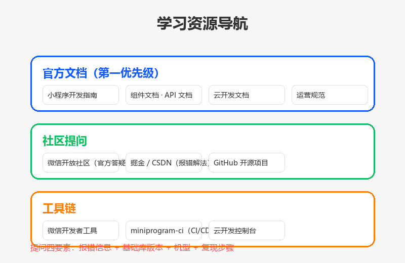

# 资源与工具

## 为什么读这篇

学完本库的路线，你需要知道「去哪查、去哪问、用什么工具、下一步学什么」。这篇是资源索引，全部是官方或高信噪比来源。

## 官方文档（第一优先级）

资源导航（概念示意图：官方文档 / 社区提问 / 工具链 三层资源结构）：

| 资源 | 链接 | 用途 |
|---|---|---|
| 小程序开发指南 | https://developers.weixin.qq.com/miniprogram/dev/framework/ | 框架总览，一切从这里出发 |
| 组件文档 | https://developers.weixin.qq.com/miniprogram/dev/component/ | 每个组件的属性/事件速查 |
| API 文档 | https://developers.weixin.qq.com/miniprogram/dev/api/ | wx.* 全部 API |
| 云开发文档 | https://developers.weixin.qq.com/miniprogram/dev/wxcloud/ | 云函数/数据库/存储 |
| 运营规范 | https://developers.weixin.qq.com/miniprogram/product/ | 审核与合规，上线前必读 |
| 微信公众平台 | https://mp.weixin.qq.com/ | 账号管理、版本管理、数据分析 |

**习惯**：遇到组件/API 问题先查官方文档，版本号以文档标注为准。官方文档更新快，本库文章提到的版本信息（如基础库要求）请以官方为准。

## 社区（问问题）

| 社区 | 说明 |
|---|---|
| [微信开放社区](https://developers.weixin.qq.com/community/) | 官方论坛，官方人员回答，BUG/能力咨询首选 |
| [CSDN / 掘金](https://juejin.cn/) | 中文技术博客，搜具体报错信息常有解法 |
| GitHub | 搜索开源小程序项目，读别人的完整工程是最快的学习方式 |

**提问技巧**：报错信息 + 基础库版本 + 机型 + 复现步骤四要素齐全，才有人能答。

## 工具

| 工具 | 用途 |
|---|---|
| 微信开发者工具 | 开发/调试/预览/上传一体（本库 [环境准备](../01-入门/02-环境准备.md)） |
| 云开发控制台 | 数据库、云函数日志、存储、统计（[云开发入门](../04-云开发/01-云开发入门.md)） |
| [微信开发者工具 CLI](https://developers.weixin.qq.com/miniprogram/dev/devtools/cli.html) | 命令行编译/预览，CI 集成 |
| [miniprogram-ci](https://developers.weixin.qq.com/miniprogram/dev/devtools/ci.html) | 上传/预览自动化（CI/CD） |
| [微信开发者工具插件](https://developers.weixin.qq.com/miniprogram/dev/devtools/editorextensions) | 语法检查、图片压缩等扩展 |
| [wechat-miniprogram 官方仓库](https://github.com/wechat-miniprogram) | 官方组件扩展（miniprogram-api-promise 等） |

## 进阶方向（学完本库之后）

本库覆盖「原生开发全链路」。之后的提升方向：

1. **性能优化**：长列表（recycle-view）、图片优化、首屏加载、[Skyline 渲染引擎](https://developers.weixin.qq.com/miniprogram/dev/framework/runtime/skyline/introduction.html)（基础库 ≥ 3.0.2、客户端 ≥ 8.0.40）
2. **工程化**：TypeScript 支持、npm 依赖、miniprogram-ci 自动化、代码分包
3. **多端复用**：Taro / uni-app（跨端框架，需先扎实原生基础）
4. **商业化能力**：微信支付、订阅消息（消息触达）、广告组件、直播能力
5. **开放能力**：小程序插件、第三方平台授权（代开发）、开放数据域

## 常见错误 / 避坑

1. **只查中文博客不查官方文档**：博客常有旧版本错误信息；先官方后社区。
2. **报错不贴环境信息**：基础库版本、机型、工具版本是排查关键，提问/自查都先确认这三样。
3. **搜不到就放弃**：微信很多能力限制在特定主体/类目/版本，官方文档「开放对象」一栏常写「个人主体不可用」——先确认限制再排查代码。
4. **跟风新框架忽略基础**：Taro/uni-app 抽象了原生，但小程序本身的坑（生命周期、setData、权限）绕不过去；本库原生产物是任何框架的底座。

## 验证

- [ ] 收藏官方五个文档入口（指南/组件/API/云开发/规范）
- [ ] 用官方组件文档查一个本库未覆盖的组件（如 picker），读完它的属性
- [ ] 在微信开放社区搜一次你遇到的真实报错，记录解法
- [ ] 确定下一个学习主题（性能/工程化/商业化），并找到对应官方文档入口

## 延伸阅读

- 本库上一篇：[实战项目](../06-实战/01-待办清单实战.md)
- 本库：[学习路径总览](../00-学习路线/01-学习路径总览.md)（回到路线图定位自己）
- 参考模式：[通往 AGI 之路](https://www.waytoagi.com/)
